Independent Project Report
================
Wynne Moss
December 16, 2018

The data
========

SUMMARY OF DATASET: I quantified parasite communities across 10 different pond sites in the East Bay of California; each site was visited 4-5 times within the 2017 summer (one site dried up and was only visited 3 times). At each visit I collected 8-12 individuals from 2 amphibian species. Individuals were measured and parasite infection was quantified.

GROUPING VARIABLES:

-   Site (10 ponds) - this is a random variable, coded as `SiteCode`

-   Sample (5 samples per site) - this is a random variable, coded as `CollectionCode`

PREDICTOR VARIABLES:

-   Species (2 species) - coded as `SpeciesCode`. Host individuals are either PSRE (Pacific chorus frog, *Pseudacris regilla*) or TATO (California newt, *Taricha torosa*)

-   Body size (snout-vent-length) - A continuous variable (fixed effect) at the individual level. I scaled this within each visit, so that individuals with a positive score are larger than average at that time of year, and individuals with a negative score are smaller than average at that time of year (delayed growth). Scaled variable is called `siteScaledSVL`.

-   `visit` - A continuous variable (though could be treated as a factor if the relationship is non linear). I could use julian date too, but since visits are equally spaced (every 2.5 weeks) I am treating visit number as a numeric variable.

-   `Latitude` - A continuous variable that is scaled, which describes the location at which an individual was sampled. All individuals from the same pond have the same latitude.

RESPONSE VARIABLE:

-   The number of parasite species found within an individual; coded as `tot.para`. There were 12 possible parasite species identified in this study, and many individuals had more than one parasite.


Questions
=========

1.  Does the impact of species and body size change over the course of the summer (interact with visit)? That is are there different dynamics driving parasite richness at the beginning vs. end of summer?
2.  How much of the variation in parasite richness is explained by visit-level, species-level, site-level, or individual-level attributes?
3.  How does parasite richness change over time and with host species?

Data Exploration
================

Overall, I want to visualize how within-host parasite richness changes over time, location, species, and body size.

Display the structure of the data
---------------------------------

``` r
getwd()
```

    ## [1] "/Users/wynnemoss/PhD life/Classes/Data Science/EBIO5460_PersonalRepos2/independent_project"

``` r
dis <- read.csv("diss.data.2017.csv")
colnames(dis)
```

    ##  [1] "X"                           "HostCode"                   
    ##  [3] "Date"                        "SiteCode"                   
    ##  [5] "SpeciesCode"                 "CollectionCode"             
    ##  [7] "Lifestage"                   "Dissector"                  
    ##  [9] "DissectionCondition"         "GosnerStage"                
    ## [11] "TarichaLarvaeStage"          "SVL"                        
    ## [13] "TailLength"                  "TotalLength"                
    ## [15] "Malformed"                   "Sex"                        
    ## [17] "collDate"                    "visit"                      
    ## [19] "SecYr"                       "tot.para"                   
    ## [21] "BDinf"                       "aveZE"                      
    ## [23] "Alaria"                      "Cephalogonimus"             
    ## [25] "Echinostoma"                 "Gorgoderid_Metacercaria"    
    ## [27] "Gyrinicola_batrachiensis"    "Manodistomum_syntomentera"  
    ## [29] "Megalobatrachonema_moraveci" "Nematode"                   
    ## [31] "Oxyurid"                     "Ribeiroia_ondatrae"         
    ## [33] "Nyctotherus"                 "Opalina"                    
    ## [35] "Tritrichomonas"

``` r
# str(dis)
```

Clean up data and add some covariates
-------------------------------------

``` r
# first visit was in March and not all ponds were sampled; get rid of and call May the first visit
dis <- dis%>% filter(visit > 1) %>% mutate(visit = visit-1) 
```

    ## Warning: package 'bindrcpp' was built under R version 3.4.4

``` r
# let's get a scaled SVL (snout-vent length)
# in this case we want negatives to be lower than average at that time, and positives to be higher than average at that time
meanSVLVisitSpec <- dis %>% group_by (visit, SpeciesCode) %>% summarise(meanVSVL = mean(SVL), sdVSVL = sd(SVL))
dis <- left_join(dis, meanSVLVisitSpec, by = c("visit", "SpeciesCode"))
dis <- dis %>% mutate(visitScaledSVL = (SVL-meanVSVL)/sdVSVL)
dis$meanVSVL =NULL
dis$sdVSVL = NULL
# visitScaledSVL is an individual's body length relative to its cohort at that time.

# add in lat and long
sitedat <- read.csv("CoreSites.csv"
)
dis <- left_join(dis, sitedat, by = "SiteCode")

# format visit as a date
# first need to split out the part after the underscore (date of sample)
spl <- strsplit(as.character(dis$CollectionCode), "_")
# then format as date
dis$Dated <- sapply(spl, function(x) x[2]) %>% as.Date("%Y%m%d")

# get julian date
dates <- as.POSIXlt(dis$Dated, format = "%Y%m%d")
dis$jDate <-dates$yday
```

### Plot 1: Distribution of Response Variable

Overall, how is parasite richness within a host distributed? 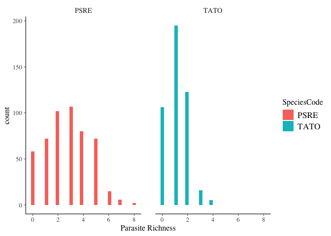

These histograms look pretty Poisson-y and not necessarily overdispersed.

### Plot 2: Richness vs. Time

Plot parasite richness as a function of time and species. Seems like frogs (PSRE) get more parasites than newts (TATO). There might be a non linear relationship for frogs, where they peak in mid-summer and then clear parasites. 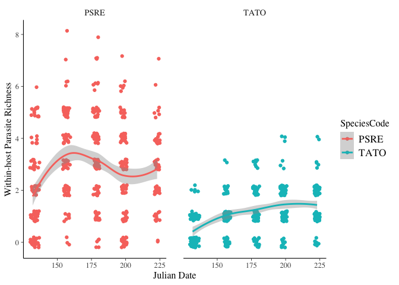

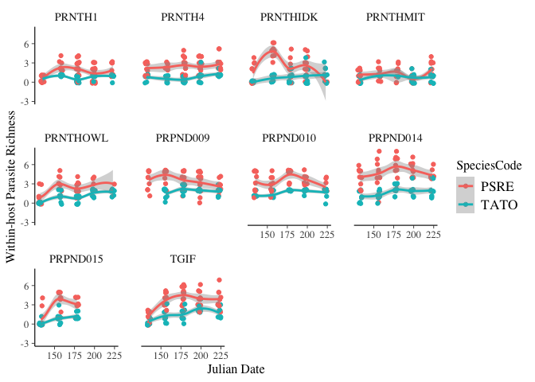

### Plot 3: Richness vs. Body Size

There's variation within each species at each time point. Is this due to individual level characteristics (e.g. body size) or site-level characteristics (the site that an individual is from)?

Check individual-level characteristic: body size, or snout-vent length (SVL)

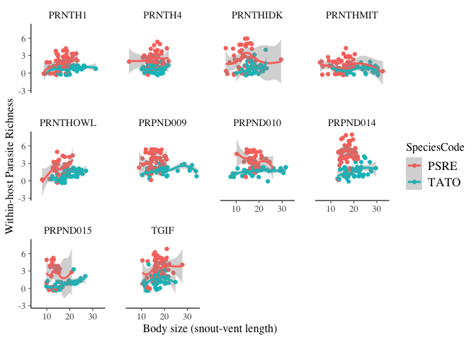

I don't see any clear patterns here.

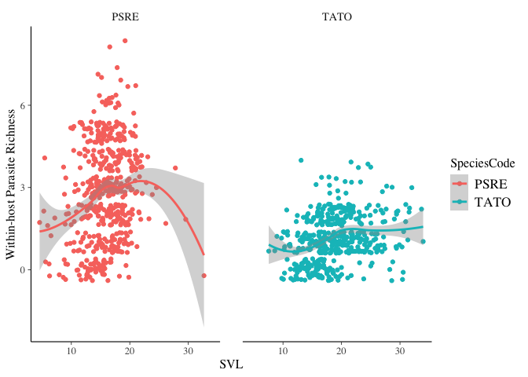

Based on this, I think I need to scale SVL (perhaps separately by species). It looks like parasite richness increases with SVL for frogs, but not for newts (or the slope is shallower). In addition, SVL is very correlated to time. Can we have both of these predictors? Maybe if we use the visitScaledSVL...

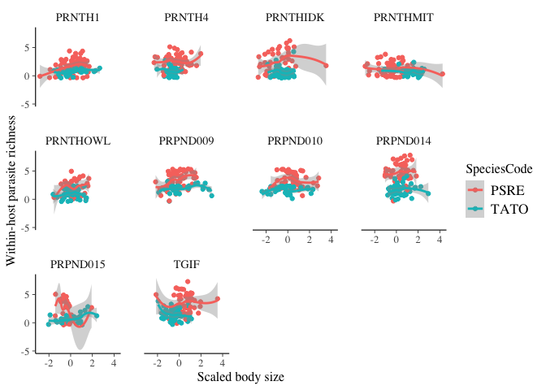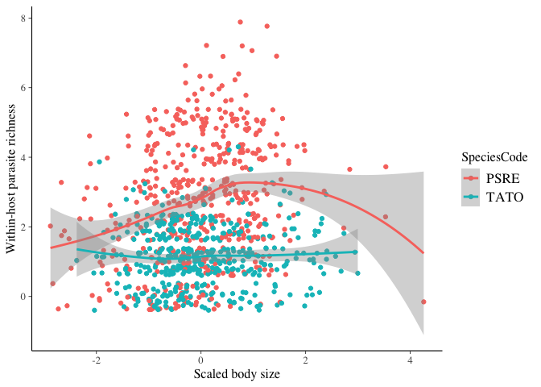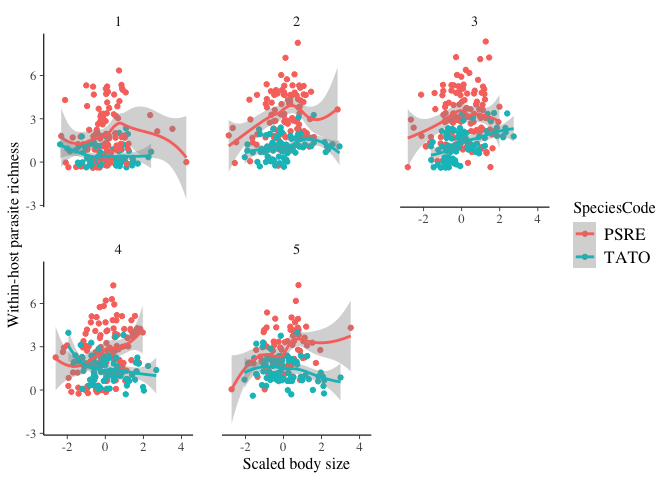

From these plots, I think that frogs have a positive relationship with scaled-body size. The earlier developing/bigger frogs tend to have more parasites. This doesn't look to be true for newts. There doesn't seem to be an interaction between size and visit (which was a main question for me). That is, it doesn't look like size is more important early in the summer.

### Plot 4: Pond location and parasite richness

Does location of a pond influence the parasite richness within individuals? Does importance of location change over time? 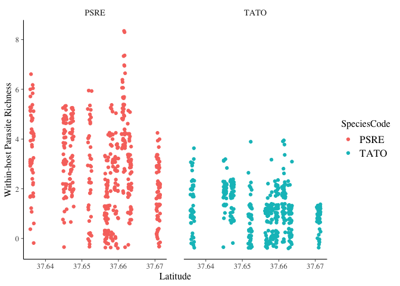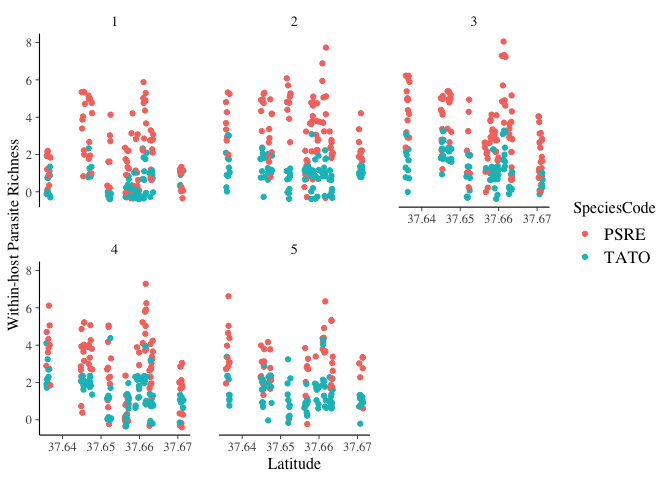

It seems like latitude does matter! The higher latitude sites seem to have fewer parasites.

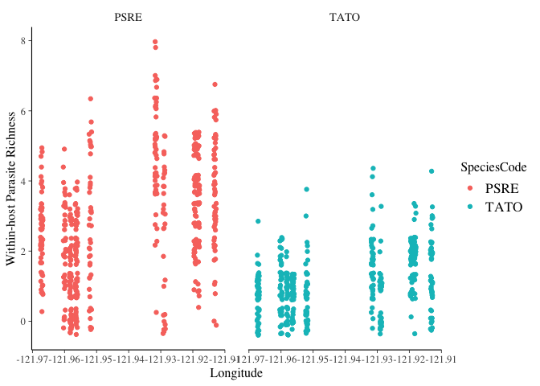

Not seeing as strong of a pattern with longitude.

Overall impressions from EDA
----------------------------

It seems like species, site location, and body size all influence the parasite richness within a host. I'm interested in which of these are most important and how they vary over time.

Model formulation
=================

Below is the model formulation for the most complex model I want to run. I think this may be in danger of overfitting, so I will trim from here.

Note: this is rendering weirdly in the knitted github document, and trying to fix it is giving knitting errors.

Overall model:

Parasite Richness ~ Species + Date + Date^2 + Species x Date + Species x Date^2 + Latitude + scaledSVL + Species x scaledSVL + (1|Site) + (1|Sample)

**Response Variable:** The response variable I want to model is within-host parasite richness (`tot.para`), which is Poisson-distributed count data.

**Hierarchical Structure:**

-   Pond level: the mean pond level parasite richness is predicted by `latitude` but also has a random component.

-   Sample level: the intercept for the sample-level mean is drawn randomly from the pond-level mean with fixed effect for `date` (parasite richness increases with date). The effect of date might need to be polynomial since it looks like it has a hump shape. In addition, there is a different effect of date for each species

-   Individual level: the individual-level richnesses are predicted by `species` (PSRE have more), `body size`, and the intercept is the sample-level mean.

(I'm still not sure how to format the greek symbols and subscripts here).

Individual level
----------------

At the individual level, parasite richness (*y*<sub>*i*</sub>) is Poisson distributed with an expected mean of *μ*<sub>*i*</sub>.

*Equation 1*: *y*<sub>*i*</sub> ~ Poisson(*μ*<sub>*i*</sub>)

The log(parasite richness) is predicted by individual-level covariates: species, scaled snout vent length, and interaction. Since the effect of visit is at the site-level, but it interacts with species, I believe that the interaction must go at this level too:

*Equation 2*: log(*μ*<sub>*i*</sub>) = *μ*<sub>*j*\[*i*\]</sub> + *β*<sub>1</sub>×species + *β*<sub>2</sub>×scaledSVL + *β*<sub>3</sub>×species×scaledSVL + *β*<sub>4</sub>×species×date + *β*<sub>5</sub>×species×date^2

Individual i's parasite load is predicted by the mean of the sample it came from \[j\] plus the fixed effects.

Sampling event level
--------------------

Each sampling event mean (*μ*<sub>*j*</sub>) can be predicted from a polynomial relationship with date, but varies by a random amount. The effect of date depends on species (which is why there is an interaction at the individual level).

The intercept represents the random parasite richness at sampling event j from site k.

*Equation 3*: *μ*<sub>*j*</sub> = *α*<sub>*j*\[*k*\]</sub> + *β*<sub>6</sub>×date + *β*<sub>7</sub>×date^2

The sample-level mean (*α*<sub>*j*</sub>) from site k is drawn randomly from the mean for that site (*γ*<sub>*k*</sub>)

*Equation 4* *α*<sub>*j*\[*k*\]</sub> ~ Normal(*μ*<sub>*γ*\[*k*\]</sub>, *σ*<sub>*α*</sub><sup>2</sup>)

Site level
----------

The expected mean for a site k is predicted by latitude

*Equation 5*: *μ*<sub>*γ*\[*k*\]</sub> = *γ*<sub>*k*</sub> + *β*<sub>8</sub>×latitude

The random effect for site k is drawn from the across-site average

*Equation 6*: *γ*<sub>*k*</sub> ~ Normal($\\bar{\\gamma}$, *σ*<sub>*γ*</sub><sup>2</sup>)

Fitting the model
=================

First, let's try this using `glmer`:

``` r
glmer.fit1 <- glmer(tot.para~visit*SpeciesCode + I(visit^2)*SpeciesCode +  SpeciesCode*visitScaledSVL + scale(Latitude) + (1|CollectionCode)+(1|SiteCode), data = dis, family = "poisson")
# convergence issues!
summary(glmer.fit1)
```

    ## Generalized linear mixed model fit by maximum likelihood (Laplace
    ##   Approximation) [glmerMod]
    ##  Family: poisson  ( log )
    ## Formula: 
    ## tot.para ~ visit * SpeciesCode + I(visit^2) * SpeciesCode + SpeciesCode *  
    ##     visitScaledSVL + scale(Latitude) + (1 | CollectionCode) +  
    ##     (1 | SiteCode)
    ##    Data: dis
    ## 
    ##      AIC      BIC   logLik deviance df.resid 
    ##   2832.6   2886.2  -1405.3   2810.6      948 
    ## 
    ## Scaled residuals: 
    ##      Min       1Q   Median       3Q      Max 
    ## -2.04697 -0.54494  0.00476  0.44568  2.74047 
    ## 
    ## Random effects:
    ##  Groups         Name        Variance Std.Dev.
    ##  CollectionCode (Intercept) 0.06649  0.2579  
    ##  SiteCode       (Intercept) 0.07925  0.2815  
    ## Number of obs: 959, groups:  CollectionCode, 48; SiteCode, 10
    ## 
    ## Fixed effects:
    ##                                  Estimate Std. Error z value Pr(>|z|)    
    ## (Intercept)                     0.0780662  0.2516406   0.310 0.756387    
    ## visit                           0.6339160  0.1754755   3.613 0.000303 ***
    ## SpeciesCodeTATO                -1.6663155  0.3338989  -4.990 6.02e-07 ***
    ## I(visit^2)                     -0.0962146  0.0288135  -3.339 0.000840 ***
    ## visitScaledSVL                  0.0691608  0.0310815   2.225 0.026072 *  
    ## scale(Latitude)                -0.1842095  0.1034996  -1.780 0.075107 .  
    ## visit:SpeciesCodeTATO           0.2803080  0.2252196   1.245 0.213279    
    ## SpeciesCodeTATO:I(visit^2)     -0.0123619  0.0347455  -0.356 0.722002    
    ## SpeciesCodeTATO:visitScaledSVL -0.0005771  0.0573420  -0.010 0.991971    
    ## ---
    ## Signif. codes:  0 '***' 0.001 '**' 0.01 '*' 0.05 '.' 0.1 ' ' 1
    ## 
    ## Correlation of Fixed Effects:
    ##             (Intr) visit  SpCTATO I(v^2) vsSSVL scl(L) v:SCTA SCTATO:I
    ## visit       -0.883                                                    
    ## SpecsCdTATO -0.249  0.248                                             
    ## I(visit^2)   0.816 -0.979 -0.232                                      
    ## vistScldSVL -0.005 -0.005  0.014   0.006                              
    ## scale(Lttd)  0.017 -0.009 -0.008   0.010  0.023                       
    ## vst:SpCTATO  0.254 -0.281 -0.957   0.279 -0.001  0.008                
    ## SCTATO:I(^2 -0.250  0.294  0.893  -0.304  0.001 -0.009 -0.982         
    ## SCTATO:SSVL  0.001  0.004  0.007  -0.005 -0.565 -0.031 -0.024  0.028  
    ## convergence code: 0
    ## Model failed to converge with max|grad| = 0.05173 (tol = 0.001, component 1)

Stan formulation
----------------

### Model fit 1: full model

``` r
stan.fit.1 <- stan_glmer(tot.para ~ visit*SpeciesCode + I(visit^2)*SpeciesCode + SpeciesCode*visitScaledSVL + scale(Latitude) + (1|CollectionCode)+ (1|SiteCode), data = dis,  family = "poisson")
saveRDS(stan.fit.1, "stan.fit.1.rds")
```

### Model fit 1: output

``` r
stan.fit.1 <- readRDS("stan.fit.1.rds")
stan.fit.1.samp <- sample(stan.fit.1)
print(summary(stan.fit.1)[,c(1,3,9,10)],digits=3)
```

    ##                                                      mean     sd n_eff
    ## (Intercept)                                      5.29e-02 0.2824  2159
    ## visit                                            6.45e-01 0.1895  1912
    ## SpeciesCodeTATO                                 -1.64e+00 0.3294  2111
    ## I(visit^2)                                      -9.75e-02 0.0309  1874
    ## visitScaledSVL                                   6.83e-02 0.0305  4748
    ## scale(Latitude)                                 -1.82e-01 0.1388  2224
    ## visit:SpeciesCodeTATO                            2.62e-01 0.2215  1945
    ## SpeciesCodeTATO:I(visit^2)                      -9.72e-03 0.0342  1974
    ## SpeciesCodeTATO:visitScaledSVL                  -2.46e-05 0.0574  4677
    ## b[(Intercept) CollectionCode:PRNTH1_20170516]   -2.64e-01 0.2307  4664
    ## b[(Intercept) CollectionCode:PRNTH1_20170608]    2.57e-01 0.1928  4445
    ## b[(Intercept) CollectionCode:PRNTH1_20170629]   -3.81e-02 0.1805  3970
    ## b[(Intercept) CollectionCode:PRNTH1_20170719]   -1.78e-01 0.1820  4555
    ## b[(Intercept) CollectionCode:PRNTH1_20170812]    9.43e-02 0.1974  4595
    ## b[(Intercept) CollectionCode:PRNTH4_20170513]    2.41e-01 0.1991  3697
    ## b[(Intercept) CollectionCode:PRNTH4_20170607]   -9.06e-02 0.1878  4357
    ## b[(Intercept) CollectionCode:PRNTH4_20170629]   -1.60e-01 0.1799  3464
    ## b[(Intercept) CollectionCode:PRNTH4_20170719]   -9.91e-02 0.1695  3818
    ## b[(Intercept) CollectionCode:PRNTH4_20170812]    1.69e-01 0.1840  3979
    ## b[(Intercept) CollectionCode:PRNTHIDK_20170513] -2.03e-01 0.2118  5007
    ## b[(Intercept) CollectionCode:PRNTHIDK_20170607]  4.29e-01 0.1740  3849
    ## b[(Intercept) CollectionCode:PRNTHIDK_20170629] -1.51e-01 0.1862  4199
    ## b[(Intercept) CollectionCode:PRNTHIDK_20170719] -7.21e-02 0.1741  4372
    ## b[(Intercept) CollectionCode:PRNTHIDK_20170812] -9.99e-02 0.2163  4662
    ## b[(Intercept) CollectionCode:PRNTHMIT_20170513]  3.27e-02 0.2168  4544
    ## b[(Intercept) CollectionCode:PRNTHMIT_20170607]  8.36e-02 0.2071  4580
    ## b[(Intercept) CollectionCode:PRNTHMIT_20170629] -8.71e-02 0.2179  4193
    ## b[(Intercept) CollectionCode:PRNTHMIT_20170719] -5.87e-01 0.2189  2594
    ## b[(Intercept) CollectionCode:PRNTHMIT_20170812]  1.80e-01 0.1995  4003
    ## b[(Intercept) CollectionCode:PRNTHOWL_20170513] -3.92e-01 0.2266  4427
    ## b[(Intercept) CollectionCode:PRNTHOWL_20170607]  1.98e-01 0.1855  4456
    ## b[(Intercept) CollectionCode:PRNTHOWL_20170629] -1.87e-01 0.1821  4119
    ## b[(Intercept) CollectionCode:PRNTHOWL_20170719]  1.34e-01 0.1883  4469
    ## b[(Intercept) CollectionCode:PRNTHOWL_20170812]  2.03e-01 0.2182  4561
    ## b[(Intercept) CollectionCode:PRPND009_20170516]  2.52e-01 0.1915  3328
    ## b[(Intercept) CollectionCode:PRPND009_20170606]  1.45e-01 0.1672  3245
    ## b[(Intercept) CollectionCode:PRPND009_20170628] -2.19e-02 0.1696  2891
    ## b[(Intercept) CollectionCode:PRPND009_20170718] -1.47e-01 0.1602  3057
    ## b[(Intercept) CollectionCode:PRPND009_20170812] -9.64e-02 0.1841  3430
    ## b[(Intercept) CollectionCode:PRPND010_20170516]  2.73e-01 0.1937  3566
    ## b[(Intercept) CollectionCode:PRPND010_20170606] -1.21e-01 0.1727  3513
    ## b[(Intercept) CollectionCode:PRPND010_20170628]  9.44e-02 0.1671  3501
    ## b[(Intercept) CollectionCode:PRPND010_20170718] -2.46e-02 0.1683  3890
    ## b[(Intercept) CollectionCode:PRPND010_20170812] -1.14e-01 0.1873  3643
    ## b[(Intercept) CollectionCode:PRPND014_20170514]  2.39e-01 0.1969  2529
    ## b[(Intercept) CollectionCode:PRPND014_20170606]  3.03e-02 0.1770  2359
    ## b[(Intercept) CollectionCode:PRPND014_20170628]  1.01e-01 0.1731  2525
    ## b[(Intercept) CollectionCode:PRPND014_20170718]  3.65e-03 0.1701  2588
    ## b[(Intercept) CollectionCode:PRPND014_20170812]  5.73e-02 0.1827  2524
    ## b[(Intercept) CollectionCode:PRPND015_20170514] -4.48e-01 0.2303  4064
    ## b[(Intercept) CollectionCode:PRPND015_20170606]  3.59e-01 0.1977  3693
    ## b[(Intercept) CollectionCode:PRPND015_20170628]  7.11e-02 0.1940  4059
    ## b[(Intercept) CollectionCode:TGIF_20170516]     -3.41e-01 0.2073  4022
    ## b[(Intercept) CollectionCode:TGIF_20170606]      5.09e-02 0.1701  3806
    ## b[(Intercept) CollectionCode:TGIF_20170628]      6.77e-02 0.1621  3020
    ## b[(Intercept) CollectionCode:TGIF_20170718]      7.85e-02 0.1622  3147
    ## b[(Intercept) CollectionCode:TGIF_20170812]      1.03e-01 0.1821  3072
    ## b[(Intercept) SiteCode:PRNTH1]                  -1.52e-01 0.2656  2303
    ## b[(Intercept) SiteCode:PRNTH4]                   7.19e-02 0.2033  2386
    ## b[(Intercept) SiteCode:PRNTHIDK]                -1.21e-01 0.1803  2713
    ## b[(Intercept) SiteCode:PRNTHMIT]                -4.95e-01 0.1976  2528
    ## b[(Intercept) SiteCode:PRNTHOWL]                -4.07e-02 0.1874  2717
    ## b[(Intercept) SiteCode:PRPND009]                 1.58e-01 0.2112  2182
    ## b[(Intercept) SiteCode:PRPND010]                 1.29e-01 0.2013  2297
    ## b[(Intercept) SiteCode:PRPND014]                 5.78e-01 0.2005  2006
    ## b[(Intercept) SiteCode:PRPND015]                -3.05e-02 0.2038  2924
    ## b[(Intercept) SiteCode:TGIF]                    -7.38e-02 0.2895  2314
    ## Sigma[CollectionCode:(Intercept),(Intercept)]    8.32e-02 0.0311  1465
    ## Sigma[SiteCode:(Intercept),(Intercept)]          1.51e-01 0.1140  1835
    ## mean_PPD                                         2.02e+00 0.0628  3901
    ## log-posterior                                   -1.47e+03 7.7575  1009
    ##                                                  Rhat
    ## (Intercept)                                     1.000
    ## visit                                           1.000
    ## SpeciesCodeTATO                                 1.002
    ## I(visit^2)                                      1.000
    ## visitScaledSVL                                  0.999
    ## scale(Latitude)                                 1.000
    ## visit:SpeciesCodeTATO                           1.002
    ## SpeciesCodeTATO:I(visit^2)                      1.001
    ## SpeciesCodeTATO:visitScaledSVL                  1.000
    ## b[(Intercept) CollectionCode:PRNTH1_20170516]   1.000
    ## b[(Intercept) CollectionCode:PRNTH1_20170608]   1.000
    ## b[(Intercept) CollectionCode:PRNTH1_20170629]   1.001
    ## b[(Intercept) CollectionCode:PRNTH1_20170719]   1.000
    ## b[(Intercept) CollectionCode:PRNTH1_20170812]   1.000
    ## b[(Intercept) CollectionCode:PRNTH4_20170513]   1.000
    ## b[(Intercept) CollectionCode:PRNTH4_20170607]   1.000
    ## b[(Intercept) CollectionCode:PRNTH4_20170629]   0.999
    ## b[(Intercept) CollectionCode:PRNTH4_20170719]   1.000
    ## b[(Intercept) CollectionCode:PRNTH4_20170812]   0.999
    ## b[(Intercept) CollectionCode:PRNTHIDK_20170513] 1.000
    ## b[(Intercept) CollectionCode:PRNTHIDK_20170607] 1.000
    ## b[(Intercept) CollectionCode:PRNTHIDK_20170629] 1.000
    ## b[(Intercept) CollectionCode:PRNTHIDK_20170719] 1.000
    ## b[(Intercept) CollectionCode:PRNTHIDK_20170812] 1.000
    ## b[(Intercept) CollectionCode:PRNTHMIT_20170513] 1.000
    ## b[(Intercept) CollectionCode:PRNTHMIT_20170607] 1.000
    ## b[(Intercept) CollectionCode:PRNTHMIT_20170629] 1.000
    ## b[(Intercept) CollectionCode:PRNTHMIT_20170719] 1.000
    ## b[(Intercept) CollectionCode:PRNTHMIT_20170812] 1.001
    ## b[(Intercept) CollectionCode:PRNTHOWL_20170513] 1.000
    ## b[(Intercept) CollectionCode:PRNTHOWL_20170607] 1.000
    ## b[(Intercept) CollectionCode:PRNTHOWL_20170629] 1.000
    ## b[(Intercept) CollectionCode:PRNTHOWL_20170719] 1.000
    ## b[(Intercept) CollectionCode:PRNTHOWL_20170812] 1.000
    ## b[(Intercept) CollectionCode:PRPND009_20170516] 1.000
    ## b[(Intercept) CollectionCode:PRPND009_20170606] 1.000
    ## b[(Intercept) CollectionCode:PRPND009_20170628] 1.000
    ## b[(Intercept) CollectionCode:PRPND009_20170718] 1.000
    ## b[(Intercept) CollectionCode:PRPND009_20170812] 1.000
    ## b[(Intercept) CollectionCode:PRPND010_20170516] 1.000
    ## b[(Intercept) CollectionCode:PRPND010_20170606] 1.000
    ## b[(Intercept) CollectionCode:PRPND010_20170628] 1.000
    ## b[(Intercept) CollectionCode:PRPND010_20170718] 1.000
    ## b[(Intercept) CollectionCode:PRPND010_20170812] 1.000
    ## b[(Intercept) CollectionCode:PRPND014_20170514] 1.001
    ## b[(Intercept) CollectionCode:PRPND014_20170606] 1.000
    ## b[(Intercept) CollectionCode:PRPND014_20170628] 1.000
    ## b[(Intercept) CollectionCode:PRPND014_20170718] 1.001
    ## b[(Intercept) CollectionCode:PRPND014_20170812] 1.001
    ## b[(Intercept) CollectionCode:PRPND015_20170514] 1.000
    ## b[(Intercept) CollectionCode:PRPND015_20170606] 1.001
    ## b[(Intercept) CollectionCode:PRPND015_20170628] 1.000
    ## b[(Intercept) CollectionCode:TGIF_20170516]     1.000
    ## b[(Intercept) CollectionCode:TGIF_20170606]     1.000
    ## b[(Intercept) CollectionCode:TGIF_20170628]     1.000
    ## b[(Intercept) CollectionCode:TGIF_20170718]     1.000
    ## b[(Intercept) CollectionCode:TGIF_20170812]     1.001
    ## b[(Intercept) SiteCode:PRNTH1]                  1.000
    ## b[(Intercept) SiteCode:PRNTH4]                  1.000
    ## b[(Intercept) SiteCode:PRNTHIDK]                1.000
    ## b[(Intercept) SiteCode:PRNTHMIT]                1.001
    ## b[(Intercept) SiteCode:PRNTHOWL]                1.002
    ## b[(Intercept) SiteCode:PRPND009]                1.000
    ## b[(Intercept) SiteCode:PRPND010]                1.001
    ## b[(Intercept) SiteCode:PRPND014]                1.000
    ## b[(Intercept) SiteCode:PRPND015]                1.000
    ## b[(Intercept) SiteCode:TGIF]                    1.001
    ## Sigma[CollectionCode:(Intercept),(Intercept)]   1.001
    ## Sigma[SiteCode:(Intercept),(Intercept)]         1.001
    ## mean_PPD                                        1.000
    ## log-posterior                                   1.006

``` r
ci95 <- posterior_interval(stan.fit.1, prob = 0.95)
round(ci95, 2)[1:9,]
```

    ##                                 2.5% 97.5%
    ## (Intercept)                    -0.51  0.60
    ## visit                           0.27  1.02
    ## SpeciesCodeTATO                -2.30 -1.00
    ## I(visit^2)                     -0.16 -0.04
    ## visitScaledSVL                  0.01  0.13
    ## scale(Latitude)                -0.46  0.10
    ## visit:SpeciesCodeTATO          -0.17  0.70
    ## SpeciesCodeTATO:I(visit^2)     -0.08  0.06
    ## SpeciesCodeTATO:visitScaledSVL -0.12  0.11

``` r
# interaction terms don't seem specific
cov2cor(vcov(stan.fit.1))
```

    ##                                 (Intercept)       visit SpeciesCodeTATO
    ## (Intercept)                     1.000000000 -0.85377691    -0.202343607
    ## visit                          -0.853776915  1.00000000     0.209752351
    ## SpeciesCodeTATO                -0.202343607  0.20975235     1.000000000
    ## I(visit^2)                      0.789252239 -0.97960644    -0.193773964
    ## visitScaledSVL                  0.018749741 -0.04046628    -0.003087883
    ## scale(Latitude)                -0.006638806  0.01118343    -0.007424777
    ## visit:SpeciesCodeTATO           0.211247258 -0.24243191    -0.954202778
    ## SpeciesCodeTATO:I(visit^2)     -0.208379672  0.25456654     0.886300717
    ## SpeciesCodeTATO:visitScaledSVL -0.023419893  0.03089714     0.023490814
    ##                                  I(visit^2) visitScaledSVL scale(Latitude)
    ## (Intercept)                     0.789252239    0.018749741    -0.006638806
    ## visit                          -0.979606438   -0.040466278     0.011183427
    ## SpeciesCodeTATO                -0.193773964   -0.003087883    -0.007424777
    ## I(visit^2)                      1.000000000    0.038166396    -0.003388045
    ## visitScaledSVL                  0.038166396    1.000000000     0.002932109
    ## scale(Latitude)                -0.003388045    0.002932109     1.000000000
    ## visit:SpeciesCodeTATO           0.239135730    0.014943395     0.017521632
    ## SpeciesCodeTATO:I(visit^2)     -0.263543090   -0.011433775    -0.023547164
    ## SpeciesCodeTATO:visitScaledSVL -0.028138942   -0.544910796    -0.020337780
    ##                                visit:SpeciesCodeTATO
    ## (Intercept)                               0.21124726
    ## visit                                    -0.24243191
    ## SpeciesCodeTATO                          -0.95420278
    ## I(visit^2)                                0.23913573
    ## visitScaledSVL                            0.01494340
    ## scale(Latitude)                           0.01752163
    ## visit:SpeciesCodeTATO                     1.00000000
    ## SpeciesCodeTATO:I(visit^2)               -0.98069040
    ## SpeciesCodeTATO:visitScaledSVL           -0.04552814
    ##                                SpeciesCodeTATO:I(visit^2)
    ## (Intercept)                                   -0.20837967
    ## visit                                          0.25456654
    ## SpeciesCodeTATO                                0.88630072
    ## I(visit^2)                                    -0.26354309
    ## visitScaledSVL                                -0.01143378
    ## scale(Latitude)                               -0.02354716
    ## visit:SpeciesCodeTATO                         -0.98069040
    ## SpeciesCodeTATO:I(visit^2)                     1.00000000
    ## SpeciesCodeTATO:visitScaledSVL                 0.05233792
    ##                                SpeciesCodeTATO:visitScaledSVL
    ## (Intercept)                                       -0.02341989
    ## visit                                              0.03089714
    ## SpeciesCodeTATO                                    0.02349081
    ## I(visit^2)                                        -0.02813894
    ## visitScaledSVL                                    -0.54491080
    ## scale(Latitude)                                   -0.02033778
    ## visit:SpeciesCodeTATO                             -0.04552814
    ## SpeciesCodeTATO:I(visit^2)                         0.05233792
    ## SpeciesCodeTATO:visitScaledSVL                     1.00000000

``` r
# some high correlations with interaction terms
samples <- extract(stan.fit.1$stanfit)
```

Posterior plots:

``` r
samplesdf <- data.frame(samples$alpha,samples$beta)
names(samplesdf) <- c("alpha", "beta 1: visit", "beta 2: species", "beta 3: visit^2",
                      "beta 4: scaled SVL", "beta 5: latitude", "beta 6: visit x species",
                      "beta 7: species x visit^2", "beta 8: species x scaled SVL")
samplesdf %>% 
    gather(key = "parameter", value = "sample") %>%
    ggplot() +
    geom_histogram(mapping = aes(x=sample,y=stat(density), fill = parameter),
                   bins=75, colour = "black", lwd =.1) +
    geom_vline(xintercept = 0, colour = "red")+
    facet_wrap(facets = ~ parameter,scales="free")+
    guides(fill= FALSE)
```

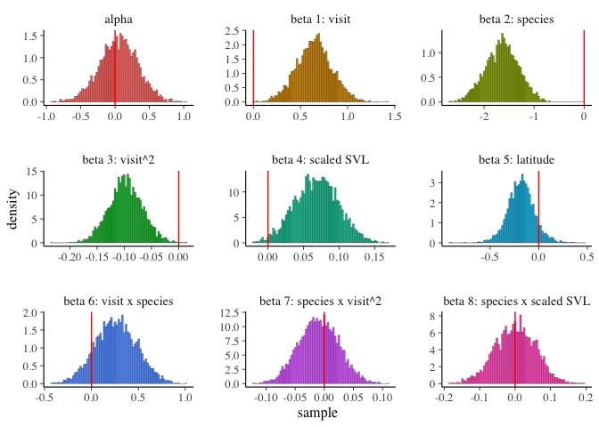

The posteriors look pretty good in terms of shape (not bimodal). The interaction terms do not seem significant (overlap 0 quite a bit).

### Model fit 2: reduced model without 2nd order interaction visit x species

Get rid of the 2nd order interaction term (visit ^2 x species). I'm not totally sure if it's ok to remove one of the interaction terms but not the other (visit x species).

``` r
stan.fit.2 <- stan_glmer(tot.para ~ visit*SpeciesCode + I(visit^2) + SpeciesCode*visitScaledSVL + scale(Latitude) + (1|CollectionCode)+ (1|SiteCode), data = dis,  family = "poisson")
saveRDS(stan.fit.2, "stan.fit.2.rds")
```

``` r
stan.fit.2 <- readRDS("stan.fit.2.rds")
stan.fit.2.samp <- sample(stan.fit.2)
print(summary(stan.fit.2)[,c(1,3,9,10)],digits=3)
```

    ##                                                      mean     sd n_eff
    ## (Intercept)                                      4.41e-02 0.2668  1730
    ## visit                                            6.48e-01 0.1771  1438
    ## SpeciesCodeTATO                                 -1.56e+00 0.1530  2515
    ## I(visit^2)                                      -9.80e-02 0.0290  1381
    ## visitScaledSVL                                   6.79e-02 0.0306  3582
    ## scale(Latitude)                                 -1.83e-01 0.1362  1345
    ## visit:SpeciesCodeTATO                            2.00e-01 0.0431  2618
    ## SpeciesCodeTATO:visitScaledSVL                   1.31e-03 0.0565  3635
    ## b[(Intercept) CollectionCode:PRNTH1_20170516]   -2.67e-01 0.2247  3366
    ## b[(Intercept) CollectionCode:PRNTH1_20170608]    2.58e-01 0.1848  3329
    ## b[(Intercept) CollectionCode:PRNTH1_20170629]   -3.72e-02 0.1810  3215
    ## b[(Intercept) CollectionCode:PRNTH1_20170719]   -1.79e-01 0.1843  3341
    ## b[(Intercept) CollectionCode:PRNTH1_20170812]    8.64e-02 0.1975  2752
    ## b[(Intercept) CollectionCode:PRNTH4_20170513]    2.41e-01 0.2036  2835
    ## b[(Intercept) CollectionCode:PRNTH4_20170607]   -8.71e-02 0.1925  3310
    ## b[(Intercept) CollectionCode:PRNTH4_20170629]   -1.59e-01 0.1778  2527
    ## b[(Intercept) CollectionCode:PRNTH4_20170719]   -9.64e-02 0.1709  2599
    ## b[(Intercept) CollectionCode:PRNTH4_20170812]    1.65e-01 0.1905  2575
    ## b[(Intercept) CollectionCode:PRNTHIDK_20170513] -1.99e-01 0.2088  3402
    ## b[(Intercept) CollectionCode:PRNTHIDK_20170607]  4.27e-01 0.1796  3399
    ## b[(Intercept) CollectionCode:PRNTHIDK_20170629] -1.56e-01 0.1859  3167
    ## b[(Intercept) CollectionCode:PRNTHIDK_20170719] -7.50e-02 0.1730  2877
    ## b[(Intercept) CollectionCode:PRNTHIDK_20170812] -1.08e-01 0.2197  3541
    ## b[(Intercept) CollectionCode:PRNTHMIT_20170513]  2.68e-02 0.2173  3141
    ## b[(Intercept) CollectionCode:PRNTHMIT_20170607]  7.64e-02 0.2019  3358
    ## b[(Intercept) CollectionCode:PRNTHMIT_20170629] -8.56e-02 0.2104  3186
    ## b[(Intercept) CollectionCode:PRNTHMIT_20170719] -5.84e-01 0.2242  2414
    ## b[(Intercept) CollectionCode:PRNTHMIT_20170812]  1.73e-01 0.2029  2735
    ## b[(Intercept) CollectionCode:PRNTHOWL_20170513] -3.87e-01 0.2233  3349
    ## b[(Intercept) CollectionCode:PRNTHOWL_20170607]  2.04e-01 0.1839  3400
    ## b[(Intercept) CollectionCode:PRNTHOWL_20170629] -1.76e-01 0.1836  3151
    ## b[(Intercept) CollectionCode:PRNTHOWL_20170719]  1.44e-01 0.1926  3616
    ## b[(Intercept) CollectionCode:PRNTHOWL_20170812]  2.02e-01 0.2131  3879
    ## b[(Intercept) CollectionCode:PRPND009_20170516]  2.46e-01 0.1949  2816
    ## b[(Intercept) CollectionCode:PRPND009_20170606]  1.38e-01 0.1686  2566
    ## b[(Intercept) CollectionCode:PRPND009_20170628] -2.32e-02 0.1686  2332
    ## b[(Intercept) CollectionCode:PRPND009_20170718] -1.55e-01 0.1646  2605
    ## b[(Intercept) CollectionCode:PRPND009_20170812] -1.13e-01 0.1857  2598
    ## b[(Intercept) CollectionCode:PRPND010_20170516]  2.66e-01 0.1922  2933
    ## b[(Intercept) CollectionCode:PRPND010_20170606] -1.22e-01 0.1768  2977
    ## b[(Intercept) CollectionCode:PRPND010_20170628]  9.29e-02 0.1656  2351
    ## b[(Intercept) CollectionCode:PRPND010_20170718] -2.56e-02 0.1663  3242
    ## b[(Intercept) CollectionCode:PRPND010_20170812] -1.21e-01 0.1854  2998
    ## b[(Intercept) CollectionCode:PRPND014_20170514]  2.37e-01 0.1963  2224
    ## b[(Intercept) CollectionCode:PRPND014_20170606]  3.45e-02 0.1771  2123
    ## b[(Intercept) CollectionCode:PRPND014_20170628]  1.03e-01 0.1721  1908
    ## b[(Intercept) CollectionCode:PRPND014_20170718]  8.60e-03 0.1673  2012
    ## b[(Intercept) CollectionCode:PRPND014_20170812]  5.62e-02 0.1857  2384
    ## b[(Intercept) CollectionCode:PRPND015_20170514] -4.55e-01 0.2350  3271
    ## b[(Intercept) CollectionCode:PRPND015_20170606]  3.58e-01 0.1969  2654
    ## b[(Intercept) CollectionCode:PRPND015_20170628]  6.61e-02 0.1939  2581
    ## b[(Intercept) CollectionCode:TGIF_20170516]     -3.46e-01 0.2059  3744
    ## b[(Intercept) CollectionCode:TGIF_20170606]      4.62e-02 0.1668  2741
    ## b[(Intercept) CollectionCode:TGIF_20170628]      6.99e-02 0.1596  2225
    ## b[(Intercept) CollectionCode:TGIF_20170718]      7.83e-02 0.1627  2636
    ## b[(Intercept) CollectionCode:TGIF_20170812]      9.18e-02 0.1827  2275
    ## b[(Intercept) SiteCode:PRNTH1]                  -1.47e-01 0.2672  1412
    ## b[(Intercept) SiteCode:PRNTH4]                   7.53e-02 0.2071  1523
    ## b[(Intercept) SiteCode:PRNTHIDK]                -1.16e-01 0.1801  1728
    ## b[(Intercept) SiteCode:PRNTHMIT]                -4.91e-01 0.1981  1720
    ## b[(Intercept) SiteCode:PRNTHOWL]                -4.28e-02 0.1905  1689
    ## b[(Intercept) SiteCode:PRPND009]                 1.71e-01 0.2074  1547
    ## b[(Intercept) SiteCode:PRPND010]                 1.38e-01 0.1999  1545
    ## b[(Intercept) SiteCode:PRPND014]                 5.81e-01 0.2059  1187
    ## b[(Intercept) SiteCode:PRPND015]                -2.22e-02 0.2008  1822
    ## b[(Intercept) SiteCode:TGIF]                    -6.65e-02 0.2790  1516
    ## Sigma[CollectionCode:(Intercept),(Intercept)]    8.31e-02 0.0323  1278
    ## Sigma[SiteCode:(Intercept),(Intercept)]          1.52e-01 0.1181  1191
    ## mean_PPD                                         2.02e+00 0.0648  4129
    ## log-posterior                                   -1.47e+03 7.9331   977
    ##                                                  Rhat
    ## (Intercept)                                     1.001
    ## visit                                           1.000
    ## SpeciesCodeTATO                                 1.001
    ## I(visit^2)                                      1.000
    ## visitScaledSVL                                  0.999
    ## scale(Latitude)                                 1.000
    ## visit:SpeciesCodeTATO                           1.001
    ## SpeciesCodeTATO:visitScaledSVL                  0.999
    ## b[(Intercept) CollectionCode:PRNTH1_20170516]   0.999
    ## b[(Intercept) CollectionCode:PRNTH1_20170608]   1.000
    ## b[(Intercept) CollectionCode:PRNTH1_20170629]   0.999
    ## b[(Intercept) CollectionCode:PRNTH1_20170719]   1.000
    ## b[(Intercept) CollectionCode:PRNTH1_20170812]   1.000
    ## b[(Intercept) CollectionCode:PRNTH4_20170513]   1.000
    ## b[(Intercept) CollectionCode:PRNTH4_20170607]   1.000
    ## b[(Intercept) CollectionCode:PRNTH4_20170629]   1.000
    ## b[(Intercept) CollectionCode:PRNTH4_20170719]   1.001
    ## b[(Intercept) CollectionCode:PRNTH4_20170812]   1.001
    ## b[(Intercept) CollectionCode:PRNTHIDK_20170513] 1.001
    ## b[(Intercept) CollectionCode:PRNTHIDK_20170607] 1.001
    ## b[(Intercept) CollectionCode:PRNTHIDK_20170629] 1.000
    ## b[(Intercept) CollectionCode:PRNTHIDK_20170719] 1.001
    ## b[(Intercept) CollectionCode:PRNTHIDK_20170812] 1.000
    ## b[(Intercept) CollectionCode:PRNTHMIT_20170513] 1.001
    ## b[(Intercept) CollectionCode:PRNTHMIT_20170607] 0.999
    ## b[(Intercept) CollectionCode:PRNTHMIT_20170629] 1.000
    ## b[(Intercept) CollectionCode:PRNTHMIT_20170719] 1.000
    ## b[(Intercept) CollectionCode:PRNTHMIT_20170812] 1.000
    ## b[(Intercept) CollectionCode:PRNTHOWL_20170513] 1.000
    ## b[(Intercept) CollectionCode:PRNTHOWL_20170607] 1.001
    ## b[(Intercept) CollectionCode:PRNTHOWL_20170629] 1.001
    ## b[(Intercept) CollectionCode:PRNTHOWL_20170719] 1.000
    ## b[(Intercept) CollectionCode:PRNTHOWL_20170812] 1.001
    ## b[(Intercept) CollectionCode:PRPND009_20170516] 1.000
    ## b[(Intercept) CollectionCode:PRPND009_20170606] 1.000
    ## b[(Intercept) CollectionCode:PRPND009_20170628] 1.000
    ## b[(Intercept) CollectionCode:PRPND009_20170718] 1.000
    ## b[(Intercept) CollectionCode:PRPND009_20170812] 1.000
    ## b[(Intercept) CollectionCode:PRPND010_20170516] 1.000
    ## b[(Intercept) CollectionCode:PRPND010_20170606] 1.000
    ## b[(Intercept) CollectionCode:PRPND010_20170628] 1.000
    ## b[(Intercept) CollectionCode:PRPND010_20170718] 1.000
    ## b[(Intercept) CollectionCode:PRPND010_20170812] 1.000
    ## b[(Intercept) CollectionCode:PRPND014_20170514] 1.001
    ## b[(Intercept) CollectionCode:PRPND014_20170606] 1.000
    ## b[(Intercept) CollectionCode:PRPND014_20170628] 1.000
    ## b[(Intercept) CollectionCode:PRPND014_20170718] 1.000
    ## b[(Intercept) CollectionCode:PRPND014_20170812] 1.000
    ## b[(Intercept) CollectionCode:PRPND015_20170514] 1.000
    ## b[(Intercept) CollectionCode:PRPND015_20170606] 1.000
    ## b[(Intercept) CollectionCode:PRPND015_20170628] 1.001
    ## b[(Intercept) CollectionCode:TGIF_20170516]     1.000
    ## b[(Intercept) CollectionCode:TGIF_20170606]     1.000
    ## b[(Intercept) CollectionCode:TGIF_20170628]     1.000
    ## b[(Intercept) CollectionCode:TGIF_20170718]     1.000
    ## b[(Intercept) CollectionCode:TGIF_20170812]     1.000
    ## b[(Intercept) SiteCode:PRNTH1]                  1.000
    ## b[(Intercept) SiteCode:PRNTH4]                  1.000
    ## b[(Intercept) SiteCode:PRNTHIDK]                1.001
    ## b[(Intercept) SiteCode:PRNTHMIT]                1.001
    ## b[(Intercept) SiteCode:PRNTHOWL]                1.002
    ## b[(Intercept) SiteCode:PRPND009]                1.001
    ## b[(Intercept) SiteCode:PRPND010]                1.000
    ## b[(Intercept) SiteCode:PRPND014]                1.000
    ## b[(Intercept) SiteCode:PRPND015]                1.001
    ## b[(Intercept) SiteCode:TGIF]                    1.001
    ## Sigma[CollectionCode:(Intercept),(Intercept)]   1.001
    ## Sigma[SiteCode:(Intercept),(Intercept)]         1.001
    ## mean_PPD                                        0.999
    ## log-posterior                                   1.001

``` r
ci95 <- posterior_interval(stan.fit.2, prob = 0.95)
round(ci95, 2)[1:8,]
```

    ##                                 2.5% 97.5%
    ## (Intercept)                    -0.48  0.56
    ## visit                           0.30  1.00
    ## SpeciesCodeTATO                -1.85 -1.26
    ## I(visit^2)                     -0.16 -0.04
    ## visitScaledSVL                  0.01  0.13
    ## scale(Latitude)                -0.45  0.10
    ## visit:SpeciesCodeTATO           0.11  0.28
    ## SpeciesCodeTATO:visitScaledSVL -0.11  0.11

``` r
cov2cor(vcov(stan.fit.2))
```

    ##                                (Intercept)       visit SpeciesCodeTATO
    ## (Intercept)                     1.00000000 -0.83374408     -0.05460880
    ## visit                          -0.83374408  1.00000000     -0.03400184
    ## SpeciesCodeTATO                -0.05460880 -0.03400184      1.00000000
    ## I(visit^2)                      0.76051278 -0.97622797      0.09381997
    ## visitScaledSVL                 -0.05253340  0.03155024      0.05497581
    ## scale(Latitude)                 0.02474623  0.01186960     -0.01416039
    ## visit:SpeciesCodeTATO           0.04732215  0.03774118     -0.93668755
    ## SpeciesCodeTATO:visitScaledSVL  0.04049677 -0.01025227     -0.07265224
    ##                                  I(visit^2) visitScaledSVL scale(Latitude)
    ## (Intercept)                     0.760512782    -0.05253340      0.02474623
    ## visit                          -0.976227973     0.03155024      0.01186960
    ## SpeciesCodeTATO                 0.093819967     0.05497581     -0.01416039
    ## I(visit^2)                      1.000000000    -0.01863936     -0.01044667
    ## visitScaledSVL                 -0.018639364     1.00000000      0.01517951
    ## scale(Latitude)                -0.010446668     0.01517951      1.00000000
    ## visit:SpeciesCodeTATO          -0.107040592    -0.03343378      0.01496601
    ## SpeciesCodeTATO:visitScaledSVL -0.002582579    -0.58670078     -0.01034459
    ##                                visit:SpeciesCodeTATO
    ## (Intercept)                               0.04732215
    ## visit                                     0.03774118
    ## SpeciesCodeTATO                          -0.93668755
    ## I(visit^2)                               -0.10704059
    ## visitScaledSVL                           -0.03343378
    ## scale(Latitude)                           0.01496601
    ## visit:SpeciesCodeTATO                     1.00000000
    ## SpeciesCodeTATO:visitScaledSVL            0.05415386
    ##                                SpeciesCodeTATO:visitScaledSVL
    ## (Intercept)                                       0.040496771
    ## visit                                            -0.010252267
    ## SpeciesCodeTATO                                  -0.072652236
    ## I(visit^2)                                       -0.002582579
    ## visitScaledSVL                                   -0.586700777
    ## scale(Latitude)                                  -0.010344595
    ## visit:SpeciesCodeTATO                             0.054153861
    ## SpeciesCodeTATO:visitScaledSVL                    1.000000000

``` r
samples2 <- extract(stan.fit.2$stanfit)
```

### Model fit 3: reduced model without 2nd order interaction and without species x SVL interaction

``` r
stan.fit.3 <- stan_glmer(tot.para ~ visit*SpeciesCode + I(visit^2) + SpeciesCode + visitScaledSVL + scale(Latitude) + (1|CollectionCode)+ (1|SiteCode), data = dis,  family = "poisson")
saveRDS(stan.fit.3, "stan.fit.3.rds")
```

### Model fit 4: reduced model without species x SVL interaciton but with the 2nd order interaction

``` r
stan.fit.4 <- stan_glmer(tot.para ~ visit*SpeciesCode + I(visit^2)*SpeciesCode + SpeciesCode + visitScaledSVL + scale(Latitude) + (1|CollectionCode)+ (1|SiteCode), data = dis,  family = "poisson")
saveRDS(stan.fit.4, "stan.fit.4.rds")
```

### Model fit 5: a reduced model with fit 3 minus the latitude

``` r
stan.fit.5<- stan_glmer(tot.para ~ visit*SpeciesCode + I(visit^2) + SpeciesCode + visitScaledSVL + (1|CollectionCode)+ (1|SiteCode), data = dis,  family = "poisson")
saveRDS(stan.fit.5, "stan.fit.5.rds")
```

### Model fit 6: a null model with random effects only

``` r
stan.fit.6<- stan_glmer(tot.para ~ 1+ (1|CollectionCode)+ (1|SiteCode), data = dis,  family = "poisson")
saveRDS(stan.fit.6, "stan.fit.6.rds")
```

### Model fit 7: try removing the sample random effect

I'm not sure if this is statistically sound, but many of the random effects overlap 0. When I did my simulation model, it was hard to re-capture these random effects. Maybe taking them out is valid, if there isn't much variance at the sample-level.

``` r
stan.fit.7 <- stan_glmer(tot.para ~ visit*SpeciesCode + I(visit^2) + SpeciesCode + visitScaledSVL +  (1|SiteCode), data = dis,  family = "poisson")
# wow -- this model runs way faster! 
saveRDS(stan.fit.7, "stan.fit.7.rds")
```

See below -- removing this random effect is not good!

### Compare the models:

``` r
stan.fit.3 <- readRDS("stan.fit.3.rds")
stan.fit.4 <- readRDS("stan.fit.4.rds")
stan.fit.5 <- readRDS("stan.fit.5.rds")
stan.fit.6 <- readRDS("stan.fit.6.rds")
stan.fit.7 <- readRDS("stan.fit.7.rds")
l1 <- loo(stan.fit.1, k_threshold = 0.7) # looic 2763.5
l2 <- loo(stan.fit.2, k_threshold = 0.7) # looic 2762.8
l3 <- loo(stan.fit.3, k_threshold = 0.7) # looic 2762.4
l4 <- loo(stan.fit.4, k_threshold = 0.7) # looic 2762.2
l5 <- loo(stan.fit.5, k_threshold = 0.7) # looic 2761.2
l6 <- loo(stan.fit.6, k_threshold = 0.7) # looic 3146.6
l7 <- loo(stan.fit.7, k_threshold = 0.7) # looic 2825.3

compare_models(l1, l2, l3, l4, l5, l6, l7)
```

    ## 
    ## Model comparison: 
    ## (ordered by highest ELPD)
    ## 
    ##            elpd_diff elpd_loo se_elpd_loo p_loo   se_p_loo looic  
    ## stan.fit.5     0.0   -1380.6     16.0        22.4     1.2   2761.2
    ## stan.fit.4    -0.5   -1381.1     16.0        22.6     1.2   2762.2
    ## stan.fit.3    -0.6   -1381.2     16.0        22.7     1.2   2762.4
    ## stan.fit.2    -0.8   -1381.4     16.0        22.7     1.2   2762.8
    ## stan.fit.1    -1.1   -1381.8     16.0        23.0     1.2   2763.5
    ## stan.fit.7   -32.0   -1412.6     16.2         9.0     0.4   2825.3
    ## stan.fit.6  -192.7   -1573.3     20.2        37.6     1.7   3146.6
    ##            se_looic
    ## stan.fit.5    32.0 
    ## stan.fit.4    32.0 
    ## stan.fit.3    32.0 
    ## stan.fit.2    32.0 
    ## stan.fit.1    32.0 
    ## stan.fit.7    32.3 
    ## stan.fit.6    40.4

These models seem pretty similar but fit number 5 seems like the best. Let's further explore this one.

Exploring model fit
===================

The best model has visit, species, visit^2, SVL, and visit\*species as predictors.

``` r
stan.fit.5.samp <- sample(stan.fit.5)
print(summary(stan.fit.5)[,c(1,3,9,10)],digits=3)
```

    ##                                                      mean     sd n_eff
    ## (Intercept)                                      4.96e-02 0.2745  1527
    ## visit                                            6.44e-01 0.1802  1620
    ## SpeciesCodeTATO                                 -1.55e+00 0.1512  2595
    ## I(visit^2)                                      -9.73e-02 0.0296  1555
    ## visitScaledSVL                                   6.77e-02 0.0251  5491
    ## visit:SpeciesCodeTATO                            1.98e-01 0.0431  2555
    ## b[(Intercept) CollectionCode:PRNTH1_20170516]   -2.90e-01 0.2391  3663
    ## b[(Intercept) CollectionCode:PRNTH1_20170608]    2.32e-01 0.1896  3624
    ## b[(Intercept) CollectionCode:PRNTH1_20170629]   -6.74e-02 0.1825  2850
    ## b[(Intercept) CollectionCode:PRNTH1_20170719]   -2.07e-01 0.1887  2959
    ## b[(Intercept) CollectionCode:PRNTH1_20170812]    6.12e-02 0.2026  3345
    ## b[(Intercept) CollectionCode:PRNTH4_20170513]    2.21e-01 0.1998  3302
    ## b[(Intercept) CollectionCode:PRNTH4_20170607]   -1.02e-01 0.1854  3404
    ## b[(Intercept) CollectionCode:PRNTH4_20170629]   -1.78e-01 0.1739  2889
    ## b[(Intercept) CollectionCode:PRNTH4_20170719]   -1.18e-01 0.1722  2926
    ## b[(Intercept) CollectionCode:PRNTH4_20170812]    1.42e-01 0.1875  3247
    ## b[(Intercept) CollectionCode:PRNTHIDK_20170513] -1.92e-01 0.2125  4038
    ## b[(Intercept) CollectionCode:PRNTHIDK_20170607]  4.42e-01 0.1765  2878
    ## b[(Intercept) CollectionCode:PRNTHIDK_20170629] -1.39e-01 0.1900  3385
    ## b[(Intercept) CollectionCode:PRNTHIDK_20170719] -6.04e-02 0.1771  3041
    ## b[(Intercept) CollectionCode:PRNTHIDK_20170812] -1.00e-01 0.2201  4149
    ## b[(Intercept) CollectionCode:PRNTHMIT_20170513]  3.64e-02 0.2188  3264
    ## b[(Intercept) CollectionCode:PRNTHMIT_20170607]  9.67e-02 0.2014  3789
    ## b[(Intercept) CollectionCode:PRNTHMIT_20170629] -8.07e-02 0.2123  3595
    ## b[(Intercept) CollectionCode:PRNTHMIT_20170719] -5.80e-01 0.2211  2230
    ## b[(Intercept) CollectionCode:PRNTHMIT_20170812]  1.88e-01 0.2074  2530
    ## b[(Intercept) CollectionCode:PRNTHOWL_20170513] -4.00e-01 0.2244  3568
    ## b[(Intercept) CollectionCode:PRNTHOWL_20170607]  1.94e-01 0.1872  3375
    ## b[(Intercept) CollectionCode:PRNTHOWL_20170629] -1.90e-01 0.1856  3264
    ## b[(Intercept) CollectionCode:PRNTHOWL_20170719]  1.36e-01 0.1914  3795
    ## b[(Intercept) CollectionCode:PRNTHOWL_20170812]  1.99e-01 0.2141  3535
    ## b[(Intercept) CollectionCode:PRPND009_20170516]  2.69e-01 0.1976  2859
    ## b[(Intercept) CollectionCode:PRPND009_20170606]  1.63e-01 0.1693  2746
    ## b[(Intercept) CollectionCode:PRPND009_20170628] -2.25e-03 0.1730  2587
    ## b[(Intercept) CollectionCode:PRPND009_20170718] -1.28e-01 0.1632  2806
    ## b[(Intercept) CollectionCode:PRPND009_20170812] -8.73e-02 0.1845  2424
    ## b[(Intercept) CollectionCode:PRPND010_20170516]  2.84e-01 0.1955  2848
    ## b[(Intercept) CollectionCode:PRPND010_20170606] -1.05e-01 0.1742  3177
    ## b[(Intercept) CollectionCode:PRPND010_20170628]  1.14e-01 0.1627  2359
    ## b[(Intercept) CollectionCode:PRPND010_20170718] -7.79e-03 0.1614  2837
    ## b[(Intercept) CollectionCode:PRPND010_20170812] -1.04e-01 0.1798  3175
    ## b[(Intercept) CollectionCode:PRPND014_20170514]  2.19e-01 0.1924  2133
    ## b[(Intercept) CollectionCode:PRPND014_20170606]  1.21e-02 0.1709  2264
    ## b[(Intercept) CollectionCode:PRPND014_20170628]  8.30e-02 0.1664  2136
    ## b[(Intercept) CollectionCode:PRPND014_20170718] -1.67e-02 0.1634  2319
    ## b[(Intercept) CollectionCode:PRPND014_20170812]  3.16e-02 0.1800  1885
    ## b[(Intercept) CollectionCode:PRPND015_20170514] -4.66e-01 0.2376  3055
    ## b[(Intercept) CollectionCode:PRPND015_20170606]  3.51e-01 0.1968  2866
    ## b[(Intercept) CollectionCode:PRPND015_20170628]  6.00e-02 0.1976  3067
    ## b[(Intercept) CollectionCode:TGIF_20170516]     -3.23e-01 0.2016  3484
    ## b[(Intercept) CollectionCode:TGIF_20170606]      8.59e-02 0.1708  2393
    ## b[(Intercept) CollectionCode:TGIF_20170628]      1.10e-01 0.1657  1967
    ## b[(Intercept) CollectionCode:TGIF_20170718]      1.18e-01 0.1667  2556
    ## b[(Intercept) CollectionCode:TGIF_20170812]      1.28e-01 0.1854  2460
    ## b[(Intercept) SiteCode:PRNTH1]                  -3.96e-01 0.1903  1327
    ## b[(Intercept) SiteCode:PRNTH4]                  -4.60e-02 0.1844  1400
    ## b[(Intercept) SiteCode:PRNTHIDK]                -7.97e-02 0.1905  1619
    ## b[(Intercept) SiteCode:PRNTHMIT]                -5.36e-01 0.2004  1727
    ## b[(Intercept) SiteCode:PRNTHOWL]                -1.10e-01 0.1882  1575
    ## b[(Intercept) SiteCode:PRPND009]                 3.23e-01 0.1841  1169
    ## b[(Intercept) SiteCode:PRPND010]                 2.60e-01 0.1850  1324
    ## b[(Intercept) SiteCode:PRPND014]                 4.92e-01 0.1879  1140
    ## b[(Intercept) SiteCode:PRPND015]                -6.41e-02 0.2100  1775
    ## b[(Intercept) SiteCode:TGIF]                     2.32e-01 0.1851  1296
    ## Sigma[CollectionCode:(Intercept),(Intercept)]    8.44e-02 0.0322  1211
    ## Sigma[SiteCode:(Intercept),(Intercept)]          1.75e-01 0.1218  1397
    ## mean_PPD                                         2.02e+00 0.0643  3855
    ## log-posterior                                   -1.46e+03 7.8511   945
    ##                                                  Rhat
    ## (Intercept)                                     1.001
    ## visit                                           1.003
    ## SpeciesCodeTATO                                 1.000
    ## I(visit^2)                                      1.003
    ## visitScaledSVL                                  0.999
    ## visit:SpeciesCodeTATO                           1.000
    ## b[(Intercept) CollectionCode:PRNTH1_20170516]   1.001
    ## b[(Intercept) CollectionCode:PRNTH1_20170608]   0.999
    ## b[(Intercept) CollectionCode:PRNTH1_20170629]   1.000
    ## b[(Intercept) CollectionCode:PRNTH1_20170719]   1.000
    ## b[(Intercept) CollectionCode:PRNTH1_20170812]   1.000
    ## b[(Intercept) CollectionCode:PRNTH4_20170513]   1.000
    ## b[(Intercept) CollectionCode:PRNTH4_20170607]   1.000
    ## b[(Intercept) CollectionCode:PRNTH4_20170629]   1.001
    ## b[(Intercept) CollectionCode:PRNTH4_20170719]   1.000
    ## b[(Intercept) CollectionCode:PRNTH4_20170812]   1.000
    ## b[(Intercept) CollectionCode:PRNTHIDK_20170513] 1.002
    ## b[(Intercept) CollectionCode:PRNTHIDK_20170607] 1.001
    ## b[(Intercept) CollectionCode:PRNTHIDK_20170629] 1.002
    ## b[(Intercept) CollectionCode:PRNTHIDK_20170719] 1.002
    ## b[(Intercept) CollectionCode:PRNTHIDK_20170812] 1.002
    ## b[(Intercept) CollectionCode:PRNTHMIT_20170513] 1.001
    ## b[(Intercept) CollectionCode:PRNTHMIT_20170607] 1.000
    ## b[(Intercept) CollectionCode:PRNTHMIT_20170629] 1.000
    ## b[(Intercept) CollectionCode:PRNTHMIT_20170719] 1.000
    ## b[(Intercept) CollectionCode:PRNTHMIT_20170812] 1.001
    ## b[(Intercept) CollectionCode:PRNTHOWL_20170513] 1.000
    ## b[(Intercept) CollectionCode:PRNTHOWL_20170607] 1.001
    ## b[(Intercept) CollectionCode:PRNTHOWL_20170629] 1.001
    ## b[(Intercept) CollectionCode:PRNTHOWL_20170719] 1.000
    ## b[(Intercept) CollectionCode:PRNTHOWL_20170812] 1.001
    ## b[(Intercept) CollectionCode:PRPND009_20170516] 1.000
    ## b[(Intercept) CollectionCode:PRPND009_20170606] 1.001
    ## b[(Intercept) CollectionCode:PRPND009_20170628] 1.002
    ## b[(Intercept) CollectionCode:PRPND009_20170718] 1.001
    ## b[(Intercept) CollectionCode:PRPND009_20170812] 1.000
    ## b[(Intercept) CollectionCode:PRPND010_20170516] 1.002
    ## b[(Intercept) CollectionCode:PRPND010_20170606] 1.000
    ## b[(Intercept) CollectionCode:PRPND010_20170628] 1.002
    ## b[(Intercept) CollectionCode:PRPND010_20170718] 1.002
    ## b[(Intercept) CollectionCode:PRPND010_20170812] 1.001
    ## b[(Intercept) CollectionCode:PRPND014_20170514] 1.001
    ## b[(Intercept) CollectionCode:PRPND014_20170606] 1.001
    ## b[(Intercept) CollectionCode:PRPND014_20170628] 1.000
    ## b[(Intercept) CollectionCode:PRPND014_20170718] 1.000
    ## b[(Intercept) CollectionCode:PRPND014_20170812] 1.001
    ## b[(Intercept) CollectionCode:PRPND015_20170514] 1.000
    ## b[(Intercept) CollectionCode:PRPND015_20170606] 1.000
    ## b[(Intercept) CollectionCode:PRPND015_20170628] 1.001
    ## b[(Intercept) CollectionCode:TGIF_20170516]     1.001
    ## b[(Intercept) CollectionCode:TGIF_20170606]     1.002
    ## b[(Intercept) CollectionCode:TGIF_20170628]     1.001
    ## b[(Intercept) CollectionCode:TGIF_20170718]     1.000
    ## b[(Intercept) CollectionCode:TGIF_20170812]     1.001
    ## b[(Intercept) SiteCode:PRNTH1]                  1.001
    ## b[(Intercept) SiteCode:PRNTH4]                  1.001
    ## b[(Intercept) SiteCode:PRNTHIDK]                1.002
    ## b[(Intercept) SiteCode:PRNTHMIT]                1.000
    ## b[(Intercept) SiteCode:PRNTHOWL]                1.001
    ## b[(Intercept) SiteCode:PRPND009]                1.002
    ## b[(Intercept) SiteCode:PRPND010]                1.004
    ## b[(Intercept) SiteCode:PRPND014]                1.004
    ## b[(Intercept) SiteCode:PRPND015]                1.001
    ## b[(Intercept) SiteCode:TGIF]                    1.005
    ## Sigma[CollectionCode:(Intercept),(Intercept)]   1.005
    ## Sigma[SiteCode:(Intercept),(Intercept)]         1.001
    ## mean_PPD                                        1.000
    ## log-posterior                                   1.008

``` r
ci95 <- posterior_interval(stan.fit.5, prob = 0.95)
round(ci95, 2)[1:6,]
```

    ##                        2.5% 97.5%
    ## (Intercept)           -0.50  0.59
    ## visit                  0.30  1.01
    ## SpeciesCodeTATO       -1.85 -1.25
    ## I(visit^2)            -0.16 -0.04
    ## visitScaledSVL         0.02  0.12
    ## visit:SpeciesCodeTATO  0.11  0.28

``` r
cov2cor(vcov(stan.fit.5))
```

    ##                       (Intercept)       visit SpeciesCodeTATO  I(visit^2)
    ## (Intercept)            1.00000000 -0.82730766    -0.049540258  0.75666648
    ## visit                 -0.82730766  1.00000000    -0.029420405 -0.97705765
    ## SpeciesCodeTATO       -0.04954026 -0.02942040     1.000000000  0.08957725
    ## I(visit^2)             0.75666648 -0.97705765     0.089577248  1.00000000
    ## visitScaledSVL         0.02830514 -0.04828996    -0.005709283  0.04676732
    ## visit:SpeciesCodeTATO  0.04973249  0.02370964    -0.937527190 -0.09444861
    ##                       visitScaledSVL visit:SpeciesCodeTATO
    ## (Intercept)              0.028305142            0.04973249
    ## visit                   -0.048289959            0.02370964
    ## SpeciesCodeTATO         -0.005709283           -0.93752719
    ## I(visit^2)               0.046767318           -0.09444861
    ## visitScaledSVL           1.000000000            0.02384673
    ## visit:SpeciesCodeTATO    0.023846731            1.00000000

``` r
samples <- rstan::extract(stan.fit.5$stanfit)
```

Posterior plots:

``` r
samplesdf <- data.frame(samples$alpha,samples$beta)
names(samplesdf) <- c("alpha", "beta 1: visit", "beta 2: species", "beta 3: visit^2",
                      "beta 4: scaled SVL", "beta 5: visit x species")
samplesdf %>% 
    gather(key = "parameter", value = "sample") %>%
    ggplot() +
    geom_histogram(mapping = aes(x=sample,y=stat(density), fill = parameter),
                   bins=75, colour = "black", lwd =.1) +
    geom_vline(xintercept = 0, colour = "red")+
    facet_wrap(facets = ~ parameter,scales="free")+
    guides(fill= FALSE)
```

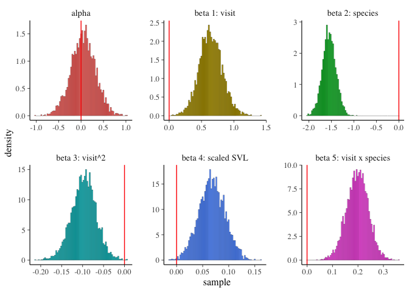

The coefficients do not overlap 0, the distributions seem smooth.

Trace plots:

``` r
intercept_trace <- rstan::extract(stan.fit.5$stanfit,pars="alpha",permuted=FALSE,inc_warmup=TRUE)
{plot(NA,NA,type="n", xlab = "", ylab = "", main = "Intercept", ylim=range(intercept_trace),xlim=c(0,length(intercept_trace[,1,1])))
for ( i in 1:4 ) {
    lines(intercept_trace[,i,1],col=i)  
}
}
```

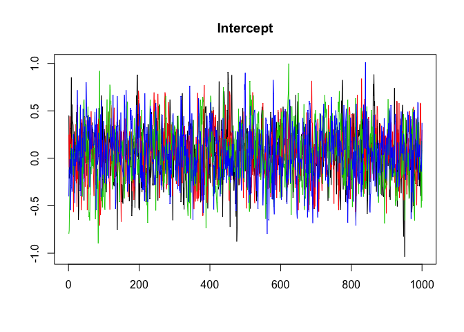

``` r
traceplot(stan.fit.5$stanfit)
```

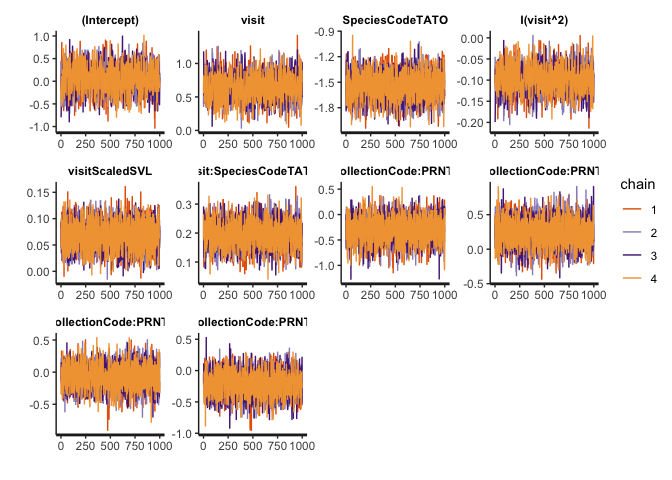

The traceplots seem pretty good (well-mixed).

The coefficient estimates I would report:

``` r
posterior_interval(stan.fit.5,prob=0.95)[1:6,]
```

    ##                              2.5%       97.5%
    ## (Intercept)           -0.50158326  0.58888432
    ## visit                  0.29715304  1.01103233
    ## SpeciesCodeTATO       -1.84878563 -1.24551143
    ## I(visit^2)            -0.15700699 -0.04018946
    ## visitScaledSVL         0.01822455  0.11758682
    ## visit:SpeciesCodeTATO  0.11194703  0.28041382

Taking a closer look at the priors:

``` r
prior_summary(stan.fit.5)
```

    ## Priors for model 'stan.fit.5' 
    ## ------
    ## Intercept (after predictors centered)
    ##  ~ normal(location = 0, scale = 10)
    ## 
    ## Coefficients
    ##  ~ normal(location = [0,0,0,...], scale = [2.5,2.5,2.5,...])
    ##      **adjusted scale = [1.84,2.50,0.30,...]
    ## 
    ## Covariance
    ##  ~ decov(reg. = 1, conc. = 1, shape = 1, scale = 1)
    ## ------
    ## See help('prior_summary.stanreg') for more details

``` r
posterior_vs_prior(stan.fit.5, pars = "beta", facet_args = list(scales = "free"))
```

    ## 
    ## Drawing from prior...

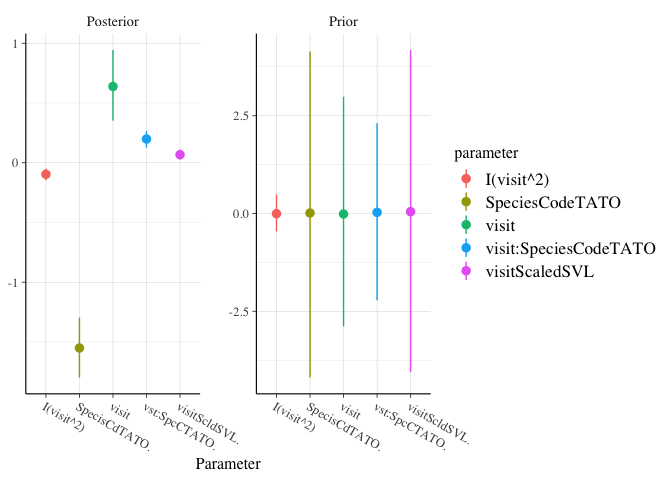

The intercept is centered around zero and scaled by 10 (I think the scaling uses the sd of the actual data somehow).

Coefficients are all centered around zero and scaled by 2.5. The smaller scaling on the coefficients relative to the intercept represents a more conservative approach; constraining closer to zero than the intercept. These priors make sense because we want to assume as a "null" that the predictors have no effect (mean = 0). I think the scaling is useful because each predictor is on a much different scale (e.g. a binary predictor vs. something like SVL which roughly ranges from -5 to 5.). I would guess that this just standardizes how "conservative" the prior is for each predictor. Otherwise, a predictor with a really large scale would have a pretty conservative prior, whereas one with a really small scale would have a pretty uninformative prior. Therefore, I don't want to change these priors.

We can see from the above plot how much the posterior has moved off of the prior.

In the future, I might want to play with the prior for latitude -- I think it covaries with the random effect for site, and I do think latitude is important, but it's not coming out as important from the model. Maybe constraining a prior for that predictor would help? Though by default, the prior should prevent this estimate from getting too crazy (as seen with some colinear predictors) -- thinking back to the McElreath example on colinear predictors.

Visualizing the data
====================

Plot the relationship between visit (time) and number of parasites, for each species. Hold body size at the average.

``` r
fake.data <- data.frame(expand.grid(SpeciesCode = c("PSRE", "TATO"), visit = 1:5, 
                                    visitScaledSVL = 0))
head(fake.data)
```

    ##   SpeciesCode visit visitScaledSVL
    ## 1        PSRE     1              0
    ## 2        TATO     1              0
    ## 3        PSRE     2              0
    ## 4        TATO     2              0
    ## 5        PSRE     3              0
    ## 6        TATO     3              0

``` r
str(samplesdf)
```

    ## 'data.frame':    4000 obs. of  6 variables:
    ##  $ alpha                  : num  0.095 -0.615 -0.0813 0.0893 0.0128 ...
    ##  $ beta 1: visit          : num  0.533 1.022 0.784 0.786 0.481 ...
    ##  $ beta 2: species        : num  -1.7 -1.47 -1.47 -1.54 -1.84 ...
    ##  $ beta 3: visit^2        : num  -0.0811 -0.1442 -0.1279 -0.1237 -0.0676 ...
    ##  $ beta 4: scaled SVL     : num  0.0705 0.0968 0.0611 0.0897 0.0334 ...
    ##  $ beta 5: visit x species: num  0.234 0.175 0.167 0.165 0.271 ...

``` r
fake.data$pred.med <- NA
fake.data$pred.lo <- NA
fake.data$pred.hi <- NA

fake.data.mm <- model.matrix(~visit*SpeciesCode + I(visit^2) + SpeciesCode + visitScaledSVL,  data = fake.data[1:3])

fake.data.preds <- matrix(nrow = nrow(fake.data), ncol = 4000)
# there's probably an "apply" way to do this but I don't know it.
for(i in 1:nrow(samplesdf)){
  # draw a sample from the posterior
  # predict at each row of fake.data
  fake.data.preds[, i] <- exp(fake.data.mm %*% t(samplesdf[i,]))
}
# each row is a specific set of predictors
# each column is a draw from the posterior
# for each row, we want the column median
fake.data$pred.med <- apply(fake.data.preds, 1, median)
fake.data$pred.lo <- apply(fake.data.preds, 1, HPDI)[1,]
fake.data$pred.hi <- apply(fake.data.preds, 1, HPDI)[2,]

fake.data$fvisitScaledSVL <- factor(fake.data$visitScaledSVL)
ggplot(data = subset(fake.data, visitScaledSVL == 0))+
  geom_ribbon(mapping=aes(x=visit ,ymin=pred.lo,ymax=pred.hi, fill = SpeciesCode),
  alpha=0.2)+
  geom_line(aes(x=visit, y = pred.med, color = SpeciesCode))+
  geom_jitter(data = dis, aes(x=visit, y = tot.para, color = SpeciesCode), width = .3, height = .3, size = .5)+
  facet_wrap(facets = ~SpeciesCode)+
  xlab("visit")+
  ylab("Within-host parasite richness")
```

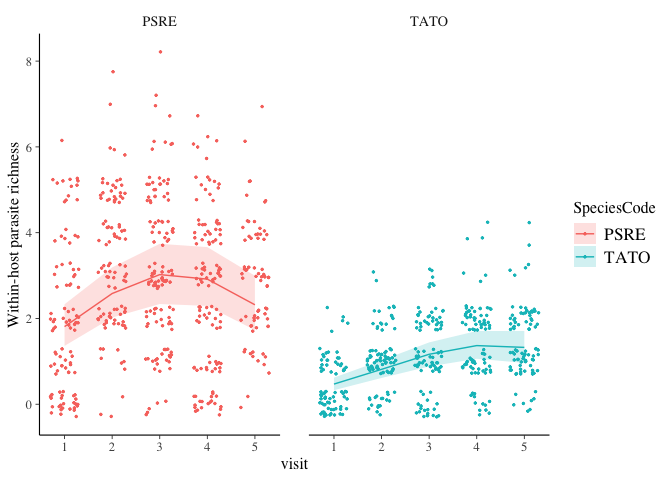

Plot the relationship between relative body size (visitScaledSVL) and number of parasites, at each visit.

``` r
fake.data2 <- data.frame(expand.grid(SpeciesCode = c("PSRE", "TATO"), visit = 1:5, 
                                    visitScaledSVL = seq(-4,4, length.out = 100)))
head(fake.data2)
```

    ##   SpeciesCode visit visitScaledSVL
    ## 1        PSRE     1             -4
    ## 2        TATO     1             -4
    ## 3        PSRE     2             -4
    ## 4        TATO     2             -4
    ## 5        PSRE     3             -4
    ## 6        TATO     3             -4

``` r
str(samplesdf)
```

    ## 'data.frame':    4000 obs. of  6 variables:
    ##  $ alpha                  : num  0.095 -0.615 -0.0813 0.0893 0.0128 ...
    ##  $ beta 1: visit          : num  0.533 1.022 0.784 0.786 0.481 ...
    ##  $ beta 2: species        : num  -1.7 -1.47 -1.47 -1.54 -1.84 ...
    ##  $ beta 3: visit^2        : num  -0.0811 -0.1442 -0.1279 -0.1237 -0.0676 ...
    ##  $ beta 4: scaled SVL     : num  0.0705 0.0968 0.0611 0.0897 0.0334 ...
    ##  $ beta 5: visit x species: num  0.234 0.175 0.167 0.165 0.271 ...

``` r
fake.data2$pred.med <- NA
fake.data2$pred.lo <- NA
fake.data2$pred.hi <- NA

fake.data.mm.2 <- model.matrix(~visit*SpeciesCode + I(visit^2) + SpeciesCode + visitScaledSVL,  data = fake.data2[1:3])

fake.data.preds2 <- matrix(nrow = nrow(fake.data2), ncol = 4000)
# there's probably an "apply" way to do this but I don't know it.
for(i in 1:nrow(samplesdf)){
  # draw a sample from the posterior
  # predict at each row of fake.data
  fake.data.preds2[, i] <- exp(fake.data.mm.2 %*% t(samplesdf[i,]))
}
# each row is a specific set of predictors
# each column is a draw from the posterior
# for each row, we want the column median
fake.data2$pred.med <- apply(fake.data.preds2, 1, median)
fake.data2$pred.lo <- apply(fake.data.preds2, 1, HPDI)[1,]
fake.data2$pred.hi <- apply(fake.data.preds2, 1, HPDI)[2,]

ggplot(data = subset(fake.data2))+
  geom_line(aes(x=visitScaledSVL, y = pred.med, color = SpeciesCode))+
  geom_ribbon(mapping=aes(x=visitScaledSVL ,ymin=pred.lo,ymax=pred.hi, fill = SpeciesCode),
  alpha=0.2)+
  geom_jitter(data = dis, aes(x=visitScaledSVL, y = tot.para, color = SpeciesCode), width = .3, height = .3, size = .5)+
  facet_wrap(facets = ~visit)+
  xlab("Scaled Body Size")+
  ylab("Within-host parasite richness")
```

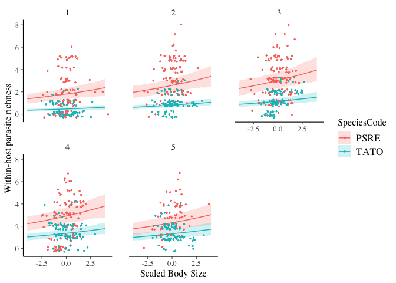

How important are site-level differences?

``` r
SiteEffects <- names(stan.fit.5$coefficients)[55:64] # 55:64
samplesdf.r <- data.frame(samples$b)[, c(51:60)]
names(samplesdf.r) <- levels(dis$SiteCode)
samplesdf.r %>% 
    gather(key = "parameter", value = "sample") %>%
    ggplot() +
    geom_histogram(mapping = aes(x=sample,y=stat(density), fill = parameter),
                   bins=75, colour = "black", lwd =.1) +
    geom_vline(xintercept = 0, colour = "red")+
    facet_wrap(facets = ~ parameter,scales="free")+
    guides(fill= FALSE)
```

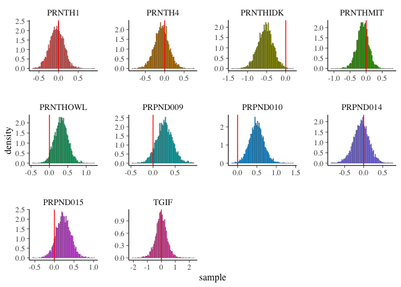

Conclusions
-----------

The parasite richness inside a host individual depends on what species the host is. Pacific chorus frogs have higher parasite richness. In other words, they support a more diverse community of parasites. The date an individual was sampled also matters. Visit (which is a proxy for date) has a monotonic relationship with parasite richness; peaking in mid-summer and then tapering off. An individual's relative size matters -- individuals who were larger relative to others in a sample had higher parasite loads. Note that scaling this means that body size is not correlated with visit, though it probably does mean that the individual was older relative to others in the sample and thus was exposed for longer. Latitude doesn't matter (which is suprising given the plot!), and the random effects for each site seem relatively small for most sites. What I conclude from this is that the individual level factor (time, body size) matters a lot in terms of an individual's parasite richness, and the site that they are at doesn't matter quite as much, except for a few extreme sites (e.g. PRPND010)
