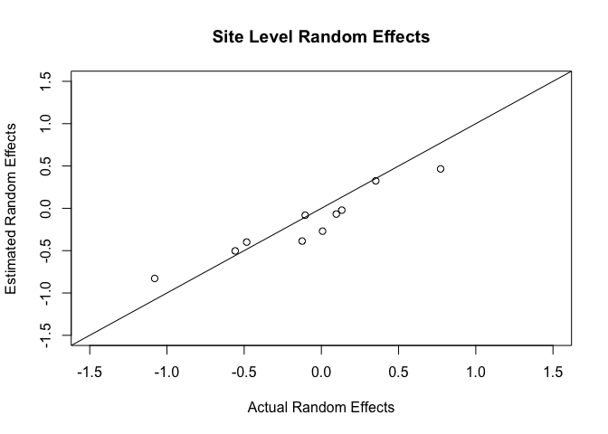
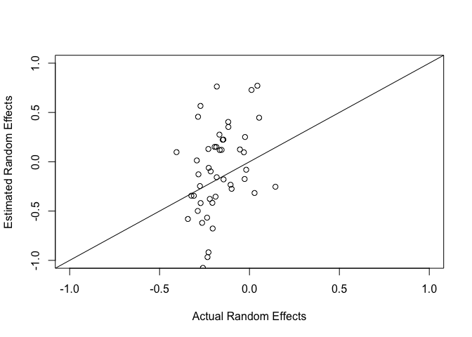
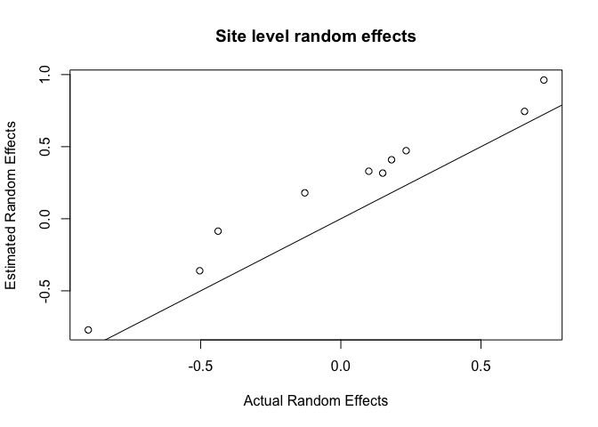
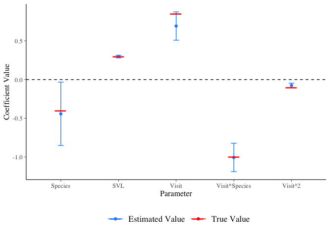

Simulation of parasite data for model checks
================

Read in and clean up data
-------------------------

``` r
ponddata <- read.csv("diss.data.2017.csv")
ponddata <- subset(ponddata, visit > 1) # take out first visit # fix this??
ponddata$visit <- ponddata$visit-1
ponddata <- ponddata[, c(2:6, 17,18)] # get just predictor variables
ponddata$visitScaledSVL <- rnorm(nrow(ponddata), 0, 2)# just make up this predictor 
```

SIMULATION 1: Site-level random effect
--------------------------------------

This model predicts parasite richness using only a random effect for site. Generate random effects for each of 10 sites from a normal distribution

``` r
nsites <- length(levels(ponddata$SiteCode)) # number of levels of the random effect (10)
site.means.gamma <- NA
set.seed(12398) # makes sure the random draws are repeatable (?)

site.means.gamma <- rnorm(n = nsites, mean = 0, sd = .2) # 10 site-level means (log(mean parasite load))

# make a dataframe that we can merge with the predictor data frame
site.means.df <- data.frame(SiteCode = levels(ponddata$SiteCode), ExpMean = site.means.gamma)
# merge this with the existing predictors
ponddata2 <- merge(ponddata, site.means.df, by = "SiteCode")
```

Generate an observed parasite count from the expected site level mean. This is done using a poisson distribution.

``` r
# for each row of the dataset, draw a random parasite richness count
# from the expected site level means
ponddata2$tot.para <- rpois(n = nrow(ponddata2), lambda = exp(ponddata2$ExpMean))
```

Fit a model; does it recapture the random effects?

``` r
stan.fit.sim1 <- stan_glmer(tot.para~ (1|SiteCode), data = ponddata2,  family ="poisson")
summary(stan.fit.sim1)
```

    ## 
    ## Model Info:
    ## 
    ##  function:     stan_glmer
    ##  family:       poisson [log]
    ##  formula:      tot.para ~ (1 | SiteCode)
    ##  algorithm:    sampling
    ##  priors:       see help('prior_summary')
    ##  sample:       4000 (posterior sample size)
    ##  observations: 959
    ##  groups:       SiteCode (10)
    ## 
    ## Estimates:
    ##                                           mean    sd      2.5%    25%  
    ## (Intercept)                                -0.1     0.1    -0.2    -0.1
    ## b[(Intercept) SiteCode:PRNTH1]             -0.1     0.1    -0.3    -0.2
    ## b[(Intercept) SiteCode:PRNTH4]             -0.1     0.1    -0.3    -0.2
    ## b[(Intercept) SiteCode:PRNTHIDK]           -0.1     0.1    -0.3    -0.2
    ## b[(Intercept) SiteCode:PRNTHMIT]           -0.2     0.1    -0.4    -0.3
    ## b[(Intercept) SiteCode:PRNTHOWL]            0.0     0.1    -0.2    -0.1
    ## b[(Intercept) SiteCode:PRPND009]            0.1     0.1    -0.1     0.1
    ## b[(Intercept) SiteCode:PRPND010]            0.2     0.1     0.0     0.1
    ## b[(Intercept) SiteCode:PRPND014]           -0.1     0.1    -0.3    -0.2
    ## b[(Intercept) SiteCode:PRPND015]            0.2     0.1     0.0     0.1
    ## b[(Intercept) SiteCode:TGIF]                0.0     0.1    -0.2     0.0
    ## Sigma[SiteCode:(Intercept),(Intercept)]     0.0     0.0     0.0     0.0
    ## mean_PPD                                    0.9     0.0     0.8     0.9
    ## log-posterior                           -1235.0     3.5 -1242.9 -1237.1
    ##                                           50%     75%     97.5%
    ## (Intercept)                                -0.1     0.0     0.1
    ## b[(Intercept) SiteCode:PRNTH1]             -0.1     0.0     0.1
    ## b[(Intercept) SiteCode:PRNTH4]             -0.1     0.0     0.1
    ## b[(Intercept) SiteCode:PRNTHIDK]           -0.1     0.0     0.1
    ## b[(Intercept) SiteCode:PRNTHMIT]           -0.2    -0.1     0.0
    ## b[(Intercept) SiteCode:PRNTHOWL]            0.0     0.0     0.2
    ## b[(Intercept) SiteCode:PRPND009]            0.1     0.2     0.4
    ## b[(Intercept) SiteCode:PRPND010]            0.2     0.3     0.4
    ## b[(Intercept) SiteCode:PRPND014]           -0.1     0.0     0.1
    ## b[(Intercept) SiteCode:PRPND015]            0.2     0.3     0.5
    ## b[(Intercept) SiteCode:TGIF]                0.0     0.1     0.2
    ## Sigma[SiteCode:(Intercept),(Intercept)]     0.0     0.1     0.1
    ## mean_PPD                                    0.9     1.0     1.0
    ## log-posterior                           -1234.6 -1232.4 -1229.3
    ## 
    ## Diagnostics:
    ##                                         mcse Rhat n_eff
    ## (Intercept)                             0.0  1.0  1138 
    ## b[(Intercept) SiteCode:PRNTH1]          0.0  1.0  1891 
    ## b[(Intercept) SiteCode:PRNTH4]          0.0  1.0  1979 
    ## b[(Intercept) SiteCode:PRNTHIDK]        0.0  1.0  2101 
    ## b[(Intercept) SiteCode:PRNTHMIT]        0.0  1.0  1941 
    ## b[(Intercept) SiteCode:PRNTHOWL]        0.0  1.0  2418 
    ## b[(Intercept) SiteCode:PRPND009]        0.0  1.0  1974 
    ## b[(Intercept) SiteCode:PRPND010]        0.0  1.0  2075 
    ## b[(Intercept) SiteCode:PRPND014]        0.0  1.0  2033 
    ## b[(Intercept) SiteCode:PRPND015]        0.0  1.0  2322 
    ## b[(Intercept) SiteCode:TGIF]            0.0  1.0  2000 
    ## Sigma[SiteCode:(Intercept),(Intercept)] 0.0  1.0   916 
    ## mean_PPD                                0.0  1.0  4391 
    ## log-posterior                           0.1  1.0   940 
    ## 
    ## For each parameter, mcse is Monte Carlo standard error, n_eff is a crude measure of effective sample size, and Rhat is the potential scale reduction factor on split chains (at convergence Rhat=1).

``` r
rand.eff.sim1 <- coefficients(stan.fit.sim1)$SiteCode
rand.eff.sim1
```

    ##          (Intercept)
    ## PRNTH1   -0.17005349
    ## PRNTH4   -0.15676673
    ## PRNTHIDK -0.16955944
    ## PRNTHMIT -0.26442440
    ## PRNTHOWL -0.09043619
    ## PRPND009  0.05950080
    ## PRPND010  0.13702361
    ## PRPND014 -0.16679127
    ## PRPND015  0.13060910
    ## TGIF     -0.03831745

``` r
site.means.gamma
```

    ##  [1] -0.245521446 -0.240448924 -0.096852973 -0.101195460 -0.143450908
    ##  [6]  0.095252545  0.129607614 -0.127518331  0.259110865 -0.005629135

Plot the estimates vs. real

``` r
{plot(rand.eff.sim1[,1]~site.means.gamma, xlab = "Actual Random Effects", ylab = "Estimated Random Effects", xlim = c(-.5,.5), ylim = c(-0.5,.5))
abline(0,1)}
```


These look OK, now try again with diff set of random intercepts:

``` r
set.seed(231)
site.means.gamma <- rnorm(n = nsites, mean = 0, sd = .2) # 10 site-level means (log(mean parasite richness))
site.means.df <- data.frame(SiteCode = levels(ponddata$SiteCode), ExpMean = site.means.gamma)
ponddata2 <- merge(ponddata, site.means.df, by = "SiteCode")
ponddata2$tot.para <- rpois(n = nrow(ponddata2), lambda = exp(ponddata2$ExpMean))
stan.fit.sim1 <- stan_glmer(tot.para~ (1|SiteCode), data = ponddata2,  family ="poisson")
rand.eff.sim1 <- coefficients(stan.fit.sim1)$SiteCode
{plot(rand.eff.sim1[,1]~site.means.gamma, xlab = "Actual Random Effects", ylab = "Estimated Random Effects", xlim = c(-.5,.5), ylim = c(-.5, .5))
abline(0,1)} 
```


It's hard to repeat this varying things like mean, sd because the model takes so long to fit! oh well. It also seems like the model underestimates variation in random effects--they are shrunk on the y axis...is this a partial pooling thing? A prior thing?

Let's try this with smaller variation between sites

``` r
set.seed(1491)
site.means.gamma <- rnorm(n = nsites, mean = 0, sd = .05) # 10 site-level means (log(mean parasite load))
site.means.df <- data.frame(SiteCode = levels(ponddata$SiteCode), ExpMean = site.means.gamma)
ponddata2 <- merge(ponddata, site.means.df, by = "SiteCode")
ponddata2$tot.para <- rpois(n = nrow(ponddata2), lambda = exp(ponddata2$ExpMean))
stan.fit.sim1 <- stan_glmer(tot.para~ (1|SiteCode), data = ponddata2,  family ="poisson")
rand.eff.sim1 <- coefficients(stan.fit.sim1)$SiteCode
{plot(rand.eff.sim1[,1]~site.means.gamma, xlab = "Actual Random Effects", ylab = "Estimated Random Effects", xlim = c(-.5,.5), ylim = c(-.5,.5))
abline(0,1)}
```


SIMULATION 2: Random effects of site and sample
-----------------------------------------------

In this simulation we have a nested random effect for the collection visit (5 per site). The visit effects are drawn randomly from the mean for that site

``` r
set.seed(523)
site.means.gamma <- rnorm(n = nsites, mean = 0, sd = .5) # 10 site-level means (log(mean parasite load))
visit.site.means <- data.frame(SiteCode = NA, visit = 1:5, visitmean = NA)
visit.site.means <- rep(list(visit.site.means), 10)
for(i in 1:nsites){
  visit.site.means[[i]][,1]<- levels(ponddata$SiteCode)[i]
  visit.site.means[[i]][,3] <- rnorm(n = 5, mean = site.means.gamma[i], sd = 0.2)

} # visit specific random effects (the site level re will change each time I run this code)
# since I didn't figure out the set seed thing within a loop
# don't want the visit effects to be the same per site

# get these in df form to combine with predictors
site.means.df <- data.frame(SiteCode = levels(ponddata$SiteCode), ExpMean = site.means.gamma)
visit.site.means <- do.call(rbind, visit.site.means)

# merge these into the dataframe
ponddata2 <- merge(ponddata, site.means.df, by = "SiteCode")
ponddata2 <- merge(ponddata2, visit.site.means, by = c("SiteCode", "visit") )
```

Simulate the expected number of parasites from the visit mean

``` r
ponddata2$tot.para <- rpois(n = nrow(ponddata2), lambda = exp(ponddata2$visitmean))
```

Fit the model

``` r
ponddata2$SiteCodevisit <- paste(ponddata2$SiteCode, "_", ponddata2$visit, sep = "")
stan.fit.sim2 <- stan_glmer(tot.para ~ (1|SiteCode) + (1|SiteCodevisit), data = ponddata2,  family = "poisson")
```

Examine fit

``` r
## site level
rand.eff.sim2.sc <- coefficients(stan.fit.sim2)$SiteCode
rand.eff.sim2.sv <- coefficients(stan.fit.sim2)$SiteCodevisit

{plot(rand.eff.sim2.sc[,1]~site.means.gamma, xlab = "Actual Random Effects", ylab = "Estimated Random Effects", main = "Site Level Random Effects", xlim = c(-1.5,1.5), ylim = c(-1.5,1.5))
abline(0,1)}  # looks good!
```



``` r
## visit level
visit.site.means$SiteCodevisit <- paste(visit.site.means$SiteCode,"_", visit.site.means$visit, sep = "")
rand.eff.sim2.sv$SiteCodevisit <- rownames(rand.eff.sim2.sv)
rand.eff.sim2.sv <- merge(rand.eff.sim2.sv, visit.site.means, by = "SiteCodevisit")
{plot(visitmean~`(Intercept)`, rand.eff.sim2.sv, xlab = "Actual Random Effects", ylab = "Estimated Random Effects", xlim = c(-1,1), ylim = c(-1,1))
abline(0,1)}  #looks less great
```



These are pretty big random effects and the deviation is worrisome...

SIMULATION 3: Random effects of site and sample, and fixed effects of species and visit
---------------------------------------------------------------------------------------

richness ~ visitscaledSVL + visit + visit^2 + speciesCode + speciesCode\*visit Set parameters

``` r
nsites <- length(levels(ponddata$SiteCode)) # number of levels of the random effect (10)
site.means.gamma <- NA
set.seed(122)
site.means.gamma <- rnorm(n = nsites, mean = 0, sd = .5) # 10 site-level means (log(mean parasite load))
visit.site.means <- data.frame(SiteCode = NA, visit = 1:5, visitmean = NA)
visit.site.means <- rep(list(visit.site.means), 10)

## set fixed parameters
visit.effect <- 0.85 # fixed effect for visit
visit.effect.sq <- -0.1
species.effect <- -0.4 # fixed effect for species
visit.species.effect <- -1 # fixed effect for species
svl.effect <- 0.3
Effects <- data.frame(FixedEffect = c("Visit", "Species", "Visit^2", "SVL", "Visit*Species"), 
             TrueValue =  c(visit.effect, species.effect, visit.effect.sq, svl.effect, visit.species.effect))

for(i in 1:nsites){
  visit.site.means[[i]][,1]<- levels(ponddata$SiteCode)[i]
  for(j in 1:5){
    Exp.mean <- site.means.gamma[i] + j*visit.effect + j^2*visit.effect.sq
    visit.site.means[[i]][j,3] <- rnorm(n=1, mean = Exp.mean, sd = .1)
  }
} # visit specific random effects drawn from expected mean. Putting the visit effect here. 


# combine into a df with predictors
site.means.df <- data.frame(SiteCode = levels(ponddata$SiteCode), ExpMean = site.means.gamma)
visit.site.means <- do.call(rbind, visit.site.means)
# merge these into the dataframe
ponddata2 <- merge(ponddata, site.means.df, by = "SiteCode")
ponddata2 <- merge(ponddata2, visit.site.means, by = c("SiteCode", "visit") )
```

Simulate the expected number of parasites from the sample mean. The sample mean will become the intercept and I will add the fixed effects.

``` r
# add fixed effect for visit and species (have to treat as numeric to multiply by species slope)
ponddata2$SpeciesCode <- as.numeric(ponddata2$SpeciesCode)-1

ponddata2$ParasiteRichExp <-  ponddata2$visitmean +
                              ponddata2$visitScaledSVL*svl.effect + 
                              ponddata2$SpeciesCode*species.effect +   
                              ponddata2$SpeciesCode*ponddata2$visit*visit.species.effect
```

Generate observed parasite counts (observations) from the expected means, again, using some kind of overdispersion parameter

``` r
ponddata2$ParasiteRichObs<- rpois(n = nrow(ponddata2), lambda = exp(ponddata2$ParasiteRichExp))
```

Fit the model

``` r
ponddata2$SiteCodevisit <- paste(ponddata2$SiteCode, "_", ponddata2$visit, sep = "")
stan.fit.sim3 <- stan_glmer(ParasiteRichObs ~ visit*SpeciesCode + I(visit^2) + visitScaledSVL +  (1|SiteCode) + (1|SiteCodevisit), data = ponddata2,  family = "poisson")
```

Examine fit

``` r
summary(stan.fit.sim3, digits = 4)
```

    ## 
    ## Model Info:
    ## 
    ##  function:     stan_glmer
    ##  family:       poisson [log]
    ##  formula:      ParasiteRichObs ~ visit * SpeciesCode + I(visit^2) + visitScaledSVL + 
    ##     (1 | SiteCode) + (1 | SiteCodevisit)
    ##  algorithm:    sampling
    ##  priors:       see help('prior_summary')
    ##  sample:       4000 (posterior sample size)
    ##  observations: 959
    ##  groups:       SiteCodevisit (48), SiteCode (10)
    ## 
    ## Estimates:
    ##                                                mean       sd      
    ## (Intercept)                                      0.0989     0.2350
    ## visit                                            0.7387     0.0977
    ## SpeciesCode                                     -0.5881     0.2135
    ## I(visit^2)                                      -0.0793     0.0157
    ## visitScaledSVL                                   0.2973     0.0085
    ## visit:SpeciesCode                               -0.9489     0.0893
    ## b[(Intercept) SiteCodevisit:PRNTH1_1]            0.0226     0.0895
    ## b[(Intercept) SiteCodevisit:PRNTH1_2]            0.0205     0.0827
    ## b[(Intercept) SiteCodevisit:PRNTH1_3]            0.1317     0.0809
    ## b[(Intercept) SiteCodevisit:PRNTH1_4]           -0.0483     0.0746
    ## b[(Intercept) SiteCodevisit:PRNTH1_5]           -0.1053     0.0867
    ## b[(Intercept) SiteCodevisit:PRNTH4_1]            0.0416     0.0947
    ## b[(Intercept) SiteCodevisit:PRNTH4_2]           -0.0104     0.0930
    ## b[(Intercept) SiteCodevisit:PRNTH4_3]           -0.0193     0.0877
    ## b[(Intercept) SiteCodevisit:PRNTH4_4]           -0.0187     0.0805
    ## b[(Intercept) SiteCodevisit:PRNTH4_5]           -0.0072     0.0894
    ## b[(Intercept) SiteCodevisit:PRNTHIDK_1]         -0.0518     0.0931
    ## b[(Intercept) SiteCodevisit:PRNTHIDK_2]         -0.0055     0.0866
    ## b[(Intercept) SiteCodevisit:PRNTHIDK_3]         -0.0011     0.0863
    ## b[(Intercept) SiteCodevisit:PRNTHIDK_4]          0.0226     0.0817
    ## b[(Intercept) SiteCodevisit:PRNTHIDK_5]          0.0351     0.0984
    ## b[(Intercept) SiteCodevisit:PRNTHMIT_1]         -0.0150     0.0878
    ## b[(Intercept) SiteCodevisit:PRNTHMIT_2]         -0.0575     0.0872
    ## b[(Intercept) SiteCodevisit:PRNTHMIT_3]         -0.0235     0.0832
    ## b[(Intercept) SiteCodevisit:PRNTHMIT_4]          0.0697     0.0754
    ## b[(Intercept) SiteCodevisit:PRNTHMIT_5]          0.0288     0.0855
    ## b[(Intercept) SiteCodevisit:PRNTHOWL_1]          0.0194     0.1001
    ## b[(Intercept) SiteCodevisit:PRNTHOWL_2]         -0.0115     0.0980
    ## b[(Intercept) SiteCodevisit:PRNTHOWL_3]         -0.0429     0.1009
    ## b[(Intercept) SiteCodevisit:PRNTHOWL_4]          0.0027     0.1005
    ## b[(Intercept) SiteCodevisit:PRNTHOWL_5]         -0.0052     0.1045
    ## b[(Intercept) SiteCodevisit:PRPND009_1]          0.0322     0.0881
    ## b[(Intercept) SiteCodevisit:PRPND009_2]          0.0695     0.0880
    ## b[(Intercept) SiteCodevisit:PRPND009_3]          0.0576     0.0776
    ## b[(Intercept) SiteCodevisit:PRPND009_4]         -0.0212     0.0744
    ## b[(Intercept) SiteCodevisit:PRPND009_5]         -0.1107     0.0883
    ## b[(Intercept) SiteCodevisit:PRPND010_1]         -0.0579     0.0932
    ## b[(Intercept) SiteCodevisit:PRPND010_2]         -0.0229     0.0858
    ## b[(Intercept) SiteCodevisit:PRPND010_3]          0.0214     0.0842
    ## b[(Intercept) SiteCodevisit:PRPND010_4]         -0.0127     0.0795
    ## b[(Intercept) SiteCodevisit:PRPND010_5]          0.0745     0.0848
    ## b[(Intercept) SiteCodevisit:PRPND014_1]          0.0392     0.0910
    ## b[(Intercept) SiteCodevisit:PRPND014_2]         -0.0294     0.0818
    ## b[(Intercept) SiteCodevisit:PRPND014_3]         -0.0574     0.0893
    ## b[(Intercept) SiteCodevisit:PRPND014_4]         -0.0455     0.0806
    ## b[(Intercept) SiteCodevisit:PRPND014_5]          0.0955     0.0946
    ## b[(Intercept) SiteCodevisit:PRPND015_1]          0.0156     0.0970
    ## b[(Intercept) SiteCodevisit:PRPND015_2]         -0.0739     0.0989
    ## b[(Intercept) SiteCodevisit:PRPND015_3]          0.0388     0.0926
    ## b[(Intercept) SiteCodevisit:TGIF_1]             -0.0422     0.0944
    ## b[(Intercept) SiteCodevisit:TGIF_2]              0.0672     0.0878
    ## b[(Intercept) SiteCodevisit:TGIF_3]              0.0000     0.0787
    ## b[(Intercept) SiteCodevisit:TGIF_4]             -0.0513     0.0817
    ## b[(Intercept) SiteCodevisit:TGIF_5]              0.0244     0.0834
    ## b[(Intercept) SiteCode:PRNTH1]                   0.6133     0.2031
    ## b[(Intercept) SiteCode:PRNTH4]                  -0.3709     0.2075
    ## b[(Intercept) SiteCode:PRNTHIDK]                 0.0794     0.2110
    ## b[(Intercept) SiteCode:PRNTHMIT]                 0.2737     0.2052
    ## b[(Intercept) SiteCode:PRNTHOWL]                -1.0590     0.2367
    ## b[(Intercept) SiteCode:PRPND009]                 0.6740     0.2040
    ## b[(Intercept) SiteCode:PRPND010]                 0.1110     0.2064
    ## b[(Intercept) SiteCode:PRPND014]                 0.1617     0.2059
    ## b[(Intercept) SiteCode:PRPND015]                -0.5141     0.2205
    ## b[(Intercept) SiteCode:TGIF]                     0.0419     0.2060
    ## Sigma[SiteCodevisit:(Intercept),(Intercept)]     0.0107     0.0065
    ## Sigma[SiteCode:(Intercept),(Intercept)]          0.3834     0.2556
    ## mean_PPD                                         3.5777     0.0850
    ## log-posterior                                -1427.6238     7.3580
    ##                                                2.5%       25%     
    ## (Intercept)                                     -0.3626    -0.0477
    ## visit                                            0.5455     0.6732
    ## SpeciesCode                                     -1.0047    -0.7345
    ## I(visit^2)                                      -0.1094    -0.0898
    ## visitScaledSVL                                   0.2804     0.2915
    ## visit:SpeciesCode                               -1.1258    -1.0089
    ## b[(Intercept) SiteCodevisit:PRNTH1_1]           -0.1531    -0.0334
    ## b[(Intercept) SiteCodevisit:PRNTH1_2]           -0.1369    -0.0320
    ## b[(Intercept) SiteCodevisit:PRNTH1_3]           -0.0092     0.0749
    ## b[(Intercept) SiteCodevisit:PRNTH1_4]           -0.2008    -0.0954
    ## b[(Intercept) SiteCodevisit:PRNTH1_5]           -0.2929    -0.1587
    ## b[(Intercept) SiteCodevisit:PRNTH4_1]           -0.1333    -0.0185
    ## b[(Intercept) SiteCodevisit:PRNTH4_2]           -0.2047    -0.0696
    ## b[(Intercept) SiteCodevisit:PRNTH4_3]           -0.2034    -0.0728
    ## b[(Intercept) SiteCodevisit:PRNTH4_4]           -0.1811    -0.0668
    ## b[(Intercept) SiteCodevisit:PRNTH4_5]           -0.1908    -0.0627
    ## b[(Intercept) SiteCodevisit:PRNTHIDK_1]         -0.2520    -0.1071
    ## b[(Intercept) SiteCodevisit:PRNTHIDK_2]         -0.1842    -0.0585
    ## b[(Intercept) SiteCodevisit:PRNTHIDK_3]         -0.1747    -0.0517
    ## b[(Intercept) SiteCodevisit:PRNTHIDK_4]         -0.1404    -0.0283
    ## b[(Intercept) SiteCodevisit:PRNTHIDK_5]         -0.1546    -0.0252
    ## b[(Intercept) SiteCodevisit:PRNTHMIT_1]         -0.1891    -0.0683
    ## b[(Intercept) SiteCodevisit:PRNTHMIT_2]         -0.2399    -0.1124
    ## b[(Intercept) SiteCodevisit:PRNTHMIT_3]         -0.1960    -0.0750
    ## b[(Intercept) SiteCodevisit:PRNTHMIT_4]         -0.0722     0.0167
    ## b[(Intercept) SiteCodevisit:PRNTHMIT_5]         -0.1334    -0.0253
    ## b[(Intercept) SiteCodevisit:PRNTHOWL_1]         -0.1742    -0.0427
    ## b[(Intercept) SiteCodevisit:PRNTHOWL_2]         -0.2139    -0.0712
    ## b[(Intercept) SiteCodevisit:PRNTHOWL_3]         -0.2592    -0.1031
    ## b[(Intercept) SiteCodevisit:PRNTHOWL_4]         -0.2057    -0.0567
    ## b[(Intercept) SiteCodevisit:PRNTHOWL_5]         -0.2250    -0.0665
    ## b[(Intercept) SiteCodevisit:PRPND009_1]         -0.1384    -0.0245
    ## b[(Intercept) SiteCodevisit:PRPND009_2]         -0.0971     0.0108
    ## b[(Intercept) SiteCodevisit:PRPND009_3]         -0.0870     0.0060
    ## b[(Intercept) SiteCodevisit:PRPND009_4]         -0.1696    -0.0676
    ## b[(Intercept) SiteCodevisit:PRPND009_5]         -0.3033    -0.1653
    ## b[(Intercept) SiteCodevisit:PRPND010_1]         -0.2533    -0.1136
    ## b[(Intercept) SiteCodevisit:PRPND010_2]         -0.2025    -0.0769
    ## b[(Intercept) SiteCodevisit:PRPND010_3]         -0.1481    -0.0311
    ## b[(Intercept) SiteCodevisit:PRPND010_4]         -0.1747    -0.0624
    ## b[(Intercept) SiteCodevisit:PRPND010_5]         -0.0849     0.0155
    ## b[(Intercept) SiteCodevisit:PRPND014_1]         -0.1356    -0.0182
    ## b[(Intercept) SiteCodevisit:PRPND014_2]         -0.2014    -0.0799
    ## b[(Intercept) SiteCodevisit:PRPND014_3]         -0.2462    -0.1117
    ## b[(Intercept) SiteCodevisit:PRPND014_4]         -0.2105    -0.0989
    ## b[(Intercept) SiteCodevisit:PRPND014_5]         -0.0695     0.0298
    ## b[(Intercept) SiteCodevisit:PRPND015_1]         -0.1753    -0.0432
    ## b[(Intercept) SiteCodevisit:PRPND015_2]         -0.2946    -0.1319
    ## b[(Intercept) SiteCodevisit:PRPND015_3]         -0.1385    -0.0210
    ## b[(Intercept) SiteCodevisit:TGIF_1]             -0.2408    -0.1000
    ## b[(Intercept) SiteCodevisit:TGIF_2]             -0.0926     0.0089
    ## b[(Intercept) SiteCodevisit:TGIF_3]             -0.1568    -0.0499
    ## b[(Intercept) SiteCodevisit:TGIF_4]             -0.2236    -0.1015
    ## b[(Intercept) SiteCodevisit:TGIF_5]             -0.1436    -0.0289
    ## b[(Intercept) SiteCode:PRNTH1]                   0.2187     0.4885
    ## b[(Intercept) SiteCode:PRNTH4]                  -0.7881    -0.4995
    ## b[(Intercept) SiteCode:PRNTHIDK]                -0.3456    -0.0495
    ## b[(Intercept) SiteCode:PRNTHMIT]                -0.1364     0.1439
    ## b[(Intercept) SiteCode:PRNTHOWL]                -1.5412    -1.2074
    ## b[(Intercept) SiteCode:PRPND009]                 0.2769     0.5456
    ## b[(Intercept) SiteCode:PRPND010]                -0.2960    -0.0166
    ## b[(Intercept) SiteCode:PRPND014]                -0.2404     0.0340
    ## b[(Intercept) SiteCode:PRPND015]                -0.9510    -0.6517
    ## b[(Intercept) SiteCode:TGIF]                    -0.3693    -0.0804
    ## Sigma[SiteCodevisit:(Intercept),(Intercept)]     0.0013     0.0062
    ## Sigma[SiteCode:(Intercept),(Intercept)]          0.1242     0.2264
    ## mean_PPD                                         3.4160     3.5203
    ## log-posterior                                -1443.1115 -1432.3244
    ##                                                50%        75%     
    ## (Intercept)                                      0.0991     0.2457
    ## visit                                            0.7393     0.8059
    ## SpeciesCode                                     -0.5875    -0.4396
    ## I(visit^2)                                      -0.0794    -0.0688
    ## visitScaledSVL                                   0.2972     0.3029
    ## visit:SpeciesCode                               -0.9484    -0.8864
    ## b[(Intercept) SiteCodevisit:PRNTH1_1]            0.0190     0.0781
    ## b[(Intercept) SiteCodevisit:PRNTH1_2]            0.0195     0.0713
    ## b[(Intercept) SiteCodevisit:PRNTH1_3]            0.1297     0.1816
    ## b[(Intercept) SiteCodevisit:PRNTH1_4]           -0.0443     0.0020
    ## b[(Intercept) SiteCodevisit:PRNTH1_5]           -0.0987    -0.0451
    ## b[(Intercept) SiteCodevisit:PRNTH4_1]            0.0348     0.0986
    ## b[(Intercept) SiteCodevisit:PRNTH4_2]           -0.0080     0.0491
    ## b[(Intercept) SiteCodevisit:PRNTH4_3]           -0.0157     0.0352
    ## b[(Intercept) SiteCodevisit:PRNTH4_4]           -0.0153     0.0331
    ## b[(Intercept) SiteCodevisit:PRNTH4_5]           -0.0043     0.0490
    ## b[(Intercept) SiteCodevisit:PRNTHIDK_1]         -0.0456     0.0066
    ## b[(Intercept) SiteCodevisit:PRNTHIDK_2]         -0.0055     0.0505
    ## b[(Intercept) SiteCodevisit:PRNTHIDK_3]         -0.0007     0.0510
    ## b[(Intercept) SiteCodevisit:PRNTHIDK_4]          0.0198     0.0714
    ## b[(Intercept) SiteCodevisit:PRNTHIDK_5]          0.0288     0.0937
    ## b[(Intercept) SiteCodevisit:PRNTHMIT_1]         -0.0139     0.0388
    ## b[(Intercept) SiteCodevisit:PRNTHMIT_2]         -0.0534     0.0000
    ## b[(Intercept) SiteCodevisit:PRNTHMIT_3]         -0.0211     0.0306
    ## b[(Intercept) SiteCodevisit:PRNTHMIT_4]          0.0666     0.1177
    ## b[(Intercept) SiteCodevisit:PRNTHMIT_5]          0.0248     0.0825
    ## b[(Intercept) SiteCodevisit:PRNTHOWL_1]          0.0158     0.0822
    ## b[(Intercept) SiteCodevisit:PRNTHOWL_2]         -0.0091     0.0499
    ## b[(Intercept) SiteCodevisit:PRNTHOWL_3]         -0.0360     0.0207
    ## b[(Intercept) SiteCodevisit:PRNTHOWL_4]          0.0023     0.0629
    ## b[(Intercept) SiteCodevisit:PRNTHOWL_5]         -0.0035     0.0579
    ## b[(Intercept) SiteCodevisit:PRPND009_1]          0.0272     0.0862
    ## b[(Intercept) SiteCodevisit:PRPND009_2]          0.0647     0.1219
    ## b[(Intercept) SiteCodevisit:PRPND009_3]          0.0524     0.1053
    ## b[(Intercept) SiteCodevisit:PRPND009_4]         -0.0189     0.0260
    ## b[(Intercept) SiteCodevisit:PRPND009_5]         -0.1040    -0.0480
    ## b[(Intercept) SiteCodevisit:PRPND010_1]         -0.0518     0.0036
    ## b[(Intercept) SiteCodevisit:PRPND010_2]         -0.0180     0.0331
    ## b[(Intercept) SiteCodevisit:PRPND010_3]          0.0175     0.0716
    ## b[(Intercept) SiteCodevisit:PRPND010_4]         -0.0100     0.0367
    ## b[(Intercept) SiteCodevisit:PRPND010_5]          0.0711     0.1284
    ## b[(Intercept) SiteCodevisit:PRPND014_1]          0.0343     0.0934
    ## b[(Intercept) SiteCodevisit:PRPND014_2]         -0.0254     0.0224
    ## b[(Intercept) SiteCodevisit:PRPND014_3]         -0.0514     0.0021
    ## b[(Intercept) SiteCodevisit:PRPND014_4]         -0.0414     0.0083
    ## b[(Intercept) SiteCodevisit:PRPND014_5]          0.0872     0.1538
    ## b[(Intercept) SiteCodevisit:PRPND015_1]          0.0138     0.0737
    ## b[(Intercept) SiteCodevisit:PRPND015_2]         -0.0654    -0.0064
    ## b[(Intercept) SiteCodevisit:PRPND015_3]          0.0323     0.0964
    ## b[(Intercept) SiteCodevisit:TGIF_1]             -0.0375     0.0172
    ## b[(Intercept) SiteCodevisit:TGIF_2]              0.0602     0.1204
    ## b[(Intercept) SiteCodevisit:TGIF_3]             -0.0007     0.0499
    ## b[(Intercept) SiteCodevisit:TGIF_4]             -0.0485     0.0019
    ## b[(Intercept) SiteCodevisit:TGIF_5]              0.0234     0.0760
    ## b[(Intercept) SiteCode:PRNTH1]                   0.6116     0.7368
    ## b[(Intercept) SiteCode:PRNTH4]                  -0.3674    -0.2430
    ## b[(Intercept) SiteCode:PRNTHIDK]                 0.0811     0.2070
    ## b[(Intercept) SiteCode:PRNTHMIT]                 0.2760     0.4010
    ## b[(Intercept) SiteCode:PRNTHOWL]                -1.0483    -0.9052
    ## b[(Intercept) SiteCode:PRPND009]                 0.6713     0.7992
    ## b[(Intercept) SiteCode:PRPND010]                 0.1135     0.2341
    ## b[(Intercept) SiteCode:PRPND014]                 0.1612     0.2903
    ## b[(Intercept) SiteCode:PRPND015]                -0.5101    -0.3749
    ## b[(Intercept) SiteCode:TGIF]                     0.0429     0.1712
    ## Sigma[SiteCodevisit:(Intercept),(Intercept)]     0.0096     0.0141
    ## Sigma[SiteCode:(Intercept),(Intercept)]          0.3139     0.4607
    ## mean_PPD                                         3.5766     3.6340
    ## log-posterior                                -1427.4965 -1422.3841
    ##                                                97.5%   
    ## (Intercept)                                      0.5680
    ## visit                                            0.9210
    ## SpeciesCode                                     -0.1804
    ## I(visit^2)                                      -0.0478
    ## visitScaledSVL                                   0.3140
    ## visit:SpeciesCode                               -0.7782
    ## b[(Intercept) SiteCodevisit:PRNTH1_1]            0.2065
    ## b[(Intercept) SiteCodevisit:PRNTH1_2]            0.1875
    ## b[(Intercept) SiteCodevisit:PRNTH1_3]            0.3093
    ## b[(Intercept) SiteCodevisit:PRNTH1_4]            0.0948
    ## b[(Intercept) SiteCodevisit:PRNTH1_5]            0.0418
    ## b[(Intercept) SiteCodevisit:PRNTH4_1]            0.2443
    ## b[(Intercept) SiteCodevisit:PRNTH4_2]            0.1711
    ## b[(Intercept) SiteCodevisit:PRNTH4_3]            0.1526
    ## b[(Intercept) SiteCodevisit:PRNTH4_4]            0.1385
    ## b[(Intercept) SiteCodevisit:PRNTH4_5]            0.1684
    ## b[(Intercept) SiteCodevisit:PRNTHIDK_1]          0.1204
    ## b[(Intercept) SiteCodevisit:PRNTHIDK_2]          0.1645
    ## b[(Intercept) SiteCodevisit:PRNTHIDK_3]          0.1714
    ## b[(Intercept) SiteCodevisit:PRNTHIDK_4]          0.1892
    ## b[(Intercept) SiteCodevisit:PRNTHIDK_5]          0.2403
    ## b[(Intercept) SiteCodevisit:PRNTHMIT_1]          0.1627
    ## b[(Intercept) SiteCodevisit:PRNTHMIT_2]          0.1073
    ## b[(Intercept) SiteCodevisit:PRNTHMIT_3]          0.1375
    ## b[(Intercept) SiteCodevisit:PRNTHMIT_4]          0.2234
    ## b[(Intercept) SiteCodevisit:PRNTHMIT_5]          0.2068
    ## b[(Intercept) SiteCodevisit:PRNTHOWL_1]          0.2185
    ## b[(Intercept) SiteCodevisit:PRNTHOWL_2]          0.1761
    ## b[(Intercept) SiteCodevisit:PRNTHOWL_3]          0.1443
    ## b[(Intercept) SiteCodevisit:PRNTHOWL_4]          0.2042
    ## b[(Intercept) SiteCodevisit:PRNTHOWL_5]          0.2035
    ## b[(Intercept) SiteCodevisit:PRPND009_1]          0.2163
    ## b[(Intercept) SiteCodevisit:PRPND009_2]          0.2636
    ## b[(Intercept) SiteCodevisit:PRPND009_3]          0.2242
    ## b[(Intercept) SiteCodevisit:PRPND009_4]          0.1218
    ## b[(Intercept) SiteCodevisit:PRPND009_5]          0.0407
    ## b[(Intercept) SiteCodevisit:PRPND010_1]          0.1146
    ## b[(Intercept) SiteCodevisit:PRPND010_2]          0.1429
    ## b[(Intercept) SiteCodevisit:PRPND010_3]          0.2005
    ## b[(Intercept) SiteCodevisit:PRPND010_4]          0.1404
    ## b[(Intercept) SiteCodevisit:PRPND010_5]          0.2566
    ## b[(Intercept) SiteCodevisit:PRPND014_1]          0.2374
    ## b[(Intercept) SiteCodevisit:PRPND014_2]          0.1255
    ## b[(Intercept) SiteCodevisit:PRPND014_3]          0.1132
    ## b[(Intercept) SiteCodevisit:PRPND014_4]          0.1036
    ## b[(Intercept) SiteCodevisit:PRPND014_5]          0.2967
    ## b[(Intercept) SiteCodevisit:PRPND015_1]          0.2088
    ## b[(Intercept) SiteCodevisit:PRPND015_2]          0.1012
    ## b[(Intercept) SiteCodevisit:PRPND015_3]          0.2331
    ## b[(Intercept) SiteCodevisit:TGIF_1]              0.1376
    ## b[(Intercept) SiteCodevisit:TGIF_2]              0.2635
    ## b[(Intercept) SiteCodevisit:TGIF_3]              0.1593
    ## b[(Intercept) SiteCodevisit:TGIF_4]              0.1050
    ## b[(Intercept) SiteCodevisit:TGIF_5]              0.1928
    ## b[(Intercept) SiteCode:PRNTH1]                   1.0036
    ## b[(Intercept) SiteCode:PRNTH4]                   0.0338
    ## b[(Intercept) SiteCode:PRNTHIDK]                 0.4961
    ## b[(Intercept) SiteCode:PRNTHMIT]                 0.6723
    ## b[(Intercept) SiteCode:PRNTHOWL]                -0.6163
    ## b[(Intercept) SiteCode:PRPND009]                 1.0918
    ## b[(Intercept) SiteCode:PRPND010]                 0.5212
    ## b[(Intercept) SiteCode:PRPND014]                 0.5738
    ## b[(Intercept) SiteCode:PRPND015]                -0.0955
    ## b[(Intercept) SiteCode:TGIF]                     0.4530
    ## Sigma[SiteCodevisit:(Intercept),(Intercept)]     0.0268
    ## Sigma[SiteCode:(Intercept),(Intercept)]          1.0521
    ## mean_PPD                                         3.7508
    ## log-posterior                                -1414.5595
    ## 
    ## Diagnostics:
    ##                                              mcse   Rhat   n_eff
    ## (Intercept)                                  0.0074 1.0029 1004 
    ## visit                                        0.0025 1.0015 1544 
    ## SpeciesCode                                  0.0039 1.0000 2968 
    ## I(visit^2)                                   0.0004 1.0018 1555 
    ## visitScaledSVL                               0.0001 0.9997 6313 
    ## visit:SpeciesCode                            0.0017 1.0005 2910 
    ## b[(Intercept) SiteCodevisit:PRNTH1_1]        0.0014 0.9997 4072 
    ## b[(Intercept) SiteCodevisit:PRNTH1_2]        0.0013 0.9998 4080 
    ## b[(Intercept) SiteCodevisit:PRNTH1_3]        0.0017 1.0000 2221 
    ## b[(Intercept) SiteCodevisit:PRNTH1_4]        0.0011 1.0000 4209 
    ## b[(Intercept) SiteCodevisit:PRNTH1_5]        0.0017 1.0009 2617 
    ## b[(Intercept) SiteCodevisit:PRNTH4_1]        0.0014 0.9995 4785 
    ## b[(Intercept) SiteCodevisit:PRNTH4_2]        0.0013 0.9997 4940 
    ## b[(Intercept) SiteCodevisit:PRNTH4_3]        0.0013 0.9995 4633 
    ## b[(Intercept) SiteCodevisit:PRNTH4_4]        0.0012 0.9993 4259 
    ## b[(Intercept) SiteCodevisit:PRNTH4_5]        0.0013 0.9997 4768 
    ## b[(Intercept) SiteCodevisit:PRNTHIDK_1]      0.0014 0.9997 4565 
    ## b[(Intercept) SiteCodevisit:PRNTHIDK_2]      0.0014 0.9997 4080 
    ## b[(Intercept) SiteCodevisit:PRNTHIDK_3]      0.0013 1.0000 4572 
    ## b[(Intercept) SiteCodevisit:PRNTHIDK_4]      0.0012 0.9998 4944 
    ## b[(Intercept) SiteCodevisit:PRNTHIDK_5]      0.0014 1.0003 5055 
    ## b[(Intercept) SiteCodevisit:PRNTHMIT_1]      0.0014 0.9996 3805 
    ## b[(Intercept) SiteCodevisit:PRNTHMIT_2]      0.0013 0.9999 4508 
    ## b[(Intercept) SiteCodevisit:PRNTHMIT_3]      0.0013 0.9996 4403 
    ## b[(Intercept) SiteCodevisit:PRNTHMIT_4]      0.0013 1.0004 3170 
    ## b[(Intercept) SiteCodevisit:PRNTHMIT_5]      0.0013 1.0000 4416 
    ## b[(Intercept) SiteCodevisit:PRNTHOWL_1]      0.0014 0.9996 5399 
    ## b[(Intercept) SiteCodevisit:PRNTHOWL_2]      0.0013 0.9995 5302 
    ## b[(Intercept) SiteCodevisit:PRNTHOWL_3]      0.0015 1.0001 4373 
    ## b[(Intercept) SiteCodevisit:PRNTHOWL_4]      0.0014 0.9995 5242 
    ## b[(Intercept) SiteCodevisit:PRNTHOWL_5]      0.0015 0.9993 4974 
    ## b[(Intercept) SiteCodevisit:PRPND009_1]      0.0014 1.0000 4078 
    ## b[(Intercept) SiteCodevisit:PRPND009_2]      0.0015 1.0001 3246 
    ## b[(Intercept) SiteCodevisit:PRPND009_3]      0.0015 1.0011 2784 
    ## b[(Intercept) SiteCodevisit:PRPND009_4]      0.0011 0.9998 4228 
    ## b[(Intercept) SiteCodevisit:PRPND009_5]      0.0018 1.0010 2427 
    ## b[(Intercept) SiteCodevisit:PRPND010_1]      0.0016 1.0000 3551 
    ## b[(Intercept) SiteCodevisit:PRPND010_2]      0.0013 0.9994 4692 
    ## b[(Intercept) SiteCodevisit:PRPND010_3]      0.0013 0.9992 4485 
    ## b[(Intercept) SiteCodevisit:PRPND010_4]      0.0011 0.9997 5143 
    ## b[(Intercept) SiteCodevisit:PRPND010_5]      0.0015 1.0001 3254 
    ## b[(Intercept) SiteCodevisit:PRPND014_1]      0.0013 0.9999 4670 
    ## b[(Intercept) SiteCodevisit:PRPND014_2]      0.0012 1.0001 4931 
    ## b[(Intercept) SiteCodevisit:PRPND014_3]      0.0015 1.0008 3685 
    ## b[(Intercept) SiteCodevisit:PRPND014_4]      0.0014 0.9995 3558 
    ## b[(Intercept) SiteCodevisit:PRPND014_5]      0.0016 1.0005 3377 
    ## b[(Intercept) SiteCodevisit:PRPND015_1]      0.0014 1.0004 4844 
    ## b[(Intercept) SiteCodevisit:PRPND015_2]      0.0016 0.9999 3731 
    ## b[(Intercept) SiteCodevisit:PRPND015_3]      0.0014 0.9995 4302 
    ## b[(Intercept) SiteCodevisit:TGIF_1]          0.0015 0.9995 3904 
    ## b[(Intercept) SiteCodevisit:TGIF_2]          0.0014 1.0000 4129 
    ## b[(Intercept) SiteCodevisit:TGIF_3]          0.0012 1.0004 4257 
    ## b[(Intercept) SiteCodevisit:TGIF_4]          0.0013 0.9995 4053 
    ## b[(Intercept) SiteCodevisit:TGIF_5]          0.0012 1.0008 4671 
    ## b[(Intercept) SiteCode:PRNTH1]               0.0073 1.0057  775 
    ## b[(Intercept) SiteCode:PRNTH4]               0.0074 1.0049  796 
    ## b[(Intercept) SiteCode:PRNTHIDK]             0.0076 1.0047  765 
    ## b[(Intercept) SiteCode:PRNTHMIT]             0.0075 1.0050  743 
    ## b[(Intercept) SiteCode:PRNTHOWL]             0.0069 1.0039 1192 
    ## b[(Intercept) SiteCode:PRPND009]             0.0074 1.0064  761 
    ## b[(Intercept) SiteCode:PRPND010]             0.0071 1.0051  848 
    ## b[(Intercept) SiteCode:PRPND014]             0.0075 1.0058  762 
    ## b[(Intercept) SiteCode:PRPND015]             0.0068 1.0040 1044 
    ## b[(Intercept) SiteCode:TGIF]                 0.0075 1.0050  762 
    ## Sigma[SiteCodevisit:(Intercept),(Intercept)] 0.0002 1.0027 1347 
    ## Sigma[SiteCode:(Intercept),(Intercept)]      0.0073 1.0035 1240 
    ## mean_PPD                                     0.0013 1.0012 4064 
    ## log-posterior                                0.2251 1.0010 1068 
    ## 
    ## For each parameter, mcse is Monte Carlo standard error, n_eff is a crude measure of effective sample size, and Rhat is the potential scale reduction factor on split chains (at convergence Rhat=1).

``` r
Effects$EstimatedValue <- as.vector(stan.fit.sim3$coefficients[2:6])
Effects$EstimatedValueSE <- stan.fit.sim3$ses[2:6]

rand.eff.sim3.sc <- coefficients(stan.fit.sim3)$SiteCode
rand.eff.sim3.sv <- coefficients(stan.fit.sim3)$SiteCodevisit

## site level RE
{plot(rand.eff.sim3.sc[,1]~site.means.gamma, xlab = "Actual Random Effects", ylab = "Estimated Random Effects", main = "Site level random effects")
abline(0,1)}  # looks pretty good! 
```



``` r
ggplot(Effects)+
  geom_hline(yintercept = 0, linetype = "dashed", col = "black")+
  geom_point(aes(x=FixedEffect, y = EstimatedValue, colour = "EstimatedValue"), shape = 16, size = 2)+
  geom_errorbar(aes(x=FixedEffect,ymin = EstimatedValue - 2*EstimatedValueSE, ymax = EstimatedValue + 2*EstimatedValueSE, colour = "EstimatedValue"), width = .1)+ 
  geom_point(aes(x=FixedEffect, y = TrueValue, colour = "TrueValue"), shape = 95, size = 10)+
  scale_colour_manual(name = "", values = c(EstimatedValue="dodgerblue", TrueValue = "red"), labels = c("Estimated Value", "True Value"))+
  xlab("Parameter")+
  ylab("Coefficient Value")+
  theme(legend.position = "bottom")
```



Overall impressions
-------------------

The model is pretty good at estimating fixed effects and the site-level random effects. I'm not really sure how to plot the site-visit random effects since they are a combination of fixed predictors and random effects. However, I think this output confirms that the model is doing a pretty decent job at estimation. I haven't played around with standard deviations much to see how this impacts estimation, since the model takes so long to fit.
