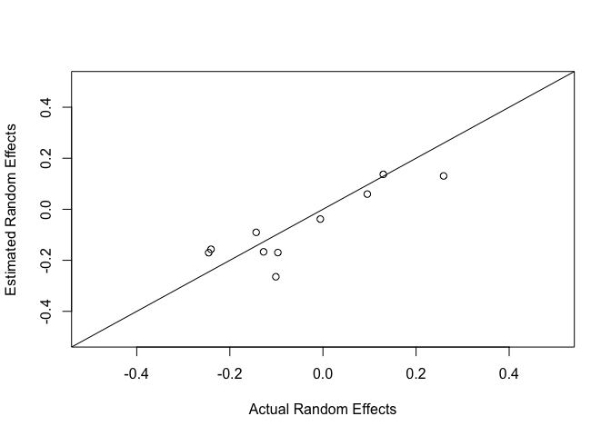
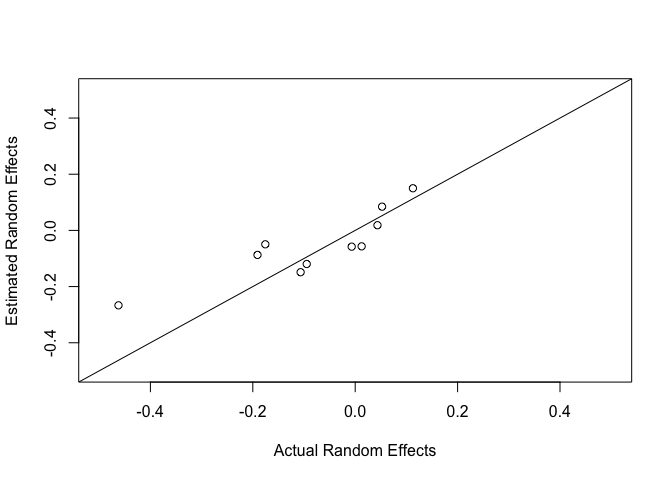
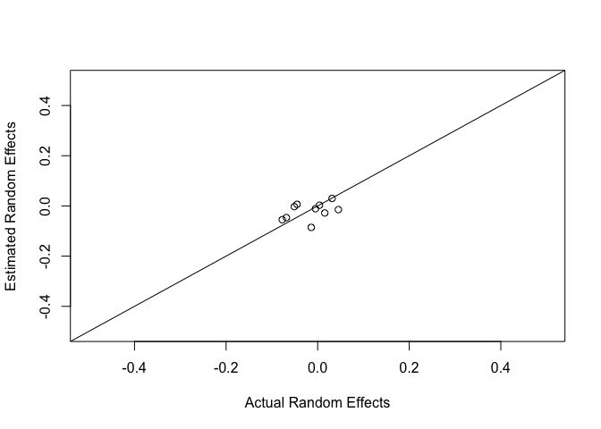

Simulation of parasite data for model checks
================

Read in and clean up data
-------------------------

``` r
ponddata <- read.csv("diss.data.2017.csv")
ponddata <- subset(ponddata, visit > 1) # take out first visit # fix this??
ponddata$visit <- ponddata$visit-1
ponddata <- ponddata[, c(2:6, 17,18)] # get just predictor variables
```

SIMULATION 1: Site-level random effect
--------------------------------------

This model predicts parasite load using only a random effect for site.

Generate random effects for each of 10 sites from a normal distribution

``` r
nsites <- length(levels(ponddata$SiteCode)) # number of levels of the random effect (10)
site.means.gamma <- NA
set.seed(12398) # makes sure the random draws are repeatable (?)

site.means.gamma <- rnorm(n = nsites, mean = 2, sd = .2) # 10 site-level means (log(mean parasite load))

# make a dataframe that we can merge with the predictor data frame
site.means.df <- data.frame(SiteCode = levels(ponddata$SiteCode), ExpMean = site.means.gamma)
# merge this with the existing predictors
ponddata2 <- merge(ponddata, site.means.df, by = "SiteCode")
```

Generate an observed parasite count from the expected site level mean. This is done using a negative binomial distribution.

``` r
# for each row of the dataset, draw a random parasite count from the expected site level means
ponddata2$Echinostoma <- rnbinom(n = nrow(ponddata2), mu = exp(ponddata2$ExpMean), size = 1)
# using the negative binomial
# not really sure what size means here but it seems that smaller values make it more aggregated
```

Fit a model; does it recapture the random effects?

``` r
stan.fit.sim1 <- stan_glmer(Echinostoma~ (1|SiteCode), data = ponddata2,  family =neg_binomial_2(link="log"))
summary(stan.fit.sim1)
```

    ## 
    ## Model Info:
    ## 
    ##  function:     stan_glmer
    ##  family:       neg_binomial_2 [log]
    ##  formula:      Echinostoma ~ (1 | SiteCode)
    ##  algorithm:    sampling
    ##  priors:       see help('prior_summary')
    ##  sample:       4000 (posterior sample size)
    ##  observations: 959
    ##  groups:       SiteCode (10)
    ## 
    ## Estimates:
    ##                                           mean    sd      2.5%    25%  
    ## (Intercept)                                 2.0     0.1     1.8     1.9
    ## b[(Intercept) SiteCode:PRNTH1]             -0.1     0.1    -0.4    -0.2
    ## b[(Intercept) SiteCode:PRNTH4]             -0.1     0.1    -0.2    -0.1
    ## b[(Intercept) SiteCode:PRNTHIDK]            0.0     0.1    -0.1     0.0
    ## b[(Intercept) SiteCode:PRNTHMIT]            0.0     0.1    -0.2    -0.1
    ## b[(Intercept) SiteCode:PRNTHOWL]            0.0     0.1    -0.2     0.0
    ## b[(Intercept) SiteCode:PRPND009]            0.0     0.1    -0.1     0.0
    ## b[(Intercept) SiteCode:PRPND010]            0.1     0.1     0.0     0.0
    ## b[(Intercept) SiteCode:PRPND014]            0.0     0.1    -0.2     0.0
    ## b[(Intercept) SiteCode:PRPND015]            0.0     0.1    -0.1     0.0
    ## b[(Intercept) SiteCode:TGIF]                0.1     0.1    -0.1     0.0
    ## reciprocal_dispersion                       1.1     0.1     1.0     1.0
    ## Sigma[SiteCode:(Intercept),(Intercept)]     0.0     0.0     0.0     0.0
    ## mean_PPD                                    7.1     0.3     6.4     6.8
    ## log-posterior                           -2915.6     3.7 -2923.5 -2917.9
    ##                                           50%     75%     97.5%
    ## (Intercept)                                 2.0     2.0     2.1
    ## b[(Intercept) SiteCode:PRNTH1]             -0.1    -0.1     0.0
    ## b[(Intercept) SiteCode:PRNTH4]             -0.1     0.0     0.1
    ## b[(Intercept) SiteCode:PRNTHIDK]            0.0     0.1     0.2
    ## b[(Intercept) SiteCode:PRNTHMIT]            0.0     0.0     0.1
    ## b[(Intercept) SiteCode:PRNTHOWL]            0.0     0.0     0.2
    ## b[(Intercept) SiteCode:PRPND009]            0.0     0.1     0.2
    ## b[(Intercept) SiteCode:PRPND010]            0.1     0.2     0.3
    ## b[(Intercept) SiteCode:PRPND014]            0.0     0.1     0.2
    ## b[(Intercept) SiteCode:PRPND015]            0.0     0.1     0.2
    ## b[(Intercept) SiteCode:TGIF]                0.1     0.1     0.3
    ## reciprocal_dispersion                       1.1     1.1     1.2
    ## Sigma[SiteCode:(Intercept),(Intercept)]     0.0     0.0     0.1
    ## mean_PPD                                    7.1     7.3     7.7
    ## log-posterior                           -2915.3 -2912.9 -2909.4
    ## 
    ## Diagnostics:
    ##                                         mcse Rhat n_eff
    ## (Intercept)                             0.0  1.0  1216 
    ## b[(Intercept) SiteCode:PRNTH1]          0.0  1.0  1728 
    ## b[(Intercept) SiteCode:PRNTH4]          0.0  1.0  1864 
    ## b[(Intercept) SiteCode:PRNTHIDK]        0.0  1.0  2423 
    ## b[(Intercept) SiteCode:PRNTHMIT]        0.0  1.0  2447 
    ## b[(Intercept) SiteCode:PRNTHOWL]        0.0  1.0  2923 
    ## b[(Intercept) SiteCode:PRPND009]        0.0  1.0  2486 
    ## b[(Intercept) SiteCode:PRPND010]        0.0  1.0  1938 
    ## b[(Intercept) SiteCode:PRPND014]        0.0  1.0  2453 
    ## b[(Intercept) SiteCode:PRPND015]        0.0  1.0  2551 
    ## b[(Intercept) SiteCode:TGIF]            0.0  1.0  2037 
    ## reciprocal_dispersion                   0.0  1.0  4065 
    ## Sigma[SiteCode:(Intercept),(Intercept)] 0.0  1.0  1155 
    ## mean_PPD                                0.0  1.0  4568 
    ## log-posterior                           0.1  1.0   965 
    ## 
    ## For each parameter, mcse is Monte Carlo standard error, n_eff is a crude measure of effective sample size, and Rhat is the potential scale reduction factor on split chains (at convergence Rhat=1).

``` r
rand.eff.sim1 <- coefficients(stan.fit.sim1)$SiteCode
rand.eff.sim1
```

    ##          (Intercept)
    ## PRNTH1      1.826865
    ## PRNTH4      1.900969
    ## PRNTHIDK    1.958181
    ## PRNTHMIT    1.917431
    ## PRNTHOWL    1.953956
    ## PRPND009    1.971701
    ## PRPND010    2.040474
    ## PRPND014    1.957749
    ## PRPND015    1.988370
    ## TGIF        2.011020

``` r
site.means.gamma
```

    ##  [1] 1.754479 1.759551 1.903147 1.898805 1.856549 2.095253 2.129608
    ##  [8] 1.872482 2.259111 1.994371

Plot the estimates vs. real

``` r
{plot(rand.eff.sim1[,1]~site.means.gamma, xlab = "Actual Random Effects", ylab = "Estimated Random Effects", xlim = c(1.5,2.5), ylim = c(1.5, 2.5))
abline(0,1)}
```



These look OK, now try again with diff set of random intercepts:

``` r
set.seed(231)
site.means.gamma <- rnorm(n = nsites, mean = 2, sd = .2) # 10 site-level means (log(mean parasite load))
site.means.df <- data.frame(SiteCode = levels(ponddata$SiteCode), ExpMean = site.means.gamma)
ponddata2 <- merge(ponddata, site.means.df, by = "SiteCode")
ponddata2$Echinostoma <- rnbinom(n = nrow(ponddata2), mu = exp(ponddata2$ExpMean), size = 1)
stan.fit.sim1 <- stan_glmer(Echinostoma~ (1|SiteCode), data = ponddata2,  family =neg_binomial_2(link="log"))
rand.eff.sim1 <- coefficients(stan.fit.sim1)$SiteCode
{plot(rand.eff.sim1[,1]~site.means.gamma, xlab = "Actual Random Effects", ylab = "Estimated Random Effects", xlim = c(1.5,2.5), ylim = c(1.5, 2.5))
abline(0,1)} 
```



It's hard to repeat this varying things like mean, sd because the model takes so long to fit! oh well. It also seems like the model underestimates variation in random effects--they are shrunk on the y axis...is this a partial pooling thing? A prior thing?

Let's try this with smaller variation between sites

``` r
set.seed(1491)
site.means.gamma <- rnorm(n = nsites, mean = 2, sd = .05) # 10 site-level means (log(mean parasite load))
site.means.df <- data.frame(SiteCode = levels(ponddata$SiteCode), ExpMean = site.means.gamma)
ponddata2 <- merge(ponddata, site.means.df, by = "SiteCode")
ponddata2$Echinostoma <- rnbinom(n = nrow(ponddata2), mu = exp(ponddata2$ExpMean), size = 1)
stan.fit.sim1 <- stan_glmer(Echinostoma~ (1|SiteCode), data = ponddata2,  family =neg_binomial_2(link="log"))
rand.eff.sim1 <- coefficients(stan.fit.sim1)$SiteCode
{plot(rand.eff.sim1[,1]~site.means.gamma, xlab = "Actual Random Effects", ylab = "Estimated Random Effects", xlim = c(1.5, 2.5), ylim = c(1.5, 2.5))
abline(0,1)}
```



Try with a poisson instead of negative binomial

``` r
set.seed(241)
site.means.gamma <- rnorm(n = nsites, mean = 2, sd = .5) # 10 site-level means (log(mean parasite load))
site.means.df <- data.frame(SiteCode = levels(ponddata$SiteCode), ExpMean = site.means.gamma)
ponddata2 <- merge(ponddata, site.means.df, by = "SiteCode")
ponddata2$Echinostoma <- rpois(n = nrow(ponddata2), lambda = exp(ponddata2$ExpMean))
stan.fit.sim1 <- stan_glmer(Echinostoma ~ (1|SiteCode), data = ponddata2,  family =poisson(link="log"))
rand.eff.sim1 <- coefficients(stan.fit.sim1)$SiteCode
{plot(rand.eff.sim1[,1]~site.means.gamma, xlab = "Actual Random Effects", ylab = "Estimated Random Effects")
abline(0,1)}
```


``` r
summary(stan.fit.sim1, digits = 3)
```

    ## 
    ## Model Info:
    ## 
    ##  function:     stan_glmer
    ##  family:       poisson [log]
    ##  formula:      Echinostoma ~ (1 | SiteCode)
    ##  algorithm:    sampling
    ##  priors:       see help('prior_summary')
    ##  sample:       4000 (posterior sample size)
    ##  observations: 959
    ##  groups:       SiteCode (10)
    ## 
    ## Estimates:
    ##                                           mean      sd        2.5%   
    ## (Intercept)                                 1.959     0.086     1.784
    ## b[(Intercept) SiteCode:PRNTH1]              0.115     0.091    -0.061
    ## b[(Intercept) SiteCode:PRNTH4]             -0.354     0.095    -0.544
    ## b[(Intercept) SiteCode:PRNTHIDK]            0.150     0.092    -0.031
    ## b[(Intercept) SiteCode:PRNTHMIT]            0.279     0.090     0.106
    ## b[(Intercept) SiteCode:PRNTHOWL]            0.252     0.091     0.075
    ## b[(Intercept) SiteCode:PRPND009]            0.102     0.091    -0.074
    ## b[(Intercept) SiteCode:PRPND010]           -0.285     0.094    -0.475
    ## b[(Intercept) SiteCode:PRPND014]           -0.117     0.093    -0.302
    ## b[(Intercept) SiteCode:PRPND015]            0.054     0.095    -0.128
    ## b[(Intercept) SiteCode:TGIF]               -0.192     0.092    -0.376
    ## Sigma[SiteCode:(Intercept),(Intercept)]     0.076     0.052     0.025
    ## mean_PPD                                    7.189     0.124     6.945
    ## log-posterior                           -2282.328     3.294 -2289.829
    ##                                           25%       50%       75%    
    ## (Intercept)                                 1.905     1.961     2.015
    ## b[(Intercept) SiteCode:PRNTH1]              0.054     0.114     0.175
    ## b[(Intercept) SiteCode:PRNTH4]             -0.415    -0.354    -0.292
    ## b[(Intercept) SiteCode:PRNTHIDK]            0.089     0.147     0.210
    ## b[(Intercept) SiteCode:PRNTHMIT]            0.220     0.277     0.337
    ## b[(Intercept) SiteCode:PRNTHOWL]            0.190     0.248     0.311
    ## b[(Intercept) SiteCode:PRPND009]            0.042     0.099     0.160
    ## b[(Intercept) SiteCode:PRPND010]           -0.347    -0.284    -0.225
    ## b[(Intercept) SiteCode:PRPND014]           -0.178    -0.120    -0.055
    ## b[(Intercept) SiteCode:PRPND015]           -0.010     0.051     0.115
    ## b[(Intercept) SiteCode:TGIF]               -0.253    -0.192    -0.133
    ## Sigma[SiteCode:(Intercept),(Intercept)]     0.045     0.063     0.091
    ## mean_PPD                                    7.105     7.191     7.272
    ## log-posterior                           -2284.257 -2282.032 -2279.966
    ##                                           97.5%  
    ## (Intercept)                                 2.130
    ## b[(Intercept) SiteCode:PRNTH1]              0.297
    ## b[(Intercept) SiteCode:PRNTH4]             -0.169
    ## b[(Intercept) SiteCode:PRNTHIDK]            0.337
    ## b[(Intercept) SiteCode:PRNTHMIT]            0.464
    ## b[(Intercept) SiteCode:PRNTHOWL]            0.440
    ## b[(Intercept) SiteCode:PRPND009]            0.287
    ## b[(Intercept) SiteCode:PRPND010]           -0.099
    ## b[(Intercept) SiteCode:PRPND014]            0.072
    ## b[(Intercept) SiteCode:PRPND015]            0.246
    ## b[(Intercept) SiteCode:TGIF]               -0.007
    ## Sigma[SiteCode:(Intercept),(Intercept)]     0.215
    ## mean_PPD                                    7.435
    ## log-posterior                           -2276.777
    ## 
    ## Diagnostics:
    ##                                         mcse  Rhat  n_eff
    ## (Intercept)                             0.003 1.001  694 
    ## b[(Intercept) SiteCode:PRNTH1]          0.003 1.002  748 
    ## b[(Intercept) SiteCode:PRNTH4]          0.003 1.002  816 
    ## b[(Intercept) SiteCode:PRNTHIDK]        0.003 1.002  792 
    ## b[(Intercept) SiteCode:PRNTHMIT]        0.003 1.002  762 
    ## b[(Intercept) SiteCode:PRNTHOWL]        0.003 1.002  770 
    ## b[(Intercept) SiteCode:PRPND009]        0.003 1.001  779 
    ## b[(Intercept) SiteCode:PRPND010]        0.003 1.002  822 
    ## b[(Intercept) SiteCode:PRPND014]        0.003 1.001  789 
    ## b[(Intercept) SiteCode:PRPND015]        0.003 1.001  823 
    ## b[(Intercept) SiteCode:TGIF]            0.003 1.000  812 
    ## Sigma[SiteCode:(Intercept),(Intercept)] 0.002 1.004  615 
    ## mean_PPD                                0.002 1.000 3914 
    ## log-posterior                           0.125 1.004  692 
    ## 
    ## For each parameter, mcse is Monte Carlo standard error, n_eff is a crude measure of effective sample size, and Rhat is the potential scale reduction factor on split chains (at convergence Rhat=1).

I think the dispersion parameter is leading to a lot of noise. The Poisson fit is better. There is an extra parameter to estimate with the negative binomial, so maybe that is the issue? Why is negative binomial so crappy??

The SD estimate around the intercept seems low (0.1) The mean is right (2)

SIMULATION 2: Random effects of site and sample
-----------------------------------------------

In this simulation we have a nested random effect for the collection visit (5 per site). The visit effects are drawn randomly from the mean for that site

``` r
set.seed(523)
site.means.gamma <- rnorm(n = nsites, mean = 3, sd = .5) # 10 site-level means (log(mean parasite load))
visit.site.means <- data.frame(SiteCode = NA, visit = 1:5, visitmean = NA)
visit.site.means <- rep(list(visit.site.means), 10)
for(i in 1:nsites){
  visit.site.means[[i]][,1]<- levels(ponddata$SiteCode)[i]
  visit.site.means[[i]][,3] <- rnorm(n = 5, mean = site.means.gamma[i], sd = 0.2)

} # visit specific random effects (the site level re will change each time I run this code)
# since I didn't figure out the set seed thing within a loop
# don't want the visit effects to be the same per site

# get these in df form to combine with predictors
site.means.df <- data.frame(SiteCode = levels(ponddata$SiteCode), ExpMean = site.means.gamma)
visit.site.means <- do.call(rbind, visit.site.means)

# merge these into the dataframe
ponddata2 <- merge(ponddata, site.means.df, by = "SiteCode")
ponddata2 <- merge(ponddata2, visit.site.means, by = c("SiteCode", "visit") )
```

Simulate the expected number of parasites from the visit mean

``` r
ponddata2$Echinostoma <- rnbinom(n = nrow(ponddata2), mu = exp(ponddata2$visitmean), size = 2)
```

Fit the model

``` r
ponddata2$SiteCodevisit <- paste(ponddata2$SiteCode, "_", ponddata2$visit, sep = "")
stan.fit.sim2 <- stan_glmer(Echinostoma ~ (1|SiteCode) + (1|SiteCodevisit), data = ponddata2,  family =neg_binomial_2(link="log"))
```

Examine fit

``` r
## site level
rand.eff.sim2.sc <- coefficients(stan.fit.sim2)$SiteCode
rand.eff.sim2.sv <- coefficients(stan.fit.sim2)$SiteCodevisit

{plot(rand.eff.sim2.sc[,1]~site.means.gamma, xlab = "Actual Random Effects", ylab = "Estimated Random Effects", main = "Site Level Random Effects")
abline(0,1)}  # looks good!
```


``` r
## visit level
visit.site.means$SiteCodevisit <- paste(visit.site.means$SiteCode,"_", visit.site.means$visit, sep = "")
rand.eff.sim2.sv$SiteCodevisit <- rownames(rand.eff.sim2.sv)
rand.eff.sim2.sv <- merge(rand.eff.sim2.sv, visit.site.means, by = "SiteCodevisit")
{plot(visitmean~`(Intercept)`, rand.eff.sim2.sv, xlab = "Actual Random Effects", ylab = "Estimated Random Effects")
abline(0,1)}  #looks decent or at least unbiased
```


SIMULATION 3: Random effects of site and sample, and fixed effects of species and visit
---------------------------------------------------------------------------------------

This has a fixed effect for species (TATO have less parasites) and visit (parasite load goes up with time)

Set parameters

``` r
nsites <- length(levels(ponddata$SiteCode)) # number of levels of the random effect (10)
site.means.gamma <- NA
set.seed(81)
site.means.gamma <- rnorm(n = nsites, mean = 2, sd = .2) # 10 site-level means (log(mean parasite load))
visit.site.means <- data.frame(SiteCode = NA, visit = 1:5, visitmean = NA)
visit.site.means <- rep(list(visit.site.means), 10)
visit.effect <- 0.2 # fixed effect for visit
species.effect <- -0.4 # fixed effect for species
for(i in 1:nsites){
  visit.site.means[[i]][,1]<- levels(ponddata$SiteCode)[i]
  visit.site.means[[i]][,3] <- rnorm(n = 5, mean = site.means.gamma[i], sd = 0.2)
  
} # visit specific random effects drawn from site means


# combine into a df with predictors
site.means.df <- data.frame(SiteCode = levels(ponddata$SiteCode), ExpMean = site.means.gamma)
visit.site.means <- do.call(rbind, visit.site.means)
# merge these into the dataframe
ponddata2 <- merge(ponddata, site.means.df, by = "SiteCode")
ponddata2 <- merge(ponddata2, visit.site.means, by = c("SiteCode", "visit") )
```

Simulate the expected number of parasites from the sample mean. The sample mean will become the intercept and I will add the fixed effects.

``` r
# add fixed effect for visit and species (have to treat as numeric to multiply by species slope)
ponddata2$EchinostomaExp <- ponddata2$visitmean + ponddata2$visit*visit.effect + (as.numeric(ponddata2$SpeciesCode)-1)*species.effect
```

Generate observed parasite counts (observations) from the expected means, again, using some kind of overdispersion parameter

``` r
ponddata2$EchinostomaObs<- rnbinom(n = nrow(ponddata2), mu = exp(ponddata2$EchinostomaExp), size = 2)
```

Fit the model

``` r
ponddata2$SiteCodevisit <- paste(ponddata2$SiteCode, "_", ponddata2$visit, sep = "")
stan.fit.sim3 <- stan_glmer(EchinostomaObs ~ visit + SpeciesCode + (1|SiteCode) + (1|SiteCodevisit), data = ponddata2,  family =neg_binomial_2(link="log"))
```

Examine fit

``` r
summary(stan.fit.sim3, digits = 4)
```

    ## 
    ## Model Info:
    ## 
    ##  function:     stan_glmer
    ##  family:       neg_binomial_2 [log]
    ##  formula:      EchinostomaObs ~ visit + SpeciesCode + (1 | SiteCode) + (1 | 
    ##     SiteCodevisit)
    ##  algorithm:    sampling
    ##  priors:       see help('prior_summary')
    ##  sample:       4000 (posterior sample size)
    ##  observations: 959
    ##  groups:       SiteCodevisit (48), SiteCode (10)
    ## 
    ## Estimates:
    ##                                                mean       sd      
    ## (Intercept)                                      2.0402     0.0894
    ## visit                                            0.1863     0.0249
    ## SpeciesCodeTATO                                 -0.4624     0.0519
    ## b[(Intercept) SiteCodevisit:PRNTH1_1]           -0.1039     0.1393
    ## b[(Intercept) SiteCodevisit:PRNTH1_2]           -0.0309     0.1208
    ## b[(Intercept) SiteCodevisit:PRNTH1_3]            0.0823     0.1096
    ## b[(Intercept) SiteCodevisit:PRNTH1_4]           -0.0122     0.1110
    ## b[(Intercept) SiteCodevisit:PRNTH1_5]            0.0262     0.1219
    ## b[(Intercept) SiteCodevisit:PRNTH4_1]           -0.0234     0.1228
    ## b[(Intercept) SiteCodevisit:PRNTH4_2]           -0.0533     0.1229
    ## b[(Intercept) SiteCodevisit:PRNTH4_3]           -0.2223     0.1432
    ## b[(Intercept) SiteCodevisit:PRNTH4_4]           -0.0228     0.1095
    ## b[(Intercept) SiteCodevisit:PRNTH4_5]            0.1961     0.1275
    ## b[(Intercept) SiteCodevisit:PRNTHIDK_1]          0.0531     0.1268
    ## b[(Intercept) SiteCodevisit:PRNTHIDK_2]          0.0329     0.1196
    ## b[(Intercept) SiteCodevisit:PRNTHIDK_3]         -0.0961     0.1252
    ## b[(Intercept) SiteCodevisit:PRNTHIDK_4]         -0.0623     0.1209
    ## b[(Intercept) SiteCodevisit:PRNTHIDK_5]          0.2533     0.1536
    ## b[(Intercept) SiteCodevisit:PRNTHMIT_1]          0.1268     0.1265
    ## b[(Intercept) SiteCodevisit:PRNTHMIT_2]          0.1561     0.1310
    ## b[(Intercept) SiteCodevisit:PRNTHMIT_3]          0.0168     0.1311
    ## b[(Intercept) SiteCodevisit:PRNTHMIT_4]         -0.0752     0.1114
    ## b[(Intercept) SiteCodevisit:PRNTHMIT_5]          0.0403     0.1194
    ## b[(Intercept) SiteCodevisit:PRNTHOWL_1]          0.1237     0.1249
    ## b[(Intercept) SiteCodevisit:PRNTHOWL_2]         -0.0837     0.1257
    ## b[(Intercept) SiteCodevisit:PRNTHOWL_3]          0.0219     0.1153
    ## b[(Intercept) SiteCodevisit:PRNTHOWL_4]          0.1107     0.1278
    ## b[(Intercept) SiteCodevisit:PRNTHOWL_5]          0.0766     0.1356
    ## b[(Intercept) SiteCodevisit:PRPND009_1]          0.1587     0.1364
    ## b[(Intercept) SiteCodevisit:PRPND009_2]         -0.0675     0.1254
    ## b[(Intercept) SiteCodevisit:PRPND009_3]         -0.0967     0.1242
    ## b[(Intercept) SiteCodevisit:PRPND009_4]          0.0380     0.1159
    ## b[(Intercept) SiteCodevisit:PRPND009_5]         -0.1287     0.1302
    ## b[(Intercept) SiteCodevisit:PRPND010_1]          0.0468     0.1252
    ## b[(Intercept) SiteCodevisit:PRPND010_2]         -0.0176     0.1229
    ## b[(Intercept) SiteCodevisit:PRPND010_3]         -0.1245     0.1307
    ## b[(Intercept) SiteCodevisit:PRPND010_4]         -0.0529     0.1183
    ## b[(Intercept) SiteCodevisit:PRPND010_5]         -0.0152     0.1191
    ## b[(Intercept) SiteCodevisit:PRPND014_1]          0.1002     0.1254
    ## b[(Intercept) SiteCodevisit:PRPND014_2]         -0.0350     0.1211
    ## b[(Intercept) SiteCodevisit:PRPND014_3]         -0.0170     0.1180
    ## b[(Intercept) SiteCodevisit:PRPND014_4]         -0.0938     0.1223
    ## b[(Intercept) SiteCodevisit:PRPND014_5]         -0.0011     0.1173
    ## b[(Intercept) SiteCodevisit:PRPND015_1]         -0.0391     0.1219
    ## b[(Intercept) SiteCodevisit:PRPND015_2]          0.0364     0.1214
    ## b[(Intercept) SiteCodevisit:PRPND015_3]         -0.0962     0.1301
    ## b[(Intercept) SiteCodevisit:TGIF_1]             -0.0028     0.1252
    ## b[(Intercept) SiteCodevisit:TGIF_2]             -0.1243     0.1325
    ## b[(Intercept) SiteCodevisit:TGIF_3]              0.0113     0.1141
    ## b[(Intercept) SiteCodevisit:TGIF_4]              0.0301     0.1172
    ## b[(Intercept) SiteCodevisit:TGIF_5]             -0.0501     0.1237
    ## b[(Intercept) SiteCode:PRNTH1]                  -0.0091     0.0591
    ## b[(Intercept) SiteCode:PRNTH4]                  -0.0213     0.0622
    ## b[(Intercept) SiteCode:PRNTHIDK]                 0.0313     0.0641
    ## b[(Intercept) SiteCode:PRNTHMIT]                 0.0465     0.0697
    ## b[(Intercept) SiteCode:PRNTHOWL]                 0.0462     0.0700
    ## b[(Intercept) SiteCode:PRPND009]                -0.0172     0.0612
    ## b[(Intercept) SiteCode:PRPND010]                -0.0302     0.0643
    ## b[(Intercept) SiteCode:PRPND014]                -0.0098     0.0606
    ## b[(Intercept) SiteCode:PRPND015]                -0.0195     0.0682
    ## b[(Intercept) SiteCode:TGIF]                    -0.0250     0.0620
    ## reciprocal_dispersion                            1.8867     0.1101
    ## Sigma[SiteCodevisit:(Intercept),(Intercept)]     0.0253     0.0138
    ## Sigma[SiteCode:(Intercept),(Intercept)]          0.0070     0.0111
    ## mean_PPD                                        11.4535     0.4401
    ## log-posterior                                -3310.0603     7.9316
    ##                                                2.5%       25%     
    ## (Intercept)                                      1.8640     1.9842
    ## visit                                            0.1372     0.1700
    ## SpeciesCodeTATO                                 -0.5633    -0.4976
    ## b[(Intercept) SiteCodevisit:PRNTH1_1]           -0.4001    -0.1919
    ## b[(Intercept) SiteCodevisit:PRNTH1_2]           -0.2828    -0.1071
    ## b[(Intercept) SiteCodevisit:PRNTH1_3]           -0.1232     0.0074
    ## b[(Intercept) SiteCodevisit:PRNTH1_4]           -0.2350    -0.0841
    ## b[(Intercept) SiteCodevisit:PRNTH1_5]           -0.2101    -0.0542
    ## b[(Intercept) SiteCodevisit:PRNTH4_1]           -0.2720    -0.1020
    ## b[(Intercept) SiteCodevisit:PRNTH4_2]           -0.3030    -0.1310
    ## b[(Intercept) SiteCodevisit:PRNTH4_3]           -0.5242    -0.3149
    ## b[(Intercept) SiteCodevisit:PRNTH4_4]           -0.2405    -0.0916
    ## b[(Intercept) SiteCodevisit:PRNTH4_5]           -0.0232     0.1056
    ## b[(Intercept) SiteCodevisit:PRNTHIDK_1]         -0.1838    -0.0301
    ## b[(Intercept) SiteCodevisit:PRNTHIDK_2]         -0.1959    -0.0445
    ## b[(Intercept) SiteCodevisit:PRNTHIDK_3]         -0.3516    -0.1765
    ## b[(Intercept) SiteCodevisit:PRNTHIDK_4]         -0.3081    -0.1403
    ## b[(Intercept) SiteCodevisit:PRNTHIDK_5]         -0.0086     0.1433
    ## b[(Intercept) SiteCodevisit:PRNTHMIT_1]         -0.1040     0.0387
    ## b[(Intercept) SiteCodevisit:PRNTHMIT_2]         -0.0711     0.0627
    ## b[(Intercept) SiteCodevisit:PRNTHMIT_3]         -0.2433    -0.0656
    ## b[(Intercept) SiteCodevisit:PRNTHMIT_4]         -0.3035    -0.1457
    ## b[(Intercept) SiteCodevisit:PRNTHMIT_5]         -0.1916    -0.0369
    ## b[(Intercept) SiteCodevisit:PRNTHOWL_1]         -0.0980     0.0361
    ## b[(Intercept) SiteCodevisit:PRNTHOWL_2]         -0.3460    -0.1623
    ## b[(Intercept) SiteCodevisit:PRNTHOWL_3]         -0.1986    -0.0536
    ## b[(Intercept) SiteCodevisit:PRNTHOWL_4]         -0.1178     0.0211
    ## b[(Intercept) SiteCodevisit:PRNTHOWL_5]         -0.1750    -0.0108
    ## b[(Intercept) SiteCodevisit:PRPND009_1]         -0.0828     0.0633
    ## b[(Intercept) SiteCodevisit:PRPND009_2]         -0.3193    -0.1472
    ## b[(Intercept) SiteCodevisit:PRPND009_3]         -0.3561    -0.1750
    ## b[(Intercept) SiteCodevisit:PRPND009_4]         -0.1789    -0.0376
    ## b[(Intercept) SiteCodevisit:PRPND009_5]         -0.3990    -0.2117
    ## b[(Intercept) SiteCodevisit:PRPND010_1]         -0.1974    -0.0347
    ## b[(Intercept) SiteCodevisit:PRPND010_2]         -0.2694    -0.0959
    ## b[(Intercept) SiteCodevisit:PRPND010_3]         -0.4001    -0.2043
    ## b[(Intercept) SiteCodevisit:PRPND010_4]         -0.3002    -0.1236
    ## b[(Intercept) SiteCodevisit:PRPND010_5]         -0.2543    -0.0866
    ## b[(Intercept) SiteCodevisit:PRPND014_1]         -0.1291     0.0134
    ## b[(Intercept) SiteCodevisit:PRPND014_2]         -0.2866    -0.1127
    ## b[(Intercept) SiteCodevisit:PRPND014_3]         -0.2568    -0.0917
    ## b[(Intercept) SiteCodevisit:PRPND014_4]         -0.3421    -0.1741
    ## b[(Intercept) SiteCodevisit:PRPND014_5]         -0.2347    -0.0740
    ## b[(Intercept) SiteCodevisit:PRPND015_1]         -0.2830    -0.1173
    ## b[(Intercept) SiteCodevisit:PRPND015_2]         -0.2057    -0.0413
    ## b[(Intercept) SiteCodevisit:PRPND015_3]         -0.3674    -0.1808
    ## b[(Intercept) SiteCodevisit:TGIF_1]             -0.2515    -0.0828
    ## b[(Intercept) SiteCodevisit:TGIF_2]             -0.4110    -0.2053
    ## b[(Intercept) SiteCodevisit:TGIF_3]             -0.2139    -0.0609
    ## b[(Intercept) SiteCodevisit:TGIF_4]             -0.1943    -0.0462
    ## b[(Intercept) SiteCodevisit:TGIF_5]             -0.2986    -0.1322
    ## b[(Intercept) SiteCode:PRNTH1]                  -0.1425    -0.0365
    ## b[(Intercept) SiteCode:PRNTH4]                  -0.1689    -0.0511
    ## b[(Intercept) SiteCode:PRNTHIDK]                -0.0740    -0.0045
    ## b[(Intercept) SiteCode:PRNTHMIT]                -0.0561     0.0000
    ## b[(Intercept) SiteCode:PRNTHOWL]                -0.0580     0.0001
    ## b[(Intercept) SiteCode:PRPND009]                -0.1572    -0.0435
    ## b[(Intercept) SiteCode:PRPND010]                -0.1841    -0.0616
    ## b[(Intercept) SiteCode:PRPND014]                -0.1511    -0.0376
    ## b[(Intercept) SiteCode:PRPND015]                -0.1799    -0.0501
    ## b[(Intercept) SiteCode:TGIF]                    -0.1689    -0.0555
    ## reciprocal_dispersion                            1.6812     1.8102
    ## Sigma[SiteCodevisit:(Intercept),(Intercept)]     0.0040     0.0155
    ## Sigma[SiteCode:(Intercept),(Intercept)]          0.0000     0.0008
    ## mean_PPD                                        10.6162    11.1533
    ## log-posterior                                -3326.4996 -3315.1551
    ##                                                50%        75%     
    ## (Intercept)                                      2.0395     2.0974
    ## visit                                            0.1862     0.2023
    ## SpeciesCodeTATO                                 -0.4630    -0.4270
    ## b[(Intercept) SiteCodevisit:PRNTH1_1]           -0.0970    -0.0082
    ## b[(Intercept) SiteCodevisit:PRNTH1_2]           -0.0271     0.0481
    ## b[(Intercept) SiteCodevisit:PRNTH1_3]            0.0773     0.1523
    ## b[(Intercept) SiteCodevisit:PRNTH1_4]           -0.0121     0.0584
    ## b[(Intercept) SiteCodevisit:PRNTH1_5]            0.0245     0.1063
    ## b[(Intercept) SiteCodevisit:PRNTH4_1]           -0.0221     0.0544
    ## b[(Intercept) SiteCodevisit:PRNTH4_2]           -0.0513     0.0250
    ## b[(Intercept) SiteCodevisit:PRNTH4_3]           -0.2147    -0.1202
    ## b[(Intercept) SiteCodevisit:PRNTH4_4]           -0.0228     0.0471
    ## b[(Intercept) SiteCodevisit:PRNTH4_5]            0.1881     0.2783
    ## b[(Intercept) SiteCodevisit:PRNTHIDK_1]          0.0472     0.1330
    ## b[(Intercept) SiteCodevisit:PRNTHIDK_2]          0.0319     0.1090
    ## b[(Intercept) SiteCodevisit:PRNTHIDK_3]         -0.0896    -0.0101
    ## b[(Intercept) SiteCodevisit:PRNTHIDK_4]         -0.0605     0.0181
    ## b[(Intercept) SiteCodevisit:PRNTHIDK_5]          0.2428     0.3484
    ## b[(Intercept) SiteCodevisit:PRNTHMIT_1]          0.1223     0.2066
    ## b[(Intercept) SiteCodevisit:PRNTHMIT_2]          0.1471     0.2380
    ## b[(Intercept) SiteCodevisit:PRNTHMIT_3]          0.0141     0.0970
    ## b[(Intercept) SiteCodevisit:PRNTHMIT_4]         -0.0729    -0.0016
    ## b[(Intercept) SiteCodevisit:PRNTHMIT_5]          0.0371     0.1161
    ## b[(Intercept) SiteCodevisit:PRNTHOWL_1]          0.1169     0.2045
    ## b[(Intercept) SiteCodevisit:PRNTHOWL_2]         -0.0792     0.0012
    ## b[(Intercept) SiteCodevisit:PRNTHOWL_3]          0.0162     0.0994
    ## b[(Intercept) SiteCodevisit:PRNTHOWL_4]          0.1041     0.1930
    ## b[(Intercept) SiteCodevisit:PRNTHOWL_5]          0.0724     0.1564
    ## b[(Intercept) SiteCodevisit:PRPND009_1]          0.1489     0.2451
    ## b[(Intercept) SiteCodevisit:PRPND009_2]         -0.0636     0.0157
    ## b[(Intercept) SiteCodevisit:PRPND009_3]         -0.0896    -0.0102
    ## b[(Intercept) SiteCodevisit:PRPND009_4]          0.0325     0.1095
    ## b[(Intercept) SiteCodevisit:PRPND009_5]         -0.1229    -0.0391
    ## b[(Intercept) SiteCodevisit:PRPND010_1]          0.0415     0.1272
    ## b[(Intercept) SiteCodevisit:PRPND010_2]         -0.0184     0.0586
    ## b[(Intercept) SiteCodevisit:PRPND010_3]         -0.1168    -0.0347
    ## b[(Intercept) SiteCodevisit:PRPND010_4]         -0.0491     0.0242
    ## b[(Intercept) SiteCodevisit:PRPND010_5]         -0.0154     0.0602
    ## b[(Intercept) SiteCodevisit:PRPND014_1]          0.0928     0.1790
    ## b[(Intercept) SiteCodevisit:PRPND014_2]         -0.0332     0.0437
    ## b[(Intercept) SiteCodevisit:PRPND014_3]         -0.0172     0.0572
    ## b[(Intercept) SiteCodevisit:PRPND014_4]         -0.0879    -0.0096
    ## b[(Intercept) SiteCodevisit:PRPND014_5]         -0.0016     0.0710
    ## b[(Intercept) SiteCodevisit:PRPND015_1]         -0.0388     0.0397
    ## b[(Intercept) SiteCodevisit:PRPND015_2]          0.0318     0.1114
    ## b[(Intercept) SiteCodevisit:PRPND015_3]         -0.0902    -0.0059
    ## b[(Intercept) SiteCodevisit:TGIF_1]             -0.0016     0.0729
    ## b[(Intercept) SiteCodevisit:TGIF_2]             -0.1174    -0.0355
    ## b[(Intercept) SiteCodevisit:TGIF_3]              0.0124     0.0839
    ## b[(Intercept) SiteCodevisit:TGIF_4]              0.0268     0.1061
    ## b[(Intercept) SiteCodevisit:TGIF_5]             -0.0463     0.0312
    ## b[(Intercept) SiteCode:PRNTH1]                  -0.0032     0.0192
    ## b[(Intercept) SiteCode:PRNTH4]                  -0.0094     0.0107
    ## b[(Intercept) SiteCode:PRNTHIDK]                 0.0167     0.0620
    ## b[(Intercept) SiteCode:PRNTHMIT]                 0.0299     0.0830
    ## b[(Intercept) SiteCode:PRNTHOWL]                 0.0283     0.0812
    ## b[(Intercept) SiteCode:PRPND009]                -0.0075     0.0115
    ## b[(Intercept) SiteCode:PRPND010]                -0.0154     0.0058
    ## b[(Intercept) SiteCode:PRPND014]                -0.0037     0.0207
    ## b[(Intercept) SiteCode:PRPND015]                -0.0083     0.0131
    ## b[(Intercept) SiteCode:TGIF]                    -0.0125     0.0089
    ## reciprocal_dispersion                            1.8831     1.9582
    ## Sigma[SiteCodevisit:(Intercept),(Intercept)]     0.0236     0.0332
    ## Sigma[SiteCode:(Intercept),(Intercept)]          0.0034     0.0086
    ## mean_PPD                                        11.4520    11.7341
    ## log-posterior                                -3309.7295 -3304.4398
    ##                                                97.5%   
    ## (Intercept)                                      2.2216
    ## visit                                            0.2362
    ## SpeciesCodeTATO                                 -0.3627
    ## b[(Intercept) SiteCodevisit:PRNTH1_1]            0.1542
    ## b[(Intercept) SiteCodevisit:PRNTH1_2]            0.2063
    ## b[(Intercept) SiteCodevisit:PRNTH1_3]            0.3090
    ## b[(Intercept) SiteCodevisit:PRNTH1_4]            0.2073
    ## b[(Intercept) SiteCodevisit:PRNTH1_5]            0.2731
    ## b[(Intercept) SiteCodevisit:PRNTH4_1]            0.2209
    ## b[(Intercept) SiteCodevisit:PRNTH4_2]            0.1911
    ## b[(Intercept) SiteCodevisit:PRNTH4_3]            0.0271
    ## b[(Intercept) SiteCodevisit:PRNTH4_4]            0.1940
    ## b[(Intercept) SiteCodevisit:PRNTH4_5]            0.4664
    ## b[(Intercept) SiteCodevisit:PRNTHIDK_1]          0.3120
    ## b[(Intercept) SiteCodevisit:PRNTHIDK_2]          0.2693
    ## b[(Intercept) SiteCodevisit:PRNTHIDK_3]          0.1381
    ## b[(Intercept) SiteCodevisit:PRNTHIDK_4]          0.1694
    ## b[(Intercept) SiteCodevisit:PRNTHIDK_5]          0.5847
    ## b[(Intercept) SiteCodevisit:PRNTHMIT_1]          0.3890
    ## b[(Intercept) SiteCodevisit:PRNTHMIT_2]          0.4381
    ## b[(Intercept) SiteCodevisit:PRNTHMIT_3]          0.2849
    ## b[(Intercept) SiteCodevisit:PRNTHMIT_4]          0.1406
    ## b[(Intercept) SiteCodevisit:PRNTHMIT_5]          0.2846
    ## b[(Intercept) SiteCodevisit:PRNTHOWL_1]          0.3880
    ## b[(Intercept) SiteCodevisit:PRNTHOWL_2]          0.1563
    ## b[(Intercept) SiteCodevisit:PRNTHOWL_3]          0.2500
    ## b[(Intercept) SiteCodevisit:PRNTHOWL_4]          0.3806
    ## b[(Intercept) SiteCodevisit:PRNTHOWL_5]          0.3772
    ## b[(Intercept) SiteCodevisit:PRPND009_1]          0.4482
    ## b[(Intercept) SiteCodevisit:PRPND009_2]          0.1728
    ## b[(Intercept) SiteCodevisit:PRPND009_3]          0.1293
    ## b[(Intercept) SiteCodevisit:PRPND009_4]          0.2792
    ## b[(Intercept) SiteCodevisit:PRPND009_5]          0.1063
    ## b[(Intercept) SiteCodevisit:PRPND010_1]          0.2994
    ## b[(Intercept) SiteCodevisit:PRPND010_2]          0.2294
    ## b[(Intercept) SiteCodevisit:PRPND010_3]          0.1159
    ## b[(Intercept) SiteCodevisit:PRPND010_4]          0.1754
    ## b[(Intercept) SiteCodevisit:PRPND010_5]          0.2164
    ## b[(Intercept) SiteCodevisit:PRPND014_1]          0.3642
    ## b[(Intercept) SiteCodevisit:PRPND014_2]          0.1995
    ## b[(Intercept) SiteCodevisit:PRPND014_3]          0.2242
    ## b[(Intercept) SiteCodevisit:PRPND014_4]          0.1380
    ## b[(Intercept) SiteCodevisit:PRPND014_5]          0.2349
    ## b[(Intercept) SiteCodevisit:PRPND015_1]          0.2020
    ## b[(Intercept) SiteCodevisit:PRPND015_2]          0.2855
    ## b[(Intercept) SiteCodevisit:PRPND015_3]          0.1415
    ## b[(Intercept) SiteCodevisit:TGIF_1]              0.2507
    ## b[(Intercept) SiteCodevisit:TGIF_2]              0.1161
    ## b[(Intercept) SiteCodevisit:TGIF_3]              0.2433
    ## b[(Intercept) SiteCodevisit:TGIF_4]              0.2611
    ## b[(Intercept) SiteCodevisit:TGIF_5]              0.1928
    ## b[(Intercept) SiteCode:PRNTH1]                   0.1070
    ## b[(Intercept) SiteCode:PRNTH4]                   0.0876
    ## b[(Intercept) SiteCode:PRNTHIDK]                 0.1864
    ## b[(Intercept) SiteCode:PRNTHMIT]                 0.2203
    ## b[(Intercept) SiteCode:PRNTHOWL]                 0.2161
    ## b[(Intercept) SiteCode:PRPND009]                 0.1011
    ## b[(Intercept) SiteCode:PRPND010]                 0.0750
    ## b[(Intercept) SiteCode:PRPND014]                 0.1083
    ## b[(Intercept) SiteCode:PRPND015]                 0.1069
    ## b[(Intercept) SiteCode:TGIF]                     0.0838
    ## reciprocal_dispersion                            2.1174
    ## Sigma[SiteCodevisit:(Intercept),(Intercept)]     0.0590
    ## Sigma[SiteCode:(Intercept),(Intercept)]          0.0344
    ## mean_PPD                                        12.3463
    ## log-posterior                                -3295.8941
    ## 
    ## Diagnostics:
    ##                                              mcse   Rhat   n_eff
    ## (Intercept)                                  0.0015 0.9999 3739 
    ## visit                                        0.0004 0.9995 4146 
    ## SpeciesCodeTATO                              0.0006 0.9992 7008 
    ## b[(Intercept) SiteCodevisit:PRNTH1_1]        0.0020 0.9998 4864 
    ## b[(Intercept) SiteCodevisit:PRNTH1_2]        0.0015 0.9997 6574 
    ## b[(Intercept) SiteCodevisit:PRNTH1_3]        0.0015 0.9995 5695 
    ## b[(Intercept) SiteCodevisit:PRNTH1_4]        0.0014 0.9996 6447 
    ## b[(Intercept) SiteCodevisit:PRNTH1_5]        0.0015 0.9991 6371 
    ## b[(Intercept) SiteCodevisit:PRNTH4_1]        0.0016 0.9997 6167 
    ## b[(Intercept) SiteCodevisit:PRNTH4_2]        0.0015 0.9999 6341 
    ## b[(Intercept) SiteCodevisit:PRNTH4_3]        0.0024 1.0002 3563 
    ## b[(Intercept) SiteCodevisit:PRNTH4_4]        0.0014 0.9993 6054 
    ## b[(Intercept) SiteCodevisit:PRNTH4_5]        0.0020 1.0002 4020 
    ## b[(Intercept) SiteCodevisit:PRNTHIDK_1]      0.0019 1.0011 4546 
    ## b[(Intercept) SiteCodevisit:PRNTHIDK_2]      0.0015 0.9995 6144 
    ## b[(Intercept) SiteCodevisit:PRNTHIDK_3]      0.0017 0.9994 5357 
    ## b[(Intercept) SiteCodevisit:PRNTHIDK_4]      0.0015 1.0001 6681 
    ## b[(Intercept) SiteCodevisit:PRNTHIDK_5]      0.0029 1.0001 2773 
    ## b[(Intercept) SiteCodevisit:PRNTHMIT_1]      0.0019 0.9992 4410 
    ## b[(Intercept) SiteCodevisit:PRNTHMIT_2]      0.0021 1.0004 3808 
    ## b[(Intercept) SiteCodevisit:PRNTHMIT_3]      0.0015 0.9995 7975 
    ## b[(Intercept) SiteCodevisit:PRNTHMIT_4]      0.0015 0.9993 5347 
    ## b[(Intercept) SiteCodevisit:PRNTHMIT_5]      0.0015 0.9995 6430 
    ## b[(Intercept) SiteCodevisit:PRNTHOWL_1]      0.0019 0.9994 4157 
    ## b[(Intercept) SiteCodevisit:PRNTHOWL_2]      0.0016 0.9998 5860 
    ## b[(Intercept) SiteCodevisit:PRNTHOWL_3]      0.0015 0.9993 6233 
    ## b[(Intercept) SiteCodevisit:PRNTHOWL_4]      0.0018 1.0005 4802 
    ## b[(Intercept) SiteCodevisit:PRNTHOWL_5]      0.0018 0.9994 5539 
    ## b[(Intercept) SiteCodevisit:PRPND009_1]      0.0021 1.0000 4034 
    ## b[(Intercept) SiteCodevisit:PRPND009_2]      0.0015 1.0001 6975 
    ## b[(Intercept) SiteCodevisit:PRPND009_3]      0.0015 0.9998 6435 
    ## b[(Intercept) SiteCodevisit:PRPND009_4]      0.0014 0.9993 7103 
    ## b[(Intercept) SiteCodevisit:PRPND009_5]      0.0019 0.9994 4681 
    ## b[(Intercept) SiteCodevisit:PRPND010_1]      0.0015 0.9993 6605 
    ## b[(Intercept) SiteCodevisit:PRPND010_2]      0.0015 0.9995 6964 
    ## b[(Intercept) SiteCodevisit:PRPND010_3]      0.0018 1.0001 5031 
    ## b[(Intercept) SiteCodevisit:PRPND010_4]      0.0015 0.9991 6299 
    ## b[(Intercept) SiteCodevisit:PRPND010_5]      0.0015 0.9993 6047 
    ## b[(Intercept) SiteCodevisit:PRPND014_1]      0.0017 0.9998 5316 
    ## b[(Intercept) SiteCodevisit:PRPND014_2]      0.0015 0.9994 6346 
    ## b[(Intercept) SiteCodevisit:PRPND014_3]      0.0014 0.9994 6911 
    ## b[(Intercept) SiteCodevisit:PRPND014_4]      0.0016 0.9996 5506 
    ## b[(Intercept) SiteCodevisit:PRPND014_5]      0.0014 0.9995 7025 
    ## b[(Intercept) SiteCodevisit:PRPND015_1]      0.0014 0.9995 7912 
    ## b[(Intercept) SiteCodevisit:PRPND015_2]      0.0015 0.9993 6364 
    ## b[(Intercept) SiteCodevisit:PRPND015_3]      0.0017 0.9998 6122 
    ## b[(Intercept) SiteCodevisit:TGIF_1]          0.0016 0.9995 6461 
    ## b[(Intercept) SiteCodevisit:TGIF_2]          0.0020 1.0002 4243 
    ## b[(Intercept) SiteCodevisit:TGIF_3]          0.0014 0.9992 6515 
    ## b[(Intercept) SiteCodevisit:TGIF_4]          0.0015 1.0002 6402 
    ## b[(Intercept) SiteCodevisit:TGIF_5]          0.0017 0.9996 5242 
    ## b[(Intercept) SiteCode:PRNTH1]               0.0009 0.9991 3999 
    ## b[(Intercept) SiteCode:PRNTH4]               0.0011 0.9995 3355 
    ## b[(Intercept) SiteCode:PRNTHIDK]             0.0011 1.0003 3277 
    ## b[(Intercept) SiteCode:PRNTHMIT]             0.0014 0.9998 2644 
    ## b[(Intercept) SiteCode:PRNTHOWL]             0.0014 0.9999 2368 
    ## b[(Intercept) SiteCode:PRPND009]             0.0010 1.0009 3773 
    ## b[(Intercept) SiteCode:PRPND010]             0.0011 0.9996 3239 
    ## b[(Intercept) SiteCode:PRPND014]             0.0009 0.9997 4315 
    ## b[(Intercept) SiteCode:PRPND015]             0.0011 0.9996 3963 
    ## b[(Intercept) SiteCode:TGIF]                 0.0011 1.0008 3189 
    ## reciprocal_dispersion                        0.0014 0.9998 6337 
    ## Sigma[SiteCodevisit:(Intercept),(Intercept)] 0.0004 1.0038 1484 
    ## Sigma[SiteCode:(Intercept),(Intercept)]      0.0003 1.0009 1382 
    ## mean_PPD                                     0.0065 1.0002 4643 
    ## log-posterior                                0.2661 1.0028  889 
    ## 
    ## For each parameter, mcse is Monte Carlo standard error, n_eff is a crude measure of effective sample size, and Rhat is the potential scale reduction factor on split chains (at convergence Rhat=1).

``` r
rand.eff.sim3.sc <- coefficients(stan.fit.sim3)$SiteCode
rand.eff.sim3.sv <- coefficients(stan.fit.sim3)$SiteCodevisit

## site level RE
{plot(rand.eff.sim3.sc[,1]~site.means.gamma, xlab = "Actual Random Effects", ylab = "Estimated Random Effects", xlim = c(1,2.5), ylim = c(1, 2.5), main = "Site level random effects")
abline(0,1)}  # looks bad! It's estimating a very low site-level variance! 
```


``` r
## visit level RE
visit.site.means$SiteCodevisit <- paste(visit.site.means$SiteCode,"_", visit.site.means$visit, sep = "")
rand.eff.sim3.sv$SiteCodevisit <- rownames(rand.eff.sim3.sv)
rand.eff.sim3.sv <- merge(rand.eff.sim3.sv, visit.site.means, by = "SiteCodevisit")
{plot(visitmean~`(Intercept)`, rand.eff.sim3.sv, xlab = "Actual Random Effects", ylab = "Estimated Random Effects", main = "Visit level random effects")
abline(0,1)} 
```


``` r
## fixed effects
stan.fit.sim3$coefficients[1:3]
```

    ##     (Intercept)           visit SpeciesCodeTATO 
    ##       2.0394978       0.1862440      -0.4630327

``` r
# estimated visit effect is 0.186; compared to 0.2
# estimated species effect is -0.46; compared to -0.4
```

I think this might be wrong. Maybe the sample level needs to be : Site-mean + visiteffect\*1 Does it really make a difference if I do this at the individual level or not? Let's see...

``` r
visit.site.means <- data.frame(SiteCode = NA, visit = 1:5, visitmean = NA)
visit.site.means <- rep(list(visit.site.means), 10)
visit.effect <- 0.2 # fixed effect for visit
species.effect <- -0.4 # fixed effect for species

# at each visit, we have a random visit effect (intercept) plus the fixed effect of time
for(i in 1:nsites){
  visit.site.means[[i]][,1]<- levels(ponddata$SiteCode)[i]
  for(j in 1:5){
      visit.site.means[[i]][j,3] <- rnorm(n = 1, mean = site.means.gamma[i], sd = 0.2) + j*visit.effect
  }
} # visit specific random effects drawn from site means

site.means.df <- data.frame(SiteCode = levels(ponddata$SiteCode), ExpMean = site.means.gamma)
visit.site.means <- do.call(rbind, visit.site.means)
# merge these into the dataframe
ponddata2 <- merge(ponddata, site.means.df, by = "SiteCode")
ponddata2 <- merge(ponddata2, visit.site.means, by = c("SiteCode", "visit"))
# add fixed effect for species (have to treat as numeric to multiply by species slope)
ponddata2$EchinostomaExp <- ponddata2$visitmean + (as.numeric(ponddata2$SpeciesCode)-1)*species.effect
ponddata2$EchinostomaObs<- rnbinom(n = nrow(ponddata2), mu = exp(ponddata2$EchinostomaExp), size = 2)
ponddata2$SiteCodevisit <- paste(ponddata2$SiteCode, "_", ponddata2$visit, sep = "")
stan.fit.sim4 <- stan_glmer(EchinostomaObs ~ visit + SpeciesCode + (1|SiteCode) + (1|SiteCodevisit), data = ponddata2,  family =neg_binomial_2(link="log"))
```

Examine fit

``` r
summary(stan.fit.sim4, digits = 4)
```

    ## 
    ## Model Info:
    ## 
    ##  function:     stan_glmer
    ##  family:       neg_binomial_2 [log]
    ##  formula:      EchinostomaObs ~ visit + SpeciesCode + (1 | SiteCode) + (1 | 
    ##     SiteCodevisit)
    ##  algorithm:    sampling
    ##  priors:       see help('prior_summary')
    ##  sample:       4000 (posterior sample size)
    ##  observations: 959
    ##  groups:       SiteCodevisit (48), SiteCode (10)
    ## 
    ## Estimates:
    ##                                                mean       sd      
    ## (Intercept)                                      2.0417     0.1126
    ## visit                                            0.1634     0.0326
    ## SpeciesCodeTATO                                 -0.3076     0.0519
    ## b[(Intercept) SiteCodevisit:PRNTH1_1]           -0.1467     0.1784
    ## b[(Intercept) SiteCodevisit:PRNTH1_2]           -0.3201     0.1661
    ## b[(Intercept) SiteCodevisit:PRNTH1_3]            0.0804     0.1381
    ## b[(Intercept) SiteCodevisit:PRNTH1_4]           -0.0574     0.1452
    ## b[(Intercept) SiteCodevisit:PRNTH1_5]            0.1882     0.1571
    ## b[(Intercept) SiteCodevisit:PRNTH4_1]           -0.0940     0.1642
    ## b[(Intercept) SiteCodevisit:PRNTH4_2]            0.3121     0.1596
    ## b[(Intercept) SiteCodevisit:PRNTH4_3]            0.3048     0.1483
    ## b[(Intercept) SiteCodevisit:PRNTH4_4]           -0.2668     0.1473
    ## b[(Intercept) SiteCodevisit:PRNTH4_5]            0.2071     0.1572
    ## b[(Intercept) SiteCodevisit:PRNTHIDK_1]         -0.1598     0.1716
    ## b[(Intercept) SiteCodevisit:PRNTHIDK_2]         -0.0841     0.1653
    ## b[(Intercept) SiteCodevisit:PRNTHIDK_3]          0.4136     0.1573
    ## b[(Intercept) SiteCodevisit:PRNTHIDK_4]          0.1313     0.1501
    ## b[(Intercept) SiteCodevisit:PRNTHIDK_5]          0.1680     0.1780
    ## b[(Intercept) SiteCodevisit:PRNTHMIT_1]          0.1369     0.1574
    ## b[(Intercept) SiteCodevisit:PRNTHMIT_2]          0.0409     0.1556
    ## b[(Intercept) SiteCodevisit:PRNTHMIT_3]         -0.0693     0.1791
    ## b[(Intercept) SiteCodevisit:PRNTHMIT_4]          0.1644     0.1406
    ## b[(Intercept) SiteCodevisit:PRNTHMIT_5]          0.0078     0.1575
    ## b[(Intercept) SiteCodevisit:PRNTHOWL_1]         -0.1344     0.1610
    ## b[(Intercept) SiteCodevisit:PRNTHOWL_2]         -0.0287     0.1625
    ## b[(Intercept) SiteCodevisit:PRNTHOWL_3]         -0.0728     0.1462
    ## b[(Intercept) SiteCodevisit:PRNTHOWL_4]          0.0133     0.1673
    ## b[(Intercept) SiteCodevisit:PRNTHOWL_5]         -0.1040     0.1808
    ## b[(Intercept) SiteCodevisit:PRPND009_1]         -0.1721     0.1903
    ## b[(Intercept) SiteCodevisit:PRPND009_2]          0.3662     0.1519
    ## b[(Intercept) SiteCodevisit:PRPND009_3]         -0.0868     0.1565
    ## b[(Intercept) SiteCodevisit:PRPND009_4]         -0.1501     0.1494
    ## b[(Intercept) SiteCodevisit:PRPND009_5]         -0.0652     0.1577
    ## b[(Intercept) SiteCodevisit:PRPND010_1]          0.0679     0.1605
    ## b[(Intercept) SiteCodevisit:PRPND010_2]         -0.0267     0.1613
    ## b[(Intercept) SiteCodevisit:PRPND010_3]         -0.1002     0.1597
    ## b[(Intercept) SiteCodevisit:PRPND010_4]          0.0784     0.1512
    ## b[(Intercept) SiteCodevisit:PRPND010_5]         -0.1216     0.1633
    ## b[(Intercept) SiteCodevisit:PRPND014_1]          0.0699     0.1571
    ## b[(Intercept) SiteCodevisit:PRPND014_2]          0.0938     0.1558
    ## b[(Intercept) SiteCodevisit:PRPND014_3]          0.2060     0.1529
    ## b[(Intercept) SiteCodevisit:PRPND014_4]         -0.0766     0.1514
    ## b[(Intercept) SiteCodevisit:PRPND014_5]         -0.4740     0.1795
    ## b[(Intercept) SiteCodevisit:PRPND015_1]          0.1182     0.1643
    ## b[(Intercept) SiteCodevisit:PRPND015_2]         -0.4971     0.1891
    ## b[(Intercept) SiteCodevisit:PRPND015_3]         -0.0808     0.1558
    ## b[(Intercept) SiteCodevisit:TGIF_1]              0.2390     0.1608
    ## b[(Intercept) SiteCodevisit:TGIF_2]             -0.1554     0.1603
    ## b[(Intercept) SiteCodevisit:TGIF_3]              0.1198     0.1386
    ## b[(Intercept) SiteCodevisit:TGIF_4]              0.0393     0.1547
    ## b[(Intercept) SiteCodevisit:TGIF_5]             -0.0019     0.1577
    ## b[(Intercept) SiteCode:PRNTH1]                  -0.0222     0.0755
    ## b[(Intercept) SiteCode:PRNTH4]                   0.0439     0.0831
    ## b[(Intercept) SiteCode:PRNTHIDK]                 0.0458     0.0854
    ## b[(Intercept) SiteCode:PRNTHMIT]                 0.0296     0.0787
    ## b[(Intercept) SiteCode:PRNTHOWL]                -0.0304     0.0772
    ## b[(Intercept) SiteCode:PRPND009]                -0.0070     0.0732
    ## b[(Intercept) SiteCode:PRPND010]                -0.0090     0.0728
    ## b[(Intercept) SiteCode:PRPND014]                -0.0168     0.0719
    ## b[(Intercept) SiteCode:PRPND015]                -0.0523     0.0917
    ## b[(Intercept) SiteCode:TGIF]                     0.0256     0.0751
    ## reciprocal_dispersion                            1.9236     0.1048
    ## Sigma[SiteCodevisit:(Intercept),(Intercept)]     0.0653     0.0228
    ## Sigma[SiteCode:(Intercept),(Intercept)]          0.0100     0.0156
    ## mean_PPD                                        11.6613     0.4383
    ## log-posterior                                -3322.5687     7.7429
    ##                                                2.5%       25%     
    ## (Intercept)                                      1.8172     1.9677
    ## visit                                            0.0982     0.1419
    ## SpeciesCodeTATO                                 -0.4066    -0.3434
    ## b[(Intercept) SiteCodevisit:PRNTH1_1]           -0.4949    -0.2579
    ## b[(Intercept) SiteCodevisit:PRNTH1_2]           -0.6500    -0.4298
    ## b[(Intercept) SiteCodevisit:PRNTH1_3]           -0.1747    -0.0170
    ## b[(Intercept) SiteCodevisit:PRNTH1_4]           -0.3434    -0.1583
    ## b[(Intercept) SiteCodevisit:PRNTH1_5]           -0.1066     0.0808
    ## b[(Intercept) SiteCodevisit:PRNTH4_1]           -0.4136    -0.2055
    ## b[(Intercept) SiteCodevisit:PRNTH4_2]           -0.0020     0.2049
    ## b[(Intercept) SiteCodevisit:PRNTH4_3]            0.0159     0.2053
    ## b[(Intercept) SiteCodevisit:PRNTH4_4]           -0.5550    -0.3650
    ## b[(Intercept) SiteCodevisit:PRNTH4_5]           -0.0951     0.1019
    ## b[(Intercept) SiteCodevisit:PRNTHIDK_1]         -0.5010    -0.2766
    ## b[(Intercept) SiteCodevisit:PRNTHIDK_2]         -0.4127    -0.1949
    ## b[(Intercept) SiteCodevisit:PRNTHIDK_3]          0.1039     0.3070
    ## b[(Intercept) SiteCodevisit:PRNTHIDK_4]         -0.1597     0.0323
    ## b[(Intercept) SiteCodevisit:PRNTHIDK_5]         -0.1617     0.0445
    ## b[(Intercept) SiteCodevisit:PRNTHMIT_1]         -0.1572     0.0254
    ## b[(Intercept) SiteCodevisit:PRNTHMIT_2]         -0.2565    -0.0661
    ## b[(Intercept) SiteCodevisit:PRNTHMIT_3]         -0.4155    -0.1930
    ## b[(Intercept) SiteCodevisit:PRNTHMIT_4]         -0.1081     0.0716
    ## b[(Intercept) SiteCodevisit:PRNTHMIT_5]         -0.2923    -0.0980
    ## b[(Intercept) SiteCodevisit:PRNTHOWL_1]         -0.4475    -0.2412
    ## b[(Intercept) SiteCodevisit:PRNTHOWL_2]         -0.3538    -0.1340
    ## b[(Intercept) SiteCodevisit:PRNTHOWL_3]         -0.3527    -0.1700
    ## b[(Intercept) SiteCodevisit:PRNTHOWL_4]         -0.3042    -0.1005
    ## b[(Intercept) SiteCodevisit:PRNTHOWL_5]         -0.4514    -0.2275
    ## b[(Intercept) SiteCodevisit:PRPND009_1]         -0.5536    -0.3005
    ## b[(Intercept) SiteCodevisit:PRPND009_2]          0.0835     0.2645
    ## b[(Intercept) SiteCodevisit:PRPND009_3]         -0.3959    -0.1913
    ## b[(Intercept) SiteCodevisit:PRPND009_4]         -0.4412    -0.2493
    ## b[(Intercept) SiteCodevisit:PRPND009_5]         -0.3631    -0.1719
    ## b[(Intercept) SiteCodevisit:PRPND010_1]         -0.2420    -0.0416
    ## b[(Intercept) SiteCodevisit:PRPND010_2]         -0.3412    -0.1392
    ## b[(Intercept) SiteCodevisit:PRPND010_3]         -0.4116    -0.2089
    ## b[(Intercept) SiteCodevisit:PRPND010_4]         -0.2175    -0.0233
    ## b[(Intercept) SiteCodevisit:PRPND010_5]         -0.4389    -0.2346
    ## b[(Intercept) SiteCodevisit:PRPND014_1]         -0.2263    -0.0383
    ## b[(Intercept) SiteCodevisit:PRPND014_2]         -0.2061    -0.0108
    ## b[(Intercept) SiteCodevisit:PRPND014_3]         -0.0867     0.1015
    ## b[(Intercept) SiteCodevisit:PRPND014_4]         -0.3588    -0.1806
    ## b[(Intercept) SiteCodevisit:PRPND014_5]         -0.8287    -0.5979
    ## b[(Intercept) SiteCodevisit:PRPND015_1]         -0.1911     0.0062
    ## b[(Intercept) SiteCodevisit:PRPND015_2]         -0.8696    -0.6243
    ## b[(Intercept) SiteCodevisit:PRPND015_3]         -0.3857    -0.1835
    ## b[(Intercept) SiteCodevisit:TGIF_1]             -0.0673     0.1274
    ## b[(Intercept) SiteCodevisit:TGIF_2]             -0.4806    -0.2616
    ## b[(Intercept) SiteCodevisit:TGIF_3]             -0.1482     0.0281
    ## b[(Intercept) SiteCodevisit:TGIF_4]             -0.2552    -0.0662
    ## b[(Intercept) SiteCodevisit:TGIF_5]             -0.3055    -0.1121
    ## b[(Intercept) SiteCode:PRNTH1]                  -0.1951    -0.0557
    ## b[(Intercept) SiteCode:PRNTH4]                  -0.0801    -0.0044
    ## b[(Intercept) SiteCode:PRNTHIDK]                -0.0801    -0.0043
    ## b[(Intercept) SiteCode:PRNTHMIT]                -0.1108    -0.0107
    ## b[(Intercept) SiteCode:PRNTHOWL]                -0.2208    -0.0663
    ## b[(Intercept) SiteCode:PRPND009]                -0.1733    -0.0396
    ## b[(Intercept) SiteCode:PRPND010]                -0.1647    -0.0409
    ## b[(Intercept) SiteCode:PRPND014]                -0.1863    -0.0502
    ## b[(Intercept) SiteCode:PRPND015]                -0.2885    -0.0899
    ## b[(Intercept) SiteCode:TGIF]                    -0.1151    -0.0115
    ## reciprocal_dispersion                            1.7269     1.8514
    ## Sigma[SiteCodevisit:(Intercept),(Intercept)]     0.0305     0.0491
    ## Sigma[SiteCode:(Intercept),(Intercept)]          0.0000     0.0011
    ## mean_PPD                                        10.8133    11.3587
    ## log-posterior                                -3338.2654 -3327.7301
    ##                                                50%        75%     
    ## (Intercept)                                      2.0434     2.1168
    ## visit                                            0.1635     0.1852
    ## SpeciesCodeTATO                                 -0.3066    -0.2722
    ## b[(Intercept) SiteCodevisit:PRNTH1_1]           -0.1464    -0.0290
    ## b[(Intercept) SiteCodevisit:PRNTH1_2]           -0.3199    -0.2047
    ## b[(Intercept) SiteCodevisit:PRNTH1_3]            0.0778     0.1755
    ## b[(Intercept) SiteCodevisit:PRNTH1_4]           -0.0565     0.0358
    ## b[(Intercept) SiteCodevisit:PRNTH1_5]            0.1857     0.2906
    ## b[(Intercept) SiteCodevisit:PRNTH4_1]           -0.0924     0.0195
    ## b[(Intercept) SiteCodevisit:PRNTH4_2]            0.3092     0.4168
    ## b[(Intercept) SiteCodevisit:PRNTH4_3]            0.3020     0.4052
    ## b[(Intercept) SiteCodevisit:PRNTH4_4]           -0.2614    -0.1677
    ## b[(Intercept) SiteCodevisit:PRNTH4_5]            0.2044     0.3114
    ## b[(Intercept) SiteCodevisit:PRNTHIDK_1]         -0.1607    -0.0410
    ## b[(Intercept) SiteCodevisit:PRNTHIDK_2]         -0.0832     0.0248
    ## b[(Intercept) SiteCodevisit:PRNTHIDK_3]          0.4153     0.5209
    ## b[(Intercept) SiteCodevisit:PRNTHIDK_4]          0.1285     0.2318
    ## b[(Intercept) SiteCodevisit:PRNTHIDK_5]          0.1612     0.2881
    ## b[(Intercept) SiteCodevisit:PRNTHMIT_1]          0.1336     0.2431
    ## b[(Intercept) SiteCodevisit:PRNTHMIT_2]          0.0415     0.1436
    ## b[(Intercept) SiteCodevisit:PRNTHMIT_3]         -0.0683     0.0521
    ## b[(Intercept) SiteCodevisit:PRNTHMIT_4]          0.1631     0.2574
    ## b[(Intercept) SiteCodevisit:PRNTHMIT_5]          0.0071     0.1100
    ## b[(Intercept) SiteCodevisit:PRNTHOWL_1]         -0.1313    -0.0258
    ## b[(Intercept) SiteCodevisit:PRNTHOWL_2]         -0.0267     0.0766
    ## b[(Intercept) SiteCodevisit:PRNTHOWL_3]         -0.0774     0.0323
    ## b[(Intercept) SiteCodevisit:PRNTHOWL_4]          0.0107     0.1181
    ## b[(Intercept) SiteCodevisit:PRNTHOWL_5]         -0.1015     0.0186
    ## b[(Intercept) SiteCodevisit:PRPND009_1]         -0.1680    -0.0429
    ## b[(Intercept) SiteCodevisit:PRPND009_2]          0.3619     0.4668
    ## b[(Intercept) SiteCodevisit:PRPND009_3]         -0.0853     0.0151
    ## b[(Intercept) SiteCodevisit:PRPND009_4]         -0.1518    -0.0491
    ## b[(Intercept) SiteCodevisit:PRPND009_5]         -0.0640     0.0375
    ## b[(Intercept) SiteCodevisit:PRPND010_1]          0.0639     0.1755
    ## b[(Intercept) SiteCodevisit:PRPND010_2]         -0.0257     0.0825
    ## b[(Intercept) SiteCodevisit:PRPND010_3]         -0.1002     0.0089
    ## b[(Intercept) SiteCodevisit:PRPND010_4]          0.0769     0.1826
    ## b[(Intercept) SiteCodevisit:PRPND010_5]         -0.1224    -0.0138
    ## b[(Intercept) SiteCodevisit:PRPND014_1]          0.0656     0.1748
    ## b[(Intercept) SiteCodevisit:PRPND014_2]          0.0909     0.1986
    ## b[(Intercept) SiteCodevisit:PRPND014_3]          0.2023     0.3085
    ## b[(Intercept) SiteCodevisit:PRPND014_4]         -0.0774     0.0262
    ## b[(Intercept) SiteCodevisit:PRPND014_5]         -0.4717    -0.3456
    ## b[(Intercept) SiteCodevisit:PRPND015_1]          0.1152     0.2252
    ## b[(Intercept) SiteCodevisit:PRPND015_2]         -0.4940    -0.3651
    ## b[(Intercept) SiteCodevisit:PRPND015_3]         -0.0820     0.0254
    ## b[(Intercept) SiteCodevisit:TGIF_1]              0.2327     0.3511
    ## b[(Intercept) SiteCodevisit:TGIF_2]             -0.1568    -0.0492
    ## b[(Intercept) SiteCodevisit:TGIF_3]              0.1195     0.2114
    ## b[(Intercept) SiteCodevisit:TGIF_4]              0.0386     0.1412
    ## b[(Intercept) SiteCodevisit:TGIF_5]             -0.0021     0.1043
    ## b[(Intercept) SiteCode:PRNTH1]                  -0.0095     0.0136
    ## b[(Intercept) SiteCode:PRNTH4]                   0.0228     0.0798
    ## b[(Intercept) SiteCode:PRNTHIDK]                 0.0234     0.0840
    ## b[(Intercept) SiteCode:PRNTHMIT]                 0.0128     0.0645
    ## b[(Intercept) SiteCode:PRNTHOWL]                -0.0132     0.0108
    ## b[(Intercept) SiteCode:PRPND009]                -0.0022     0.0254
    ## b[(Intercept) SiteCode:PRPND010]                -0.0033     0.0243
    ## b[(Intercept) SiteCode:PRPND014]                -0.0059     0.0181
    ## b[(Intercept) SiteCode:PRPND015]                -0.0264     0.0016
    ## b[(Intercept) SiteCode:TGIF]                     0.0113     0.0603
    ## reciprocal_dispersion                            1.9220     1.9915
    ## Sigma[SiteCodevisit:(Intercept),(Intercept)]     0.0619     0.0779
    ## Sigma[SiteCode:(Intercept),(Intercept)]          0.0046     0.0124
    ## mean_PPD                                        11.6590    11.9520
    ## log-posterior                                -3322.2974 -3317.4192
    ##                                                97.5%   
    ## (Intercept)                                      2.2674
    ## visit                                            0.2258
    ## SpeciesCodeTATO                                 -0.2069
    ## b[(Intercept) SiteCodevisit:PRNTH1_1]            0.1981
    ## b[(Intercept) SiteCodevisit:PRNTH1_2]            0.0062
    ## b[(Intercept) SiteCodevisit:PRNTH1_3]            0.3506
    ## b[(Intercept) SiteCodevisit:PRNTH1_4]            0.2309
    ## b[(Intercept) SiteCodevisit:PRNTH1_5]            0.5067
    ## b[(Intercept) SiteCodevisit:PRNTH4_1]            0.2239
    ## b[(Intercept) SiteCodevisit:PRNTH4_2]            0.6357
    ## b[(Intercept) SiteCodevisit:PRNTH4_3]            0.6010
    ## b[(Intercept) SiteCodevisit:PRNTH4_4]            0.0232
    ## b[(Intercept) SiteCodevisit:PRNTH4_5]            0.5180
    ## b[(Intercept) SiteCodevisit:PRNTHIDK_1]          0.1677
    ## b[(Intercept) SiteCodevisit:PRNTHIDK_2]          0.2438
    ## b[(Intercept) SiteCodevisit:PRNTHIDK_3]          0.7212
    ## b[(Intercept) SiteCodevisit:PRNTHIDK_4]          0.4390
    ## b[(Intercept) SiteCodevisit:PRNTHIDK_5]          0.5274
    ## b[(Intercept) SiteCodevisit:PRNTHMIT_1]          0.4608
    ## b[(Intercept) SiteCodevisit:PRNTHMIT_2]          0.3449
    ## b[(Intercept) SiteCodevisit:PRNTHMIT_3]          0.2655
    ## b[(Intercept) SiteCodevisit:PRNTHMIT_4]          0.4492
    ## b[(Intercept) SiteCodevisit:PRNTHMIT_5]          0.3275
    ## b[(Intercept) SiteCodevisit:PRNTHOWL_1]          0.1774
    ## b[(Intercept) SiteCodevisit:PRNTHOWL_2]          0.2889
    ## b[(Intercept) SiteCodevisit:PRNTHOWL_3]          0.2199
    ## b[(Intercept) SiteCodevisit:PRNTHOWL_4]          0.3647
    ## b[(Intercept) SiteCodevisit:PRNTHOWL_5]          0.2587
    ## b[(Intercept) SiteCodevisit:PRPND009_1]          0.1869
    ## b[(Intercept) SiteCodevisit:PRPND009_2]          0.6772
    ## b[(Intercept) SiteCodevisit:PRPND009_3]          0.2213
    ## b[(Intercept) SiteCodevisit:PRPND009_4]          0.1483
    ## b[(Intercept) SiteCodevisit:PRPND009_5]          0.2534
    ## b[(Intercept) SiteCodevisit:PRPND010_1]          0.3803
    ## b[(Intercept) SiteCodevisit:PRPND010_2]          0.2943
    ## b[(Intercept) SiteCodevisit:PRPND010_3]          0.2150
    ## b[(Intercept) SiteCodevisit:PRPND010_4]          0.3831
    ## b[(Intercept) SiteCodevisit:PRPND010_5]          0.2010
    ## b[(Intercept) SiteCodevisit:PRPND014_1]          0.3906
    ## b[(Intercept) SiteCodevisit:PRPND014_2]          0.3995
    ## b[(Intercept) SiteCodevisit:PRPND014_3]          0.5143
    ## b[(Intercept) SiteCodevisit:PRPND014_4]          0.2229
    ## b[(Intercept) SiteCodevisit:PRPND014_5]         -0.1289
    ## b[(Intercept) SiteCodevisit:PRPND015_1]          0.4526
    ## b[(Intercept) SiteCodevisit:PRPND015_2]         -0.1420
    ## b[(Intercept) SiteCodevisit:PRPND015_3]          0.2239
    ## b[(Intercept) SiteCodevisit:TGIF_1]              0.5636
    ## b[(Intercept) SiteCodevisit:TGIF_2]              0.1650
    ## b[(Intercept) SiteCodevisit:TGIF_3]              0.4023
    ## b[(Intercept) SiteCodevisit:TGIF_4]              0.3515
    ## b[(Intercept) SiteCodevisit:TGIF_5]              0.3003
    ## b[(Intercept) SiteCode:PRNTH1]                   0.1169
    ## b[(Intercept) SiteCode:PRNTH4]                   0.2535
    ## b[(Intercept) SiteCode:PRNTHIDK]                 0.2603
    ## b[(Intercept) SiteCode:PRNTHMIT]                 0.2253
    ## b[(Intercept) SiteCode:PRNTHOWL]                 0.0999
    ## b[(Intercept) SiteCode:PRPND009]                 0.1467
    ## b[(Intercept) SiteCode:PRPND010]                 0.1393
    ## b[(Intercept) SiteCode:PRPND014]                 0.1213
    ## b[(Intercept) SiteCode:PRPND015]                 0.0818
    ## b[(Intercept) SiteCode:TGIF]                     0.2068
    ## reciprocal_dispersion                            2.1363
    ## Sigma[SiteCodevisit:(Intercept),(Intercept)]     0.1211
    ## Sigma[SiteCode:(Intercept),(Intercept)]          0.0546
    ## mean_PPD                                        12.5486
    ## log-posterior                                -3307.8471
    ## 
    ## Diagnostics:
    ##                                              mcse   Rhat   n_eff
    ## (Intercept)                                  0.0023 1.0002 2341 
    ## visit                                        0.0007 1.0003 2125 
    ## SpeciesCodeTATO                              0.0006 0.9994 6790 
    ## b[(Intercept) SiteCodevisit:PRNTH1_1]        0.0024 0.9997 5490 
    ## b[(Intercept) SiteCodevisit:PRNTH1_2]        0.0024 1.0002 4792 
    ## b[(Intercept) SiteCodevisit:PRNTH1_3]        0.0020 1.0002 4800 
    ## b[(Intercept) SiteCodevisit:PRNTH1_4]        0.0022 1.0011 4184 
    ## b[(Intercept) SiteCodevisit:PRNTH1_5]        0.0024 0.9999 4355 
    ## b[(Intercept) SiteCodevisit:PRNTH4_1]        0.0024 0.9992 4499 
    ## b[(Intercept) SiteCodevisit:PRNTH4_2]        0.0028 1.0000 3304 
    ## b[(Intercept) SiteCodevisit:PRNTH4_3]        0.0027 1.0005 3094 
    ## b[(Intercept) SiteCodevisit:PRNTH4_4]        0.0025 0.9998 3527 
    ## b[(Intercept) SiteCodevisit:PRNTH4_5]        0.0026 0.9999 3724 
    ## b[(Intercept) SiteCodevisit:PRNTHIDK_1]      0.0024 1.0000 5194 
    ## b[(Intercept) SiteCodevisit:PRNTHIDK_2]      0.0022 0.9994 5652 
    ## b[(Intercept) SiteCodevisit:PRNTHIDK_3]      0.0027 1.0006 3483 
    ## b[(Intercept) SiteCodevisit:PRNTHIDK_4]      0.0023 0.9993 4376 
    ## b[(Intercept) SiteCodevisit:PRNTHIDK_5]      0.0025 0.9997 4977 
    ## b[(Intercept) SiteCodevisit:PRNTHMIT_1]      0.0022 0.9996 4985 
    ## b[(Intercept) SiteCodevisit:PRNTHMIT_2]      0.0024 0.9994 4378 
    ## b[(Intercept) SiteCodevisit:PRNTHMIT_3]      0.0024 0.9995 5589 
    ## b[(Intercept) SiteCodevisit:PRNTHMIT_4]      0.0022 0.9996 4098 
    ## b[(Intercept) SiteCodevisit:PRNTHMIT_5]      0.0025 0.9995 3845 
    ## b[(Intercept) SiteCodevisit:PRNTHOWL_1]      0.0024 0.9997 4664 
    ## b[(Intercept) SiteCodevisit:PRNTHOWL_2]      0.0024 1.0001 4753 
    ## b[(Intercept) SiteCodevisit:PRNTHOWL_3]      0.0023 0.9996 4065 
    ## b[(Intercept) SiteCodevisit:PRNTHOWL_4]      0.0023 0.9996 5244 
    ## b[(Intercept) SiteCodevisit:PRNTHOWL_5]      0.0025 0.9992 5444 
    ## b[(Intercept) SiteCodevisit:PRPND009_1]      0.0025 0.9994 5621 
    ## b[(Intercept) SiteCodevisit:PRPND009_2]      0.0023 0.9994 4197 
    ## b[(Intercept) SiteCodevisit:PRPND009_3]      0.0021 0.9998 5743 
    ## b[(Intercept) SiteCodevisit:PRPND009_4]      0.0021 0.9997 4981 
    ## b[(Intercept) SiteCodevisit:PRPND009_5]      0.0026 0.9992 3770 
    ## b[(Intercept) SiteCodevisit:PRPND010_1]      0.0022 1.0003 5180 
    ## b[(Intercept) SiteCodevisit:PRPND010_2]      0.0022 0.9997 5182 
    ## b[(Intercept) SiteCodevisit:PRPND010_3]      0.0022 0.9998 5395 
    ## b[(Intercept) SiteCodevisit:PRPND010_4]      0.0023 0.9995 4392 
    ## b[(Intercept) SiteCodevisit:PRPND010_5]      0.0024 0.9998 4512 
    ## b[(Intercept) SiteCodevisit:PRPND014_1]      0.0022 1.0000 4926 
    ## b[(Intercept) SiteCodevisit:PRPND014_2]      0.0021 1.0000 5272 
    ## b[(Intercept) SiteCodevisit:PRPND014_3]      0.0021 0.9993 5463 
    ## b[(Intercept) SiteCodevisit:PRPND014_4]      0.0022 0.9999 4815 
    ## b[(Intercept) SiteCodevisit:PRPND014_5]      0.0031 1.0005 3276 
    ## b[(Intercept) SiteCodevisit:PRPND015_1]      0.0028 1.0006 3521 
    ## b[(Intercept) SiteCodevisit:PRPND015_2]      0.0033 1.0004 3216 
    ## b[(Intercept) SiteCodevisit:PRPND015_3]      0.0024 0.9998 4060 
    ## b[(Intercept) SiteCodevisit:TGIF_1]          0.0024 1.0003 4403 
    ## b[(Intercept) SiteCodevisit:TGIF_2]          0.0023 0.9996 5056 
    ## b[(Intercept) SiteCodevisit:TGIF_3]          0.0019 0.9999 5059 
    ## b[(Intercept) SiteCodevisit:TGIF_4]          0.0022 0.9996 5034 
    ## b[(Intercept) SiteCodevisit:TGIF_5]          0.0025 1.0003 3922 
    ## b[(Intercept) SiteCode:PRNTH1]               0.0015 1.0007 2482 
    ## b[(Intercept) SiteCode:PRNTH4]               0.0022 1.0011 1488 
    ## b[(Intercept) SiteCode:PRNTHIDK]             0.0022 1.0018 1540 
    ## b[(Intercept) SiteCode:PRNTHMIT]             0.0016 0.9996 2280 
    ## b[(Intercept) SiteCode:PRNTHOWL]             0.0015 1.0000 2672 
    ## b[(Intercept) SiteCode:PRPND009]             0.0013 1.0003 3164 
    ## b[(Intercept) SiteCode:PRPND010]             0.0013 1.0001 3351 
    ## b[(Intercept) SiteCode:PRPND014]             0.0013 0.9998 2848 
    ## b[(Intercept) SiteCode:PRPND015]             0.0022 1.0015 1766 
    ## b[(Intercept) SiteCode:TGIF]                 0.0015 1.0006 2438 
    ## reciprocal_dispersion                        0.0014 0.9992 5533 
    ## Sigma[SiteCodevisit:(Intercept),(Intercept)] 0.0006 1.0022 1516 
    ## Sigma[SiteCode:(Intercept),(Intercept)]      0.0005 1.0009 1134 
    ## mean_PPD                                     0.0068 1.0004 4184 
    ## log-posterior                                0.2467 1.0032  985 
    ## 
    ## For each parameter, mcse is Monte Carlo standard error, n_eff is a crude measure of effective sample size, and Rhat is the potential scale reduction factor on split chains (at convergence Rhat=1).

``` r
rand.eff.sim4.sc <- coefficients(stan.fit.sim4)$SiteCode
rand.eff.sim4.sv <- coefficients(stan.fit.sim4)$SiteCodevisit

## site level RE
{plot(rand.eff.sim4.sc[,1]~site.means.gamma, xlab = "Actual Random Effects", ylab = "Estimated Random Effects", xlim = c(1,2.5), ylim = c(1, 2.5), main = "Site level random effects")
abline(0,1)}  # looks bad! It's estimating a very low site-level variance! 
```


``` r
## visit level RE
# visit.site.means$SiteCodevisit <- paste(visit.site.means$SiteCode,"_", visit.site.means$visit, sep = "")
# rand.eff.sim4.sv$SiteCodevisit <- rownames(rand.eff.sim4.sv)
# rand.eff.sim4.sv <- merge(rand.eff.sim4.sv, visit.site.means, by = "SiteCodevisit")
# {plot(visitmean~`(Intercept)`, rand.eff.sim4.sv, xlab = "Actual Random Effects", ylab = "Estimated Random Effects", main = "Visit level random effects")
# abline(0,1)} 
# these aren't really right so ignore them (they have fef added)

## fixed effects
stan.fit.sim4$coefficients[1:3]
```

    ##     (Intercept)           visit SpeciesCodeTATO 
    ##       2.0433947       0.1635339      -0.3066473

``` r
# estimated visit effect is 0.139; compared to 0.2
# estimated species effect is -0.38; compared to -0.4
```

Estimate around visit got worse...is this just a random blip due to the simulation or did I screw this up?

Overall impressions
-------------------

The model is pretty good at estimating fixed effects, but not so good at the random effects. Is this due to partial pooling? It's estimating a pretty low between site variance and the random effects per site are pretty small. Could be a coding error...?

It doesn't really seem to matter what level you put the fixed effects on, maybe since it's all additive anyways? But I don't know.
