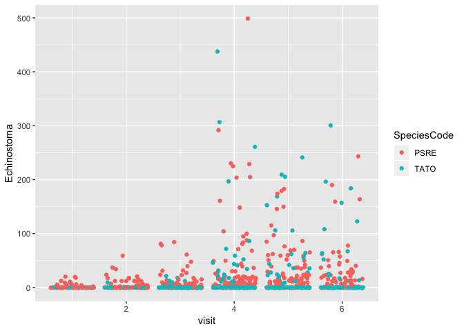
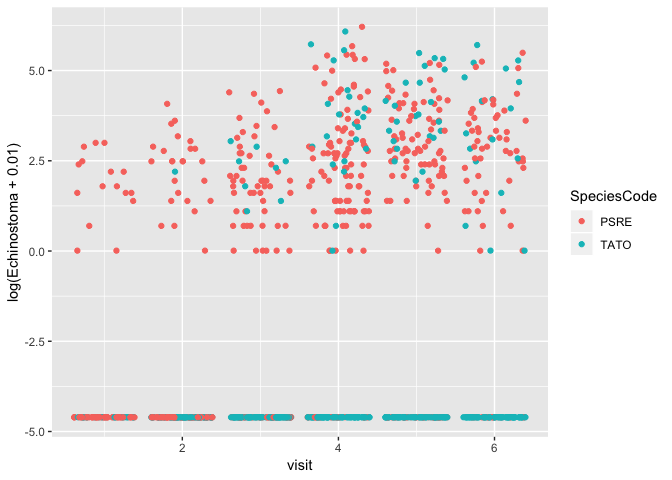
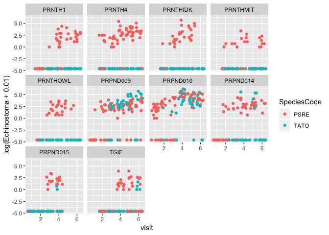
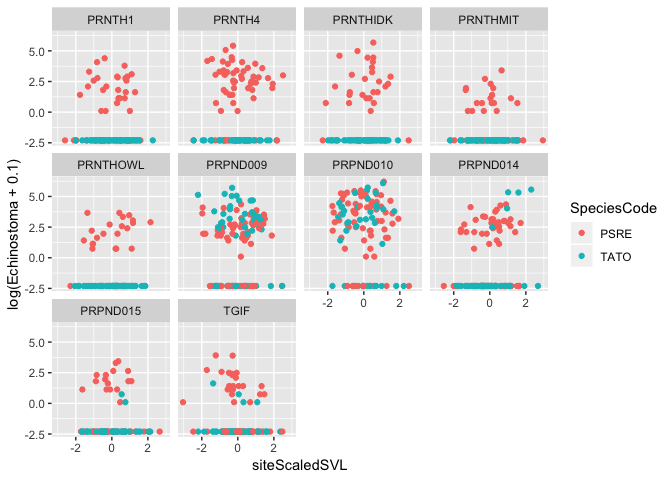
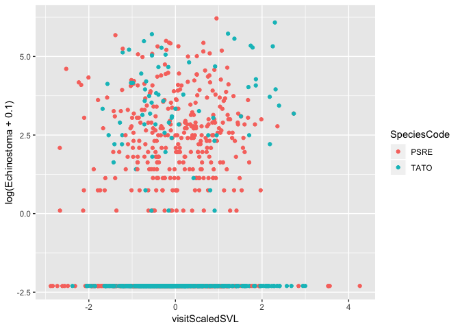
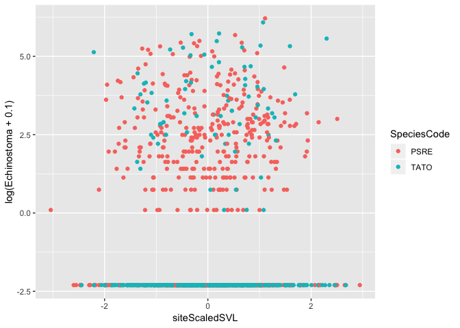
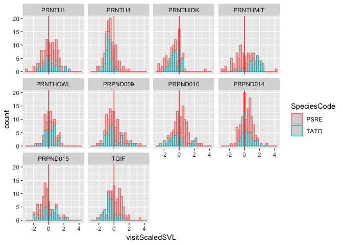
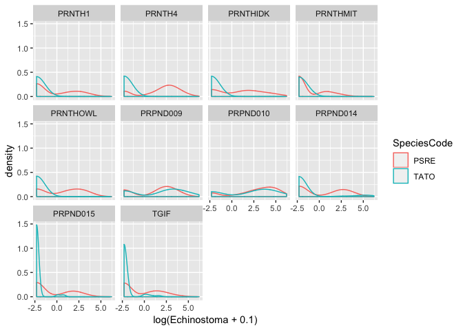
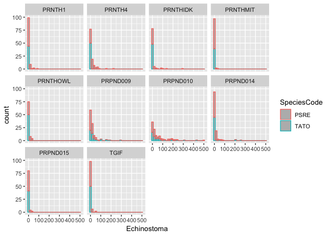

ip\_2\_DataExploration.R
================
wynnemoss
Mon Oct 29 12:25:59 2018

``` r
# Data Analysis # 

## Data description==========
# Data are parasite community data within amphibian larvae, analyzed over time.
# Experimental design: visit 10 sites (ponds) 5 times each over the summer (2017). At each visit, # collect 10 individuals of each species (newt: TATO and chorus frog:PSRE) and dissect.
# Each row is an individual amphibian larvae with columns being individual level data as well as counts of various parasite species
# For this analysis, I will model the abundance of one parasite species (Echinostoma). Response variable is number of parasites within an individual (Poisson distributed). Explanatory variable is visit date (fixed), site (random), individual relative size (fixed), and species (fixed).


## Libraries=================
library(ggplot2)
```

    ## Warning: package 'ggplot2' was built under R version 3.4.4

``` r
library(dplyr)
```

    ## Warning: package 'dplyr' was built under R version 3.4.4

    ## 
    ## Attaching package: 'dplyr'

    ## The following objects are masked from 'package:stats':
    ## 
    ##     filter, lag

    ## The following objects are masked from 'package:base':
    ## 
    ##     intersect, setdiff, setequal, union

``` r
## Exploratory analyses========
# read in data
dis <- read.csv("diss.data.2017.csv")
str(dis)
```

    ## 'data.frame':    1049 obs. of  35 variables:
    ##  $ X                          : int  1 2 3 4 5 6 7 8 9 10 ...
    ##  $ HostCode                   : Factor w/ 1049 levels "PRNTH1_20170328_PSRE_001",..: 113 872 340 755 1 230 231 866 870 346 ...
    ##  $ Date                       : int  20170513 20170328 20170607 20170327 20170328 20170513 20170513 20170328 20170328 20170607 ...
    ##  $ SiteCode                   : Factor w/ 10 levels "PRNTH1","PRNTH4",..: 2 9 4 8 1 3 3 9 9 4 ...
    ##  $ SpeciesCode                : Factor w/ 2 levels "PSRE","TATO": 1 1 1 1 1 1 1 1 1 1 ...
    ##  $ CollectionCode             : Factor w/ 53 levels "PRNTH1_20170328",..: 7 45 18 39 1 12 12 45 45 18 ...
    ##  $ Lifestage                  : Factor w/ 2 levels "Larva","Metamorph": 1 1 1 1 1 1 1 1 1 1 ...
    ##  $ Dissector                  : Factor w/ 5 levels "AO","CM","DC",..: 2 3 2 3 3 2 2 3 3 2 ...
    ##  $ DissectionCondition        : Factor w/ 3 levels "Dead on Arrival",..: 3 3 3 1 3 3 3 3 3 2 ...
    ##  $ GosnerStage                : int  40 26 26 26 26 29 26 26 26 26 ...
    ##  $ TarichaLarvaeStage         : Factor w/ 6 levels "","2T","3T","4T",..: 1 1 1 1 1 1 1 1 1 1 ...
    ##  $ SVL                        : num  4.58 5.13 5.29 5.41 5.42 5.45 5.6 5.74 5.94 5.95 ...
    ##  $ TailLength                 : num  27.44 6.44 5.76 6.78 7.15 ...
    ##  $ TotalLength                : num  32 11.6 11.1 12.2 12.6 ...
    ##  $ Malformed                  : Factor w/ 2 levels "N","Y": 1 1 1 1 1 1 1 1 1 1 ...
    ##  $ Sex                        : Factor w/ 3 levels "Female","Male",..: 3 3 3 3 3 3 3 3 3 3 ...
    ##  $ collDate                   : Factor w/ 13 levels "2017-03-27","2017-03-28",..: 3 2 7 1 2 3 3 2 2 7 ...
    ##  $ visit                      : int  2 1 3 1 1 2 2 1 1 3 ...
    ##  $ SecYr                      : logi  NA NA NA NA NA NA ...
    ##  $ tot.para                   : int  2 1 2 0 0 4 0 1 1 2 ...
    ##  $ BDinf                      : int  1 0 0 0 0 0 0 1 1 0 ...
    ##  $ aveZE                      : num  2.75 0 0 0 0 ...
    ##  $ Alaria                     : int  0 0 0 0 0 0 0 0 0 0 ...
    ##  $ Cephalogonimus             : int  0 0 0 0 0 0 0 0 0 0 ...
    ##  $ Echinostoma                : int  0 0 0 0 0 2 0 0 0 1 ...
    ##  $ Gorgoderid_Metacercaria    : int  0 0 0 0 0 0 0 0 0 0 ...
    ##  $ Gyrinicola_batrachiensis   : int  0 0 0 0 0 3 0 0 0 0 ...
    ##  $ Manodistomum_syntomentera  : int  0 0 0 0 0 0 0 0 0 0 ...
    ##  $ Megalobatrachonema_moraveci: int  0 0 0 0 0 0 0 0 0 0 ...
    ##  $ Nematode                   : int  0 0 0 0 0 0 0 0 0 0 ...
    ##  $ Oxyurid                    : int  0 0 0 0 0 0 0 0 0 0 ...
    ##  $ Ribeiroia_ondatrae         : int  0 0 0 0 0 0 0 0 0 0 ...
    ##  $ Nyctotherus                : int  1 1 0 0 0 1 0 0 1 0 ...
    ##  $ Opalina                    : int  1 0 1 0 0 1 0 1 0 0 ...
    ##  $ Tritrichomonas             : int  0 0 1 0 0 0 0 0 0 1 ...

``` r
dis$X = NULL # get rid of CSV's X column
colnames(dis)
```

    ##  [1] "HostCode"                    "Date"                       
    ##  [3] "SiteCode"                    "SpeciesCode"                
    ##  [5] "CollectionCode"              "Lifestage"                  
    ##  [7] "Dissector"                   "DissectionCondition"        
    ##  [9] "GosnerStage"                 "TarichaLarvaeStage"         
    ## [11] "SVL"                         "TailLength"                 
    ## [13] "TotalLength"                 "Malformed"                  
    ## [15] "Sex"                         "collDate"                   
    ## [17] "visit"                       "SecYr"                      
    ## [19] "tot.para"                    "BDinf"                      
    ## [21] "aveZE"                       "Alaria"                     
    ## [23] "Cephalogonimus"              "Echinostoma"                
    ## [25] "Gorgoderid_Metacercaria"     "Gyrinicola_batrachiensis"   
    ## [27] "Manodistomum_syntomentera"   "Megalobatrachonema_moraveci"
    ## [29] "Nematode"                    "Oxyurid"                    
    ## [31] "Ribeiroia_ondatrae"          "Nyctotherus"                
    ## [33] "Opalina"                     "Tritrichomonas"

``` r
## Adding new columns ==========
# make a new column that is scaled Snout-Vent-Length
# At each visit and for each species, take the average SVL.
# Scale each individual relative to that average
# Smaller than average individuals have a negative SVL and larger than average have a positive

# first, let's take the avg SVL at each site-visit combination
# This is basically a "cohort mean"
meanSVLSiteSpec <- dis %>% group_by (CollectionCode, SpeciesCode) %>% summarise(meanSVL = mean(SVL), sdSVL = sd(SVL))
# For each individual, standardize their size relative to the cohort mean
# merge these data
dis <- left_join(dis, meanSVLSiteSpec, by = c("CollectionCode", "SpeciesCode"))
# some sites have only 1 individual, for those, the scaled SVL will be NA
dis <- dis %>% mutate(siteScaledSVL = (SVL-meanSVL)/sdSVL)
```

    ## Warning: package 'bindrcpp' was built under R version 3.4.4

``` r
dis$meanSVL =NULL
dis$sdSVL = NULL

# now let's try it without a site-specific standardization. Just standardize for VISIT
# meaning, some sites will have smaller-than-average larvae
meanSVLVisitSpec <- dis %>% group_by (visit, SpeciesCode) %>% summarise(meanVSVL = mean(SVL), sdVSVL = sd(SVL))
dis <- left_join(dis, meanSVLVisitSpec, by = c("visit", "SpeciesCode"))
dis <- dis %>% mutate(visitScaledSVL = (SVL-meanVSVL)/sdVSVL)
dis$meanVSVL =NULL
dis$sdVSVL = NULL
## Data visualization =========

# relationship between Echinostoma parasite count and visit
# question: do individual's parasite burdens increase over time?
ggplot(data = dis) +
  geom_jitter(aes(x=visit, y = Echinostoma, color = SpeciesCode))
```



``` r
# data are Poisson distributed so try a log transformation for visualization
ggplot(data = dis) +
  geom_jitter(aes(x=visit, y = log(Echinostoma+.01), color = SpeciesCode))
```



``` r
# there are a lot of zeroes and a lot of noise!

# let's try separating out by site to reduce some of this noise
ggplot(data = dis) +
  geom_jitter(aes(x=visit, y = log(Echinostoma+.01), color = SpeciesCode))+
  facet_wrap(facets = ~SiteCode)
```



``` r
# it looks like newts (TATO) don't seem to get Echinostoma at some of the sites (weird!)
# In some sites, it seems like Echinostoma count goes up with time
# Might this be a case where we need random slopes and intercepts?

# question: do individual's relative size (are they late bloomers or early bloomers) impact their parasite counts?
ggplot(data = dis)+
  geom_jitter(aes(x = siteScaledSVL, y = log(Echinostoma + .1), color = SpeciesCode))+
  facet_wrap(facets= ~SiteCode)
```

    ## Warning: Removed 4 rows containing missing values (geom_point).



``` r
# I don't see much of a relationship here

# do sites with delayed growth have more parasites?
# negative values indicate sites with smaller than average individuals
ggplot(data = dis)+
  geom_jitter(aes(x = visitScaledSVL, y = log(Echinostoma + .1), color = SpeciesCode))
```



``` r
# nah not really

# do individuals with delayed growth have more parasites?
# negative values indicate sites with smaller than average individuals
ggplot(data = dis)+
  geom_jitter(aes(x = siteScaledSVL, y = log(Echinostoma + .1), color = SpeciesCode))
```

    ## Warning: Removed 4 rows containing missing values (geom_point).



``` r
# nah not really

# check distribution of important variables
ggplot(data = dis)+
  geom_histogram(aes(visitScaledSVL, group = SpeciesCode, color = SpeciesCode), alpha = .2)+
  geom_vline(xintercept = 0, col = "red")+
  facet_wrap(facets = ~SiteCode)
```

    ## `stat_bin()` using `bins = 30`. Pick better value with `binwidth`.



``` r
ggplot(data = dis)+
  geom_density(aes(log(Echinostoma+.1), color = SpeciesCode)) +
  facet_wrap(facets = ~SiteCode)
```



``` r
ggplot(data = dis)+
  geom_histogram(aes(Echinostoma, color = SpeciesCode), alpha =.4) +
  facet_wrap(facets = ~SiteCode)
```

    ## `stat_bin()` using `bins = 30`. Pick better value with `binwidth`.



``` r
# my response variable is overdispersed (lots of zeroes!)
# this is normal for parasite data
```
