Independent Project Report
================
Wynne Moss
December 16, 2018

The data
--------

SUMMARY OF DATASET: I quantified parasite communities across 10 different pond sites in the East Bay of California; each site was visited 4-6 times within the 2017 summer. At each visit I collected 10-12 individuals from 2 amphibian species. Individuals were measured and parasite infection was quantified.

GROUPING VARIABLES:

-   Site (10 ponds) - this is a random variable.

-   Population (2 species at each site) - this is a random variable

PREDICTOR VARIABLES:

-   Species (2 species) - I think this is a better designation for species

-   Body size (snout-vent-length) - A continuous variable (fixed effect) at the individual level

-   Developmental stage - A continuous variable at the individual level...problematic since development is measured differently in newts vs. frogs

-   Sex - A factor variable at the individual level

-   Visit - A continuous variable (though could be treated as a factor if the relationship si non linear)

RESPONSE VARIABLE:

-   The number of parasites found within an individual. For this analysis, just count number of Echinostoma parasites. Can be modeled as Poisson distributed with a negative binomial to account for aggregation. Infection status (1 or 0) could also be modeled as a binary response variable using logistic regression.


Questions
---------

1.  Does the impact of species and body size change over the course of the summer (interact with visit)?
2.  How much of the variation in overall parasite load is explained by visit-level, species-level, site-level, or individual-level variation?

Display the structure of the data
---------------------------------

``` r
dis <- read.csv("diss.data.2017.csv")
colnames(dis)
```

    ##  [1] "X"                           "HostCode"                   
    ##  [3] "Date"                        "SiteCode"                   
    ##  [5] "SpeciesCode"                 "CollectionCode"             
    ##  [7] "Lifestage"                   "Dissector"                  
    ##  [9] "DissectionCondition"         "GosnerStage"                
    ## [11] "TarichaLarvaeStage"          "SVL"                        
    ## [13] "TailLength"                  "TotalLength"                
    ## [15] "Malformed"                   "Sex"                        
    ## [17] "collDate"                    "visit"                      
    ## [19] "SecYr"                       "tot.para"                   
    ## [21] "BDinf"                       "aveZE"                      
    ## [23] "Alaria"                      "Cephalogonimus"             
    ## [25] "Echinostoma"                 "Gorgoderid_Metacercaria"    
    ## [27] "Gyrinicola_batrachiensis"    "Manodistomum_syntomentera"  
    ## [29] "Megalobatrachonema_moraveci" "Nematode"                   
    ## [31] "Oxyurid"                     "Ribeiroia_ondatrae"         
    ## [33] "Nyctotherus"                 "Opalina"                    
    ## [35] "Tritrichomonas"

``` r
# str(dis)
```

Clean up data and add some covariates
-------------------------------------

``` r
# first visit was in March and not all ponds were sampled; get rid of and call May the first visit
dis <- dis%>% filter(visit > 1) %>% mutate(visit = visit-1) 
```

    ## Warning: package 'bindrcpp' was built under R version 3.4.4

``` r
# dis$Pop <- paste(dis$SiteCode, dis$SpeciesCode, sep = "_") # make a new column that has the population
# dis$fsample <- factor(dis$visit) # for random effect

# each population is sampled multiple time so the observations are nested within pop

# let's get a scaled SVL (snout-vent length)
# in this case we want negatives to be lower than average at that time, and positives to be higher than average at that time
meanSVLVisitSpec <- dis %>% group_by (visit, SpeciesCode) %>% summarise(meanVSVL = mean(SVL), sdVSVL = sd(SVL))
dis <- left_join(dis, meanSVLVisitSpec, by = c("visit", "SpeciesCode"))
dis <- dis %>% mutate(visitScaledSVL = (SVL-meanVSVL)/sdVSVL)
dis$meanVSVL =NULL
dis$sdVSVL = NULL

#add in lat and long
sitedat <- read.csv("data/CoreSites.csv"
)
dis <- left_join(dis, sitedat, by = "SiteCode")

# format visit as a date
# first need to split out the part after the underscore (date of sample)
spl <- strsplit(as.character(dis$CollectionCode), "_")
# then format as date
dis$Dated <- sapply(spl, function(x) x[2]) %>% as.Date("%Y%m%d")

# get julian date
dates <- as.POSIXlt(dis$Dated, format = "%Y%m%d")
dis$jDate <-dates$yday
```

Exploratory data analysis
-------------------------

Look at the distribution of echinostoma over time by site. SVL vs. load.

How does parasite load change over time?

``` r
ggplot(data = dis) +
  geom_jitter(aes(x=jDate, y = log(Echinostoma+.1), color = SpeciesCode))
```

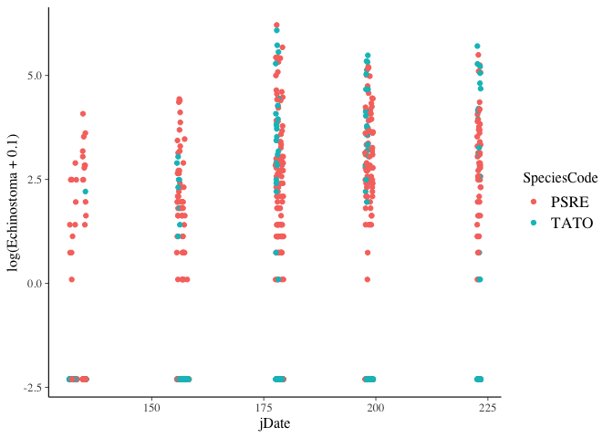

``` r
ggplot(data = dis) +
  geom_jitter(aes(x=jDate, y = tot.para, color = SpeciesCode))
```

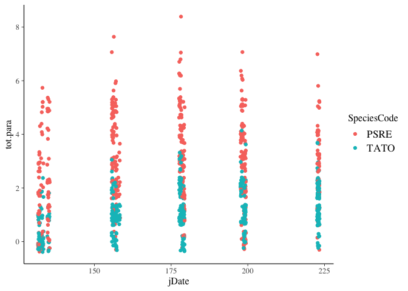

``` r
# ggplot(data = dis) +
#   geom_jitter(aes(x=visit, y = tot.para, color = SpeciesCode))
```

It kind of looks like Echinostoma load increases over time and that TATO have fewer, but this relationship isn't super obvious.

Let's try separating out by site to reduce some of this noise

``` r
ggplot(data = dis) +
  geom_jitter(aes(x=jDate, y = log(Echinostoma+.01), color = SpeciesCode))+
  facet_wrap(facets = ~SiteCode)
```


``` r
ggplot(data = dis) + 
  geom_jitter(aes(x=jDate, y = log(Ribeiroia_ondatrae+.01), color = SpeciesCode))+
  geom_smooth(aes(x=jDate, y = log(Ribeiroia_ondatrae+.01), color = SpeciesCode))+
  facet_wrap(facets = ~SiteCode)
```

    ## `geom_smooth()` using method = 'loess' and formula 'y ~ x'

    ## Warning in simpleLoess(y, x, w, span, degree = degree, parametric =
    ## parametric, : pseudoinverse used at 179

    ## Warning in simpleLoess(y, x, w, span, degree = degree, parametric =
    ## parametric, : neighborhood radius 22

    ## Warning in simpleLoess(y, x, w, span, degree = degree, parametric =
    ## parametric, : reciprocal condition number 5.5105e-16

    ## Warning in predLoess(object$y, object$x, newx = if
    ## (is.null(newdata)) object$x else if (is.data.frame(newdata))
    ## as.matrix(model.frame(delete.response(terms(object)), : pseudoinverse used
    ## at 179

    ## Warning in predLoess(object$y, object$x, newx = if
    ## (is.null(newdata)) object$x else if (is.data.frame(newdata))
    ## as.matrix(model.frame(delete.response(terms(object)), : neighborhood radius
    ## 22

    ## Warning in predLoess(object$y, object$x, newx = if
    ## (is.null(newdata)) object$x else if (is.data.frame(newdata))
    ## as.matrix(model.frame(delete.response(terms(object)), : reciprocal
    ## condition number 5.5105e-16

    ## Warning in simpleLoess(y, x, w, span, degree = degree, parametric =
    ## parametric, : pseudoinverse used at 131.54

    ## Warning in simpleLoess(y, x, w, span, degree = degree, parametric =
    ## parametric, : neighborhood radius 47.455

    ## Warning in simpleLoess(y, x, w, span, degree = degree, parametric =
    ## parametric, : reciprocal condition number 4.2492e-17

    ## Warning in simpleLoess(y, x, w, span, degree = degree, parametric =
    ## parametric, : There are other near singularities as well. 625

    ## Warning in predLoess(object$y, object$x, newx = if
    ## (is.null(newdata)) object$x else if (is.data.frame(newdata))
    ## as.matrix(model.frame(delete.response(terms(object)), : pseudoinverse used
    ## at 131.54

    ## Warning in predLoess(object$y, object$x, newx = if
    ## (is.null(newdata)) object$x else if (is.data.frame(newdata))
    ## as.matrix(model.frame(delete.response(terms(object)), : neighborhood radius
    ## 47.455

    ## Warning in predLoess(object$y, object$x, newx = if
    ## (is.null(newdata)) object$x else if (is.data.frame(newdata))
    ## as.matrix(model.frame(delete.response(terms(object)), : reciprocal
    ## condition number 4.2492e-17

    ## Warning in predLoess(object$y, object$x, newx = if
    ## (is.null(newdata)) object$x else if (is.data.frame(newdata))
    ## as.matrix(model.frame(delete.response(terms(object)), : There are other
    ## near singularities as well. 625

    ## Warning in simpleLoess(y, x, w, span, degree = degree, parametric =
    ## parametric, : pseudoinverse used at 155.66

    ## Warning in simpleLoess(y, x, w, span, degree = degree, parametric =
    ## parametric, : neighborhood radius 42.335

    ## Warning in simpleLoess(y, x, w, span, degree = degree, parametric =
    ## parametric, : reciprocal condition number 1.0416e-16

    ## Warning in simpleLoess(y, x, w, span, degree = degree, parametric =
    ## parametric, : There are other near singularities as well. 2055.3

    ## Warning in predLoess(object$y, object$x, newx = if
    ## (is.null(newdata)) object$x else if (is.data.frame(newdata))
    ## as.matrix(model.frame(delete.response(terms(object)), : pseudoinverse used
    ## at 155.66

    ## Warning in predLoess(object$y, object$x, newx = if
    ## (is.null(newdata)) object$x else if (is.data.frame(newdata))
    ## as.matrix(model.frame(delete.response(terms(object)), : neighborhood radius
    ## 42.335

    ## Warning in predLoess(object$y, object$x, newx = if
    ## (is.null(newdata)) object$x else if (is.data.frame(newdata))
    ## as.matrix(model.frame(delete.response(terms(object)), : reciprocal
    ## condition number 1.0416e-16

    ## Warning in predLoess(object$y, object$x, newx = if
    ## (is.null(newdata)) object$x else if (is.data.frame(newdata))
    ## as.matrix(model.frame(delete.response(terms(object)), : There are other
    ## near singularities as well. 2055.3

    ## Warning in simpleLoess(y, x, w, span, degree = degree, parametric =
    ## parametric, : pseudoinverse used at 132.78

    ## Warning in simpleLoess(y, x, w, span, degree = degree, parametric =
    ## parametric, : neighborhood radius 45.225

    ## Warning in simpleLoess(y, x, w, span, degree = degree, parametric =
    ## parametric, : reciprocal condition number 2.809e-16

    ## Warning in simpleLoess(y, x, w, span, degree = degree, parametric =
    ## parametric, : There are other near singularities as well. 2045.3

    ## Warning in predLoess(object$y, object$x, newx = if
    ## (is.null(newdata)) object$x else if (is.data.frame(newdata))
    ## as.matrix(model.frame(delete.response(terms(object)), : pseudoinverse used
    ## at 132.78

    ## Warning in predLoess(object$y, object$x, newx = if
    ## (is.null(newdata)) object$x else if (is.data.frame(newdata))
    ## as.matrix(model.frame(delete.response(terms(object)), : neighborhood radius
    ## 45.225

    ## Warning in predLoess(object$y, object$x, newx = if
    ## (is.null(newdata)) object$x else if (is.data.frame(newdata))
    ## as.matrix(model.frame(delete.response(terms(object)), : reciprocal
    ## condition number 2.809e-16

    ## Warning in predLoess(object$y, object$x, newx = if
    ## (is.null(newdata)) object$x else if (is.data.frame(newdata))
    ## as.matrix(model.frame(delete.response(terms(object)), : There are other
    ## near singularities as well. 2045.3

    ## Warning in simpleLoess(y, x, w, span, degree = degree, parametric =
    ## parametric, : pseudoinverse used at 132.78

    ## Warning in simpleLoess(y, x, w, span, degree = degree, parametric =
    ## parametric, : neighborhood radius 45.225

    ## Warning in simpleLoess(y, x, w, span, degree = degree, parametric =
    ## parametric, : reciprocal condition number 1.917e-16

    ## Warning in simpleLoess(y, x, w, span, degree = degree, parametric =
    ## parametric, : There are other near singularities as well. 2045.3

    ## Warning in predLoess(object$y, object$x, newx = if
    ## (is.null(newdata)) object$x else if (is.data.frame(newdata))
    ## as.matrix(model.frame(delete.response(terms(object)), : pseudoinverse used
    ## at 132.78

    ## Warning in predLoess(object$y, object$x, newx = if
    ## (is.null(newdata)) object$x else if (is.data.frame(newdata))
    ## as.matrix(model.frame(delete.response(terms(object)), : neighborhood radius
    ## 45.225

    ## Warning in predLoess(object$y, object$x, newx = if
    ## (is.null(newdata)) object$x else if (is.data.frame(newdata))
    ## as.matrix(model.frame(delete.response(terms(object)), : reciprocal
    ## condition number 1.917e-16

    ## Warning in predLoess(object$y, object$x, newx = if
    ## (is.null(newdata)) object$x else if (is.data.frame(newdata))
    ## as.matrix(model.frame(delete.response(terms(object)), : There are other
    ## near singularities as well. 2045.3

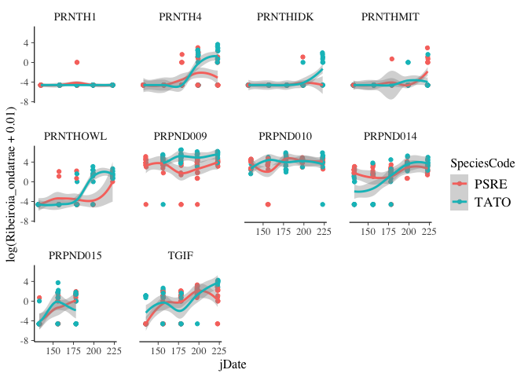

``` r
ggplot(data = dis) + 
  geom_jitter(aes(x=jDate, y = BDinf, color = SpeciesCode))+
  geom_smooth(aes(x=jDate, y = BDinf, color = SpeciesCode))+
  facet_wrap(facets = ~SiteCode)
```

    ## `geom_smooth()` using method = 'loess' and formula 'y ~ x'

    ## Warning: Removed 108 rows containing non-finite values (stat_smooth).

    ## Warning in simpleLoess(y, x, w, span, degree = degree, parametric =
    ## parametric, : pseudoinverse used at 199.32

    ## Warning in simpleLoess(y, x, w, span, degree = degree, parametric =
    ## parametric, : neighborhood radius 41.32

    ## Warning in simpleLoess(y, x, w, span, degree = degree, parametric =
    ## parametric, : reciprocal condition number 3.8629e-17

    ## Warning in simpleLoess(y, x, w, span, degree = degree, parametric =
    ## parametric, : There are other near singularities as well. 441

    ## Warning in predLoess(object$y, object$x, newx = if
    ## (is.null(newdata)) object$x else if (is.data.frame(newdata))
    ## as.matrix(model.frame(delete.response(terms(object)), : pseudoinverse used
    ## at 199.32

    ## Warning in predLoess(object$y, object$x, newx = if
    ## (is.null(newdata)) object$x else if (is.data.frame(newdata))
    ## as.matrix(model.frame(delete.response(terms(object)), : neighborhood radius
    ## 41.32

    ## Warning in predLoess(object$y, object$x, newx = if
    ## (is.null(newdata)) object$x else if (is.data.frame(newdata))
    ## as.matrix(model.frame(delete.response(terms(object)), : reciprocal
    ## condition number 3.8629e-17

    ## Warning in predLoess(object$y, object$x, newx = if
    ## (is.null(newdata)) object$x else if (is.data.frame(newdata))
    ## as.matrix(model.frame(delete.response(terms(object)), : There are other
    ## near singularities as well. 441

    ## Warning in simpleLoess(y, x, w, span, degree = degree, parametric =
    ## parametric, : pseudoinverse used at 131.66

    ## Warning in simpleLoess(y, x, w, span, degree = degree, parametric =
    ## parametric, : neighborhood radius 47.335

    ## Warning in simpleLoess(y, x, w, span, degree = degree, parametric =
    ## parametric, : reciprocal condition number 2.3341e-16

    ## Warning in simpleLoess(y, x, w, span, degree = degree, parametric =
    ## parametric, : There are other near singularities as well. 1792.3

    ## Warning in predLoess(object$y, object$x, newx = if
    ## (is.null(newdata)) object$x else if (is.data.frame(newdata))
    ## as.matrix(model.frame(delete.response(terms(object)), : pseudoinverse used
    ## at 131.66

    ## Warning in predLoess(object$y, object$x, newx = if
    ## (is.null(newdata)) object$x else if (is.data.frame(newdata))
    ## as.matrix(model.frame(delete.response(terms(object)), : neighborhood radius
    ## 47.335

    ## Warning in predLoess(object$y, object$x, newx = if
    ## (is.null(newdata)) object$x else if (is.data.frame(newdata))
    ## as.matrix(model.frame(delete.response(terms(object)), : reciprocal
    ## condition number 2.3341e-16

    ## Warning in predLoess(object$y, object$x, newx = if
    ## (is.null(newdata)) object$x else if (is.data.frame(newdata))
    ## as.matrix(model.frame(delete.response(terms(object)), : There are other
    ## near singularities as well. 1792.3

    ## Warning in simpleLoess(y, x, w, span, degree = degree, parametric =
    ## parametric, : pseudoinverse used at 199.34

    ## Warning in simpleLoess(y, x, w, span, degree = degree, parametric =
    ## parametric, : neighborhood radius 42.335

    ## Warning in simpleLoess(y, x, w, span, degree = degree, parametric =
    ## parametric, : reciprocal condition number 5.4987e-17

    ## Warning in simpleLoess(y, x, w, span, degree = degree, parametric =
    ## parametric, : There are other near singularities as well. 484

    ## Warning in predLoess(object$y, object$x, newx = if
    ## (is.null(newdata)) object$x else if (is.data.frame(newdata))
    ## as.matrix(model.frame(delete.response(terms(object)), : pseudoinverse used
    ## at 199.34

    ## Warning in predLoess(object$y, object$x, newx = if
    ## (is.null(newdata)) object$x else if (is.data.frame(newdata))
    ## as.matrix(model.frame(delete.response(terms(object)), : neighborhood radius
    ## 42.335

    ## Warning in predLoess(object$y, object$x, newx = if
    ## (is.null(newdata)) object$x else if (is.data.frame(newdata))
    ## as.matrix(model.frame(delete.response(terms(object)), : reciprocal
    ## condition number 5.4987e-17

    ## Warning in predLoess(object$y, object$x, newx = if
    ## (is.null(newdata)) object$x else if (is.data.frame(newdata))
    ## as.matrix(model.frame(delete.response(terms(object)), : There are other
    ## near singularities as well. 484

    ## Warning in simpleLoess(y, x, w, span, degree = degree, parametric =
    ## parametric, : pseudoinverse used at 131.66

    ## Warning in simpleLoess(y, x, w, span, degree = degree, parametric =
    ## parametric, : neighborhood radius 47.335

    ## Warning in simpleLoess(y, x, w, span, degree = degree, parametric =
    ## parametric, : reciprocal condition number 3.1406e-16

    ## Warning in simpleLoess(y, x, w, span, degree = degree, parametric =
    ## parametric, : There are other near singularities as well. 1792.3

    ## Warning in predLoess(object$y, object$x, newx = if
    ## (is.null(newdata)) object$x else if (is.data.frame(newdata))
    ## as.matrix(model.frame(delete.response(terms(object)), : pseudoinverse used
    ## at 131.66

    ## Warning in predLoess(object$y, object$x, newx = if
    ## (is.null(newdata)) object$x else if (is.data.frame(newdata))
    ## as.matrix(model.frame(delete.response(terms(object)), : neighborhood radius
    ## 47.335

    ## Warning in predLoess(object$y, object$x, newx = if
    ## (is.null(newdata)) object$x else if (is.data.frame(newdata))
    ## as.matrix(model.frame(delete.response(terms(object)), : reciprocal
    ## condition number 3.1406e-16

    ## Warning in predLoess(object$y, object$x, newx = if
    ## (is.null(newdata)) object$x else if (is.data.frame(newdata))
    ## as.matrix(model.frame(delete.response(terms(object)), : There are other
    ## near singularities as well. 1792.3

    ## Warning in simpleLoess(y, x, w, span, degree = degree, parametric =
    ## parametric, : pseudoinverse used at 131.54

    ## Warning in simpleLoess(y, x, w, span, degree = degree, parametric =
    ## parametric, : neighborhood radius 47.455

    ## Warning in simpleLoess(y, x, w, span, degree = degree, parametric =
    ## parametric, : reciprocal condition number 1.5101e-16

    ## Warning in simpleLoess(y, x, w, span, degree = degree, parametric =
    ## parametric, : There are other near singularities as well. 625

    ## Warning in predLoess(object$y, object$x, newx = if
    ## (is.null(newdata)) object$x else if (is.data.frame(newdata))
    ## as.matrix(model.frame(delete.response(terms(object)), : pseudoinverse used
    ## at 131.54

    ## Warning in predLoess(object$y, object$x, newx = if
    ## (is.null(newdata)) object$x else if (is.data.frame(newdata))
    ## as.matrix(model.frame(delete.response(terms(object)), : neighborhood radius
    ## 47.455

    ## Warning in predLoess(object$y, object$x, newx = if
    ## (is.null(newdata)) object$x else if (is.data.frame(newdata))
    ## as.matrix(model.frame(delete.response(terms(object)), : reciprocal
    ## condition number 1.5101e-16

    ## Warning in predLoess(object$y, object$x, newx = if
    ## (is.null(newdata)) object$x else if (is.data.frame(newdata))
    ## as.matrix(model.frame(delete.response(terms(object)), : There are other
    ## near singularities as well. 625

    ## Warning in simpleLoess(y, x, w, span, degree = degree, parametric =
    ## parametric, : pseudoinverse used at 131.66

    ## Warning in simpleLoess(y, x, w, span, degree = degree, parametric =
    ## parametric, : neighborhood radius 47.335

    ## Warning in simpleLoess(y, x, w, span, degree = degree, parametric =
    ## parametric, : reciprocal condition number 1.7576e-17

    ## Warning in simpleLoess(y, x, w, span, degree = degree, parametric =
    ## parametric, : There are other near singularities as well. 1792.3

    ## Warning in predLoess(object$y, object$x, newx = if
    ## (is.null(newdata)) object$x else if (is.data.frame(newdata))
    ## as.matrix(model.frame(delete.response(terms(object)), : pseudoinverse used
    ## at 131.66

    ## Warning in predLoess(object$y, object$x, newx = if
    ## (is.null(newdata)) object$x else if (is.data.frame(newdata))
    ## as.matrix(model.frame(delete.response(terms(object)), : neighborhood radius
    ## 47.335

    ## Warning in predLoess(object$y, object$x, newx = if
    ## (is.null(newdata)) object$x else if (is.data.frame(newdata))
    ## as.matrix(model.frame(delete.response(terms(object)), : reciprocal
    ## condition number 1.7576e-17

    ## Warning in predLoess(object$y, object$x, newx = if
    ## (is.null(newdata)) object$x else if (is.data.frame(newdata))
    ## as.matrix(model.frame(delete.response(terms(object)), : There are other
    ## near singularities as well. 1792.3

    ## Warning in simpleLoess(y, x, w, span, degree = degree, parametric =
    ## parametric, : pseudoinverse used at 155.79

    ## Warning in simpleLoess(y, x, w, span, degree = degree, parametric =
    ## parametric, : neighborhood radius 42.21

    ## Warning in simpleLoess(y, x, w, span, degree = degree, parametric =
    ## parametric, : reciprocal condition number 1.5677e-16

    ## Warning in simpleLoess(y, x, w, span, degree = degree, parametric =
    ## parametric, : There are other near singularities as well. 1781.7

    ## Warning in predLoess(object$y, object$x, newx = if
    ## (is.null(newdata)) object$x else if (is.data.frame(newdata))
    ## as.matrix(model.frame(delete.response(terms(object)), : pseudoinverse used
    ## at 155.79

    ## Warning in predLoess(object$y, object$x, newx = if
    ## (is.null(newdata)) object$x else if (is.data.frame(newdata))
    ## as.matrix(model.frame(delete.response(terms(object)), : neighborhood radius
    ## 42.21

    ## Warning in predLoess(object$y, object$x, newx = if
    ## (is.null(newdata)) object$x else if (is.data.frame(newdata))
    ## as.matrix(model.frame(delete.response(terms(object)), : reciprocal
    ## condition number 1.5677e-16

    ## Warning in predLoess(object$y, object$x, newx = if
    ## (is.null(newdata)) object$x else if (is.data.frame(newdata))
    ## as.matrix(model.frame(delete.response(terms(object)), : There are other
    ## near singularities as well. 1781.7

    ## Warning in simpleLoess(y, x, w, span, degree = degree, parametric =
    ## parametric, : pseudoinverse used at 198.31

    ## Warning in simpleLoess(y, x, w, span, degree = degree, parametric =
    ## parametric, : neighborhood radius 42.315

    ## Warning in simpleLoess(y, x, w, span, degree = degree, parametric =
    ## parametric, : reciprocal condition number 1.5816e-16

    ## Warning in simpleLoess(y, x, w, span, degree = degree, parametric =
    ## parametric, : There are other near singularities as well. 484

    ## Warning in predLoess(object$y, object$x, newx = if
    ## (is.null(newdata)) object$x else if (is.data.frame(newdata))
    ## as.matrix(model.frame(delete.response(terms(object)), : pseudoinverse used
    ## at 198.31

    ## Warning in predLoess(object$y, object$x, newx = if
    ## (is.null(newdata)) object$x else if (is.data.frame(newdata))
    ## as.matrix(model.frame(delete.response(terms(object)), : neighborhood radius
    ## 42.315

    ## Warning in predLoess(object$y, object$x, newx = if
    ## (is.null(newdata)) object$x else if (is.data.frame(newdata))
    ## as.matrix(model.frame(delete.response(terms(object)), : reciprocal
    ## condition number 1.5816e-16

    ## Warning in predLoess(object$y, object$x, newx = if
    ## (is.null(newdata)) object$x else if (is.data.frame(newdata))
    ## as.matrix(model.frame(delete.response(terms(object)), : There are other
    ## near singularities as well. 484

    ## Warning in simpleLoess(y, x, w, span, degree = degree, parametric =
    ## parametric, : pseudoinverse used at 132.68

    ## Warning in simpleLoess(y, x, w, span, degree = degree, parametric =
    ## parametric, : neighborhood radius 45.325

    ## Warning in simpleLoess(y, x, w, span, degree = degree, parametric =
    ## parametric, : reciprocal condition number 1.7342e-17

    ## Warning in simpleLoess(y, x, w, span, degree = degree, parametric =
    ## parametric, : There are other near singularities as well. 1791.4

    ## Warning in predLoess(object$y, object$x, newx = if
    ## (is.null(newdata)) object$x else if (is.data.frame(newdata))
    ## as.matrix(model.frame(delete.response(terms(object)), : pseudoinverse used
    ## at 132.68

    ## Warning in predLoess(object$y, object$x, newx = if
    ## (is.null(newdata)) object$x else if (is.data.frame(newdata))
    ## as.matrix(model.frame(delete.response(terms(object)), : neighborhood radius
    ## 45.325

    ## Warning in predLoess(object$y, object$x, newx = if
    ## (is.null(newdata)) object$x else if (is.data.frame(newdata))
    ## as.matrix(model.frame(delete.response(terms(object)), : reciprocal
    ## condition number 1.7342e-17

    ## Warning in predLoess(object$y, object$x, newx = if
    ## (is.null(newdata)) object$x else if (is.data.frame(newdata))
    ## as.matrix(model.frame(delete.response(terms(object)), : There are other
    ## near singularities as well. 1791.4

    ## Warning in simpleLoess(y, x, w, span, degree = degree, parametric =
    ## parametric, : pseudoinverse used at 132.78

    ## Warning in simpleLoess(y, x, w, span, degree = degree, parametric =
    ## parametric, : neighborhood radius 45.225

    ## Warning in simpleLoess(y, x, w, span, degree = degree, parametric =
    ## parametric, : reciprocal condition number 2.809e-16

    ## Warning in simpleLoess(y, x, w, span, degree = degree, parametric =
    ## parametric, : There are other near singularities as well. 2045.3

    ## Warning in predLoess(object$y, object$x, newx = if
    ## (is.null(newdata)) object$x else if (is.data.frame(newdata))
    ## as.matrix(model.frame(delete.response(terms(object)), : pseudoinverse used
    ## at 132.78

    ## Warning in predLoess(object$y, object$x, newx = if
    ## (is.null(newdata)) object$x else if (is.data.frame(newdata))
    ## as.matrix(model.frame(delete.response(terms(object)), : neighborhood radius
    ## 45.225

    ## Warning in predLoess(object$y, object$x, newx = if
    ## (is.null(newdata)) object$x else if (is.data.frame(newdata))
    ## as.matrix(model.frame(delete.response(terms(object)), : reciprocal
    ## condition number 2.809e-16

    ## Warning in predLoess(object$y, object$x, newx = if
    ## (is.null(newdata)) object$x else if (is.data.frame(newdata))
    ## as.matrix(model.frame(delete.response(terms(object)), : There are other
    ## near singularities as well. 2045.3

    ## Warning in simpleLoess(y, x, w, span, degree = degree, parametric =
    ## parametric, : pseudoinverse used at 132.78

    ## Warning in simpleLoess(y, x, w, span, degree = degree, parametric =
    ## parametric, : neighborhood radius 45.225

    ## Warning in simpleLoess(y, x, w, span, degree = degree, parametric =
    ## parametric, : reciprocal condition number 1.8715e-17

    ## Warning in simpleLoess(y, x, w, span, degree = degree, parametric =
    ## parametric, : There are other near singularities as well. 2045.3

    ## Warning in predLoess(object$y, object$x, newx = if
    ## (is.null(newdata)) object$x else if (is.data.frame(newdata))
    ## as.matrix(model.frame(delete.response(terms(object)), : pseudoinverse used
    ## at 132.78

    ## Warning in predLoess(object$y, object$x, newx = if
    ## (is.null(newdata)) object$x else if (is.data.frame(newdata))
    ## as.matrix(model.frame(delete.response(terms(object)), : neighborhood radius
    ## 45.225

    ## Warning in predLoess(object$y, object$x, newx = if
    ## (is.null(newdata)) object$x else if (is.data.frame(newdata))
    ## as.matrix(model.frame(delete.response(terms(object)), : reciprocal
    ## condition number 1.8715e-17

    ## Warning in predLoess(object$y, object$x, newx = if
    ## (is.null(newdata)) object$x else if (is.data.frame(newdata))
    ## as.matrix(model.frame(delete.response(terms(object)), : There are other
    ## near singularities as well. 2045.3

    ## Warning in simpleLoess(y, x, w, span, degree = degree, parametric =
    ## parametric, : pseudoinverse used at 134.69

    ## Warning in simpleLoess(y, x, w, span, degree = degree, parametric =
    ## parametric, : neighborhood radius 43.315

    ## Warning in simpleLoess(y, x, w, span, degree = degree, parametric =
    ## parametric, : reciprocal condition number 8.4688e-17

    ## Warning in simpleLoess(y, x, w, span, degree = degree, parametric =
    ## parametric, : There are other near singularities as well. 1790.6

    ## Warning in predLoess(object$y, object$x, newx = if
    ## (is.null(newdata)) object$x else if (is.data.frame(newdata))
    ## as.matrix(model.frame(delete.response(terms(object)), : pseudoinverse used
    ## at 134.69

    ## Warning in predLoess(object$y, object$x, newx = if
    ## (is.null(newdata)) object$x else if (is.data.frame(newdata))
    ## as.matrix(model.frame(delete.response(terms(object)), : neighborhood radius
    ## 43.315

    ## Warning in predLoess(object$y, object$x, newx = if
    ## (is.null(newdata)) object$x else if (is.data.frame(newdata))
    ## as.matrix(model.frame(delete.response(terms(object)), : reciprocal
    ## condition number 8.4688e-17

    ## Warning in predLoess(object$y, object$x, newx = if
    ## (is.null(newdata)) object$x else if (is.data.frame(newdata))
    ## as.matrix(model.frame(delete.response(terms(object)), : There are other
    ## near singularities as well. 1790.6

    ## Warning: Removed 108 rows containing missing values (geom_point).

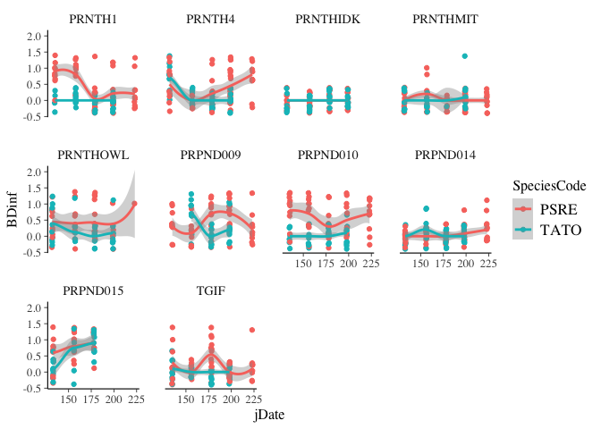

``` r
ggplot(data = dis) + 
  geom_jitter(aes(x=jDate, y = log(aveZE+1), color = SpeciesCode))+
  geom_smooth(aes(x=jDate, y = log(aveZE+1), color = SpeciesCode))
```

    ## `geom_smooth()` using method = 'loess' and formula 'y ~ x'

    ## Warning: Removed 108 rows containing non-finite values (stat_smooth).

    ## Warning: Removed 108 rows containing missing values (geom_point).

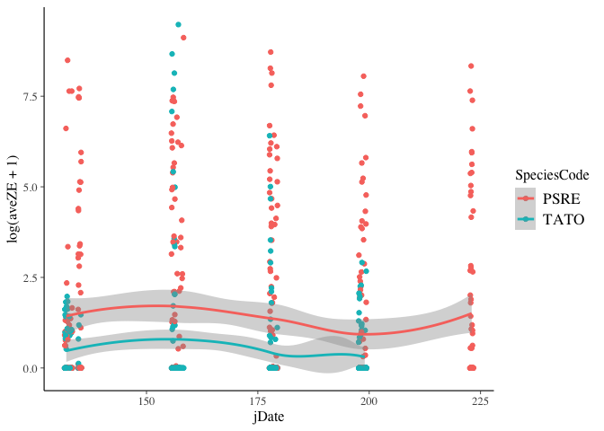

``` r
ggplot(data = dis) + 
  geom_jitter(aes(x=jDate, y = log(Ribeiroia_ondatrae+.1), color = SpeciesCode))+
  geom_smooth(aes(x=jDate, y = log(Ribeiroia_ondatrae+.1), color = SpeciesCode))
```

    ## `geom_smooth()` using method = 'loess' and formula 'y ~ x'

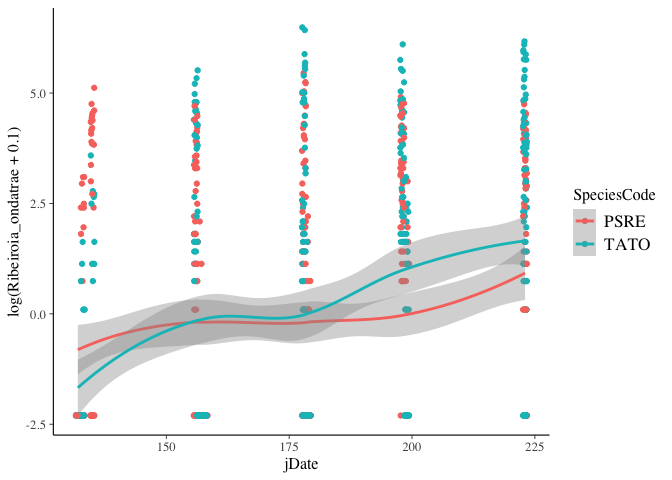

``` r
ggplot(data = dis) +
  geom_jitter(aes(x=jDate, y = tot.para, color = SpeciesCode))+
  geom_smooth(aes(x=jDate, y= tot.para, color = SpeciesCode))+
  facet_wrap(facets = ~SiteCode)
```

    ## `geom_smooth()` using method = 'loess' and formula 'y ~ x'

    ## Warning in simpleLoess(y, x, w, span, degree = degree, parametric =
    ## parametric, : pseudoinverse used at 179

    ## Warning in simpleLoess(y, x, w, span, degree = degree, parametric =
    ## parametric, : neighborhood radius 22

    ## Warning in simpleLoess(y, x, w, span, degree = degree, parametric =
    ## parametric, : reciprocal condition number 5.5105e-16

    ## Warning in predLoess(object$y, object$x, newx = if
    ## (is.null(newdata)) object$x else if (is.data.frame(newdata))
    ## as.matrix(model.frame(delete.response(terms(object)), : pseudoinverse used
    ## at 179

    ## Warning in predLoess(object$y, object$x, newx = if
    ## (is.null(newdata)) object$x else if (is.data.frame(newdata))
    ## as.matrix(model.frame(delete.response(terms(object)), : neighborhood radius
    ## 22

    ## Warning in predLoess(object$y, object$x, newx = if
    ## (is.null(newdata)) object$x else if (is.data.frame(newdata))
    ## as.matrix(model.frame(delete.response(terms(object)), : reciprocal
    ## condition number 5.5105e-16

    ## Warning in simpleLoess(y, x, w, span, degree = degree, parametric =
    ## parametric, : pseudoinverse used at 131.54

    ## Warning in simpleLoess(y, x, w, span, degree = degree, parametric =
    ## parametric, : neighborhood radius 47.455

    ## Warning in simpleLoess(y, x, w, span, degree = degree, parametric =
    ## parametric, : reciprocal condition number 4.2492e-17

    ## Warning in simpleLoess(y, x, w, span, degree = degree, parametric =
    ## parametric, : There are other near singularities as well. 625

    ## Warning in predLoess(object$y, object$x, newx = if
    ## (is.null(newdata)) object$x else if (is.data.frame(newdata))
    ## as.matrix(model.frame(delete.response(terms(object)), : pseudoinverse used
    ## at 131.54

    ## Warning in predLoess(object$y, object$x, newx = if
    ## (is.null(newdata)) object$x else if (is.data.frame(newdata))
    ## as.matrix(model.frame(delete.response(terms(object)), : neighborhood radius
    ## 47.455

    ## Warning in predLoess(object$y, object$x, newx = if
    ## (is.null(newdata)) object$x else if (is.data.frame(newdata))
    ## as.matrix(model.frame(delete.response(terms(object)), : reciprocal
    ## condition number 4.2492e-17

    ## Warning in predLoess(object$y, object$x, newx = if
    ## (is.null(newdata)) object$x else if (is.data.frame(newdata))
    ## as.matrix(model.frame(delete.response(terms(object)), : There are other
    ## near singularities as well. 625

    ## Warning in simpleLoess(y, x, w, span, degree = degree, parametric =
    ## parametric, : pseudoinverse used at 155.66

    ## Warning in simpleLoess(y, x, w, span, degree = degree, parametric =
    ## parametric, : neighborhood radius 42.335

    ## Warning in simpleLoess(y, x, w, span, degree = degree, parametric =
    ## parametric, : reciprocal condition number 1.0416e-16

    ## Warning in simpleLoess(y, x, w, span, degree = degree, parametric =
    ## parametric, : There are other near singularities as well. 2055.3

    ## Warning in predLoess(object$y, object$x, newx = if
    ## (is.null(newdata)) object$x else if (is.data.frame(newdata))
    ## as.matrix(model.frame(delete.response(terms(object)), : pseudoinverse used
    ## at 155.66

    ## Warning in predLoess(object$y, object$x, newx = if
    ## (is.null(newdata)) object$x else if (is.data.frame(newdata))
    ## as.matrix(model.frame(delete.response(terms(object)), : neighborhood radius
    ## 42.335

    ## Warning in predLoess(object$y, object$x, newx = if
    ## (is.null(newdata)) object$x else if (is.data.frame(newdata))
    ## as.matrix(model.frame(delete.response(terms(object)), : reciprocal
    ## condition number 1.0416e-16

    ## Warning in predLoess(object$y, object$x, newx = if
    ## (is.null(newdata)) object$x else if (is.data.frame(newdata))
    ## as.matrix(model.frame(delete.response(terms(object)), : There are other
    ## near singularities as well. 2055.3

    ## Warning in simpleLoess(y, x, w, span, degree = degree, parametric =
    ## parametric, : pseudoinverse used at 132.78

    ## Warning in simpleLoess(y, x, w, span, degree = degree, parametric =
    ## parametric, : neighborhood radius 45.225

    ## Warning in simpleLoess(y, x, w, span, degree = degree, parametric =
    ## parametric, : reciprocal condition number 2.809e-16

    ## Warning in simpleLoess(y, x, w, span, degree = degree, parametric =
    ## parametric, : There are other near singularities as well. 2045.3

    ## Warning in predLoess(object$y, object$x, newx = if
    ## (is.null(newdata)) object$x else if (is.data.frame(newdata))
    ## as.matrix(model.frame(delete.response(terms(object)), : pseudoinverse used
    ## at 132.78

    ## Warning in predLoess(object$y, object$x, newx = if
    ## (is.null(newdata)) object$x else if (is.data.frame(newdata))
    ## as.matrix(model.frame(delete.response(terms(object)), : neighborhood radius
    ## 45.225

    ## Warning in predLoess(object$y, object$x, newx = if
    ## (is.null(newdata)) object$x else if (is.data.frame(newdata))
    ## as.matrix(model.frame(delete.response(terms(object)), : reciprocal
    ## condition number 2.809e-16

    ## Warning in predLoess(object$y, object$x, newx = if
    ## (is.null(newdata)) object$x else if (is.data.frame(newdata))
    ## as.matrix(model.frame(delete.response(terms(object)), : There are other
    ## near singularities as well. 2045.3

    ## Warning in simpleLoess(y, x, w, span, degree = degree, parametric =
    ## parametric, : pseudoinverse used at 132.78

    ## Warning in simpleLoess(y, x, w, span, degree = degree, parametric =
    ## parametric, : neighborhood radius 45.225

    ## Warning in simpleLoess(y, x, w, span, degree = degree, parametric =
    ## parametric, : reciprocal condition number 1.917e-16

    ## Warning in simpleLoess(y, x, w, span, degree = degree, parametric =
    ## parametric, : There are other near singularities as well. 2045.3

    ## Warning in predLoess(object$y, object$x, newx = if
    ## (is.null(newdata)) object$x else if (is.data.frame(newdata))
    ## as.matrix(model.frame(delete.response(terms(object)), : pseudoinverse used
    ## at 132.78

    ## Warning in predLoess(object$y, object$x, newx = if
    ## (is.null(newdata)) object$x else if (is.data.frame(newdata))
    ## as.matrix(model.frame(delete.response(terms(object)), : neighborhood radius
    ## 45.225

    ## Warning in predLoess(object$y, object$x, newx = if
    ## (is.null(newdata)) object$x else if (is.data.frame(newdata))
    ## as.matrix(model.frame(delete.response(terms(object)), : reciprocal
    ## condition number 1.917e-16

    ## Warning in predLoess(object$y, object$x, newx = if
    ## (is.null(newdata)) object$x else if (is.data.frame(newdata))
    ## as.matrix(model.frame(delete.response(terms(object)), : There are other
    ## near singularities as well. 2045.3

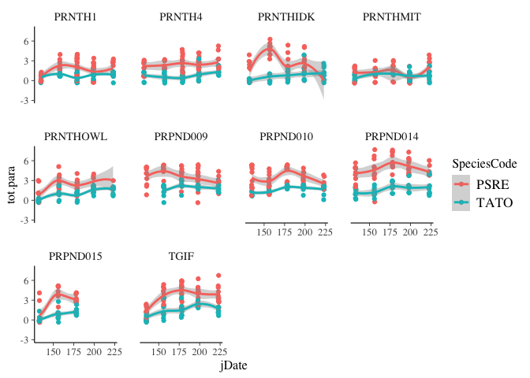

``` r
ggplot(data = dis) +
  geom_jitter(aes(x=jDate, y = tot.para, color = SpeciesCode))+
  geom_smooth(aes(x=jDate, y= tot.para, color = SpeciesCode))
```

    ## `geom_smooth()` using method = 'loess' and formula 'y ~ x'

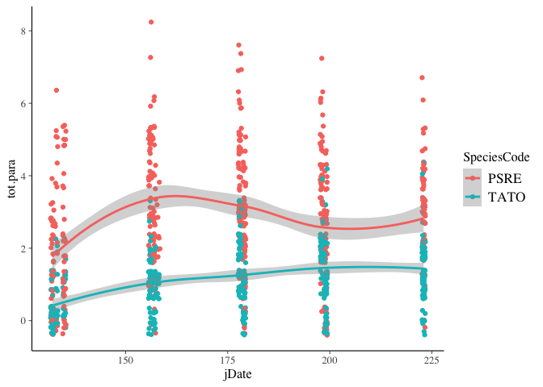

``` r
ggplot(data = dis)+
  geom_jitter(aes(x=Latitude, y = log(Echinostoma+.01), color = SpeciesCode))+
  facet_wrap(facets = ~visit)
```

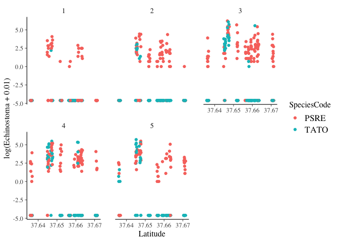 It looks like newts (TATO) don't seem to get Echinostoma at some of the sites (weird!)

In some sites, it seems like Echinostoma count goes up with time. So there might be a site X species interaction. And there might be a site X visit interaction. It also seems like the difference between species changes over time, but that only happens in some sites (e.g. PRPND010). Yikes...that seems like a 3 way interaction. Or the interaction between visit\*species depends on site (random slope)?

Do individuals' relative size (are they late bloomers or early bloomers) impact their parasite counts?

``` r
ggplot(data = dis)+
  geom_jitter(aes(x = visitScaledSVL, y = log(Echinostoma + .1), color = SpeciesCode))+
  facet_wrap(facets= ~SiteCode)
```

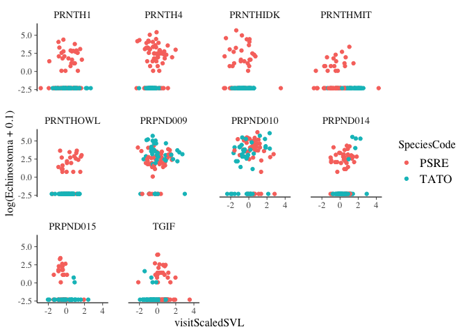 Doesn't seem like it.

Does location of a pond or its longevity matter?

``` r
ggplot(data=dis)+
  geom_jitter(aes(x=Latitude, y = log(Echinostoma+.1), color = Longevity))
```

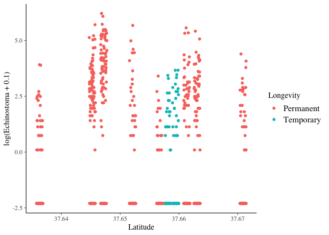

Model formulation
-----------------

For now, I'll focus on question 1 with the response variable being `Echinostoma` (number of Echinostoma parasites found within that individual) *I think that site should be nested within visit because I think that this is a higher level; e.g. ALL sites will be higher at visit 3, etc. But I'm not totally sure about this.*

Individual level
----------------

At the individual level, parasite load () is Poisson distributed with an expected mean of . Technically the data are negative-binomially (or overdispersed Poisson) - distributed, but I deal with that below by adding an extra error term, .

*Equation 1*:  ~ Poisson()

The log(expected mean parasite level) is predicted by individual-level covariates: date, species, snout vent length, and interaction, with each individual deviating from expected by .

*Equation 2*: ") = ![\\alpha\_{j\[i\]}](https://latex.codecogs.com/png.latex?%5Calpha_%7Bj%5Bi%5D%7D "\alpha_{j[i]}") + ![\\beta\_{j\[i\]}](https://latex.codecogs.com/png.latex?%5Cbeta_%7Bj%5Bi%5D%7D "\beta_{j[i]}") +  +  +  + 

Those deviations follow a normal distribution centered around 0 with variance of . This is the overdispersion parameter.

*Equation 3*:  ~ Normal(0, )

Sampling event level
--------------------

Each sampling event mean () can be predicted from a linear relationship with date, but varies by a random amount. The relationship with date is site specific (random slope)

*Equation 4*: ![\\alpha\_{j\[i\]}](https://latex.codecogs.com/png.latex?%5Calpha_%7Bj%5Bi%5D%7D "\alpha_{j[i]}") ~ Normal(![\\mu\_{\\alpha\[j\]}](https://latex.codecogs.com/png.latex?%5Cmu_%7B%5Calpha%5Bj%5D%7D "\mu_{\alpha[j]}"), )

*Equation 5*: ![\\mu\_{\\alpha\[j\]}](https://latex.codecogs.com/png.latex?%5Cmu_%7B%5Calpha%5Bj%5D%7D "\mu_{\alpha[j]}") = ![\\gamma\_{k\[i\]}](https://latex.codecogs.com/png.latex?%5Cgamma_%7Bk%5Bi%5D%7D "\gamma_{k[i]}") + ![\\beta\_j\[i\]](https://latex.codecogs.com/png.latex?%5Cbeta_j%5Bi%5D "\beta_j[i]")

Site level
----------

Each site varies randomly from the average in the mean parasite load. The mean for a particular site is drawn from a distribution centered at the mean among sites ():

*Equation 6*:  ~ Normal(, )

The effect of visit depends on site, thus we have a random slope as well, at the site-level. I don't know what greek symbols to use here...

*Equation 7*  ~ Normal(, ).

If there were site level covariates (in the future),  could be predicted with another linear model with site-level covariates (e.g. snail density, size, location).

Stan formulation
----------------

Model 1: This model includes interactions between time and species and time and SVL. I think that the differences between species or the importance of SVL could vary over the course of the summer.

``` r
stan.fit <- stan_glmer(Echinostoma ~ visit*SpeciesCode + visit*scale(SVL) + (1|SiteCode) + (1|CollectionCode), data = dis,  family =neg_binomial_2(link="log"))
stan.fit1 <- stan.fit
summary(stan.fit1)
# launch_shinystan(stan.fit)
plot(stan.fit1)
stan.samp1 <- sample(stan.fit1)
save(stan.samp1, file = "stan.fit.1.RData")
```

The interactions aren't significant (overlap with zero) so I will remove and re-fit. I'm also going to add a random slope model because I think the effect of species depends on site. The two species are very similar at some sites and very different at other sites.

Can I have two random slopes for Site, if so how to specify? jDate|SiteCode + SpeciesCode|SiteCode doesn't work.

``` r
# this model doesn't seem to work...

stan.fit2 <- stan_glmer(Echinostoma ~ visitScaledSVL + (visit|SiteCode) + SpeciesCode*visit + (1|CollectionCode) , data = dis,  family =neg_binomial_2(link="log"))

summary(stan.fit2)
stan.samp2<- sample(stan.fit2)
save(stan.samp2, file = "stan.fit.2.RData")

# launch_shinystan(stan.fit2)
```

Exploring model fit
-------------------

``` r
# variance partitioning
```

Posterior predictive checks. Simulating the model

Visualization
-------------

What are the best ways to represent these data? Should I do residual plots?

Conclusions
-----------

Next steps: Perhaps use a random slope model as well (visit|SiteCode). Developmental stages could perhaps be included with an interaction with species, which would allow TATO to have some levels and PSRE to have other levels. e.g. I need to put them in the same column. Will autocorrelation of fixed and random effects (e.g. Species, Population) become an issue?
