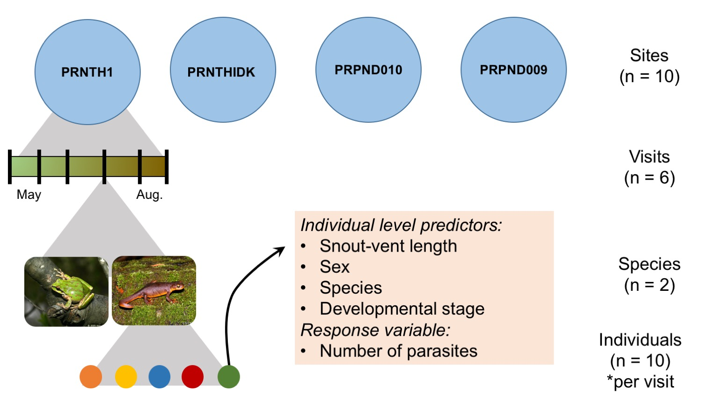

The data
--------

SUMMARY OF DATASET: I quantified parasite communities across 10
different pond sites in the East Bay of California; each site was
visited 4-6 times within the 2017 summer. At each visit I collected
10-12 individuals from 2 amphibian species. Individuals were measured
and parasite infection was quantified.

GROUPING VARIABLES: \* Site (10 ponds) - this is a random variable. \*
Population (2 species at each site) - this is a random variable

PREDICTOR VARIABLES:

-   Species (2 species) - I think this is a better designation for
    species

-   Body size (snout-vent-length) - A continuous variable (fixed effect)
    at the individual level

-   Developmental stage - A continuous variable at the individual
    level...problematic since development is measured differently in
    newts vs. frogs

-   Sex - A factor variable at the individual level

-   Visit - A continuous variable (though could be treated as a factor
    if the relationship si non linear)

RESPONSE VARIABLE:

-   The number of parasites found within an individual. For this
    analysis, just count number of Echinostoma parasites. Can be modeled
    as Poisson distributed with a negative binomial to account for
    aggregation. Infection status (1 or 0) could also be modeled as a
    binary response variable using logistic regression.

Questions
---------

1.  Does the impact of species and body size change over the course of
    the summer (interact with visit)?
2.  How much of the variation in overall parasite load is explained by
    visit-level, species-level, site-level, or individual-level
    variation?

Display the structure of the data
---------------------------------

    dis <- read.csv("diss.data.2017.csv")
    # colnames(dis)
    str(dis)

    ## 'data.frame':    1049 obs. of  35 variables:
    ##  $ X                          : int  1 2 3 4 5 6 7 8 9 10 ...
    ##  $ HostCode                   : Factor w/ 1049 levels "PRNTH1_20170328_PSRE_001",..: 113 872 340 755 1 230 231 866 870 346 ...
    ##  $ Date                       : int  20170513 20170328 20170607 20170327 20170328 20170513 20170513 20170328 20170328 20170607 ...
    ##  $ SiteCode                   : Factor w/ 10 levels "PRNTH1","PRNTH4",..: 2 9 4 8 1 3 3 9 9 4 ...
    ##  $ SpeciesCode                : Factor w/ 2 levels "PSRE","TATO": 1 1 1 1 1 1 1 1 1 1 ...
    ##  $ CollectionCode             : Factor w/ 53 levels "PRNTH1_20170328",..: 7 45 18 39 1 12 12 45 45 18 ...
    ##  $ Lifestage                  : Factor w/ 2 levels "Larva","Metamorph": 1 1 1 1 1 1 1 1 1 1 ...
    ##  $ Dissector                  : Factor w/ 5 levels "AO","CM","DC",..: 2 3 2 3 3 2 2 3 3 2 ...
    ##  $ DissectionCondition        : Factor w/ 3 levels "Dead on Arrival",..: 3 3 3 1 3 3 3 3 3 2 ...
    ##  $ GosnerStage                : int  40 26 26 26 26 29 26 26 26 26 ...
    ##  $ TarichaLarvaeStage         : Factor w/ 6 levels "","2T","3T","4T",..: 1 1 1 1 1 1 1 1 1 1 ...
    ##  $ SVL                        : num  4.58 5.13 5.29 5.41 5.42 5.45 5.6 5.74 5.94 5.95 ...
    ##  $ TailLength                 : num  27.44 6.44 5.76 6.78 7.15 ...
    ##  $ TotalLength                : num  32 11.6 11.1 12.2 12.6 ...
    ##  $ Malformed                  : Factor w/ 2 levels "N","Y": 1 1 1 1 1 1 1 1 1 1 ...
    ##  $ Sex                        : Factor w/ 3 levels "Female","Male",..: 3 3 3 3 3 3 3 3 3 3 ...
    ##  $ collDate                   : Factor w/ 13 levels "2017-03-27","2017-03-28",..: 3 2 7 1 2 3 3 2 2 7 ...
    ##  $ visit                      : int  2 1 3 1 1 2 2 1 1 3 ...
    ##  $ SecYr                      : logi  NA NA NA NA NA NA ...
    ##  $ tot.para                   : int  2 1 2 0 0 4 0 1 1 2 ...
    ##  $ BDinf                      : int  1 0 0 0 0 0 0 1 1 0 ...
    ##  $ aveZE                      : num  2.75 0 0 0 0 ...
    ##  $ Alaria                     : int  0 0 0 0 0 0 0 0 0 0 ...
    ##  $ Cephalogonimus             : int  0 0 0 0 0 0 0 0 0 0 ...
    ##  $ Echinostoma                : int  0 0 0 0 0 2 0 0 0 1 ...
    ##  $ Gorgoderid_Metacercaria    : int  0 0 0 0 0 0 0 0 0 0 ...
    ##  $ Gyrinicola_batrachiensis   : int  0 0 0 0 0 3 0 0 0 0 ...
    ##  $ Manodistomum_syntomentera  : int  0 0 0 0 0 0 0 0 0 0 ...
    ##  $ Megalobatrachonema_moraveci: int  0 0 0 0 0 0 0 0 0 0 ...
    ##  $ Nematode                   : int  0 0 0 0 0 0 0 0 0 0 ...
    ##  $ Oxyurid                    : int  0 0 0 0 0 0 0 0 0 0 ...
    ##  $ Ribeiroia_ondatrae         : int  0 0 0 0 0 0 0 0 0 0 ...
    ##  $ Nyctotherus                : int  1 1 0 0 0 1 0 0 1 0 ...
    ##  $ Opalina                    : int  1 0 1 0 0 1 0 1 0 0 ...
    ##  $ Tritrichomonas             : int  0 0 1 0 0 0 0 0 0 1 ...

    dis$Pop <- paste(dis$SiteCode, dis$SpeciesCode, sep = "_") 
    # each population is sampled multiple time so the observations are nested with in pop

Model formulation
-----------------

For now, I'll focus on question 1 with the response variable being
`Echinostoma` (number of Echinostoma parasites found within that
individual)

At the individual level, parasite load (*y**i*) is Poisson
distributed with an expected mean of *μ**i*

(Equation 1) *y**i* ~ Poisson(*μ**i*)

The log(expected mean parasite level) is predicted by visit, species,
snout vent length, and interaction, with each individual deviating from
expected by *ϵ**i*.

(Equation 2) *l**o**g*(*μ**i*) = *α**j*\[*i*\] +
*β*1 \* *v**i**s**i**t* +
*β*2 \* *s**p**e**c**i**e**s* + *β*3 \* *S**V**L*
+ *β*4 \* *v**i**s**i**t* \* *s**p**e**c**i**e**s* +
*β*5 \* *v**i**s**i**t* \* *S**V**L* + *ϵ**i*

Those deviations follow a normal distribution centered around 0 with
variance of *σ**ϵ*2. This is the overdispersion
parameter.

(Equation 3) *ϵ**i* ~ Normal(0,
*σ**ϵ*2)

Each individual is a member of a repeatedly sampled population. The
populations are centered around the mean for that site
(*γ**k*\[*i*\]).:

(Equation 4) *α**j* ~ Normal(*γ**k*\[*i*\],
*σ**α*2)

The mean for a particular site is drawn from a distribution centered at
the mean among sites ($\\bar{\\gamma}$):

(Equation 5) *γ**k* ~ Normal($\\bar{\\gamma}$,
*σ**γ*2)

If there were site level covariates (in the future), $\\bar{\\gamma}$
could be predicted with another linear model with site-level covariates
(e.g. snail density, size, location).

Stan formulation
----------------

In stan\_glm, the model could be written as:

    stan.fit <- stan_glmer(Echinostoma ~ visit*SpeciesCode + visit*SVL + (1|SiteCode) + (1|Pop) +
                             (1|HostCode), data = dis,  family =poisson(link="log"))
    summary(stan.fit)
    # launch_shinystan(stan.fit)
    stan.samp <- sample(stan.fit)
    save(stan.samp, file = "stan.fit.1.RData")

The interactions aren't significant (overlap with zero) so I will remove
and re-fit. I'm also going to add a random slope model because I think
the effect of species depends on site. The two species are very similar
at some sites and very different at other sites.

    stan.fit2 <- stan_glmer(Echinostoma ~ visit + SpeciesCode + SVL + (SpeciesCode|SiteCode) + (1|Pop) +
                             (1|HostCode), data = dis,  family =poisson(link="log"))

Exploring model fit
-------------------

Next steps: Perhaps use a random slope model as well (visit|SiteCode).
Developmental stages could perhaps be included with an interaction with
species, which would allow TATO to have some levels and PSRE to have
other levels. e.g. I need to put them in the same column. Will
autocorrelation of fixed and random effects (e.g. Species, Population)
become an issue?
